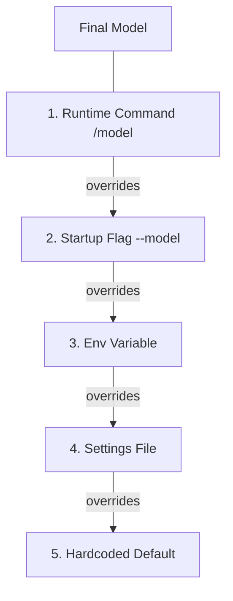
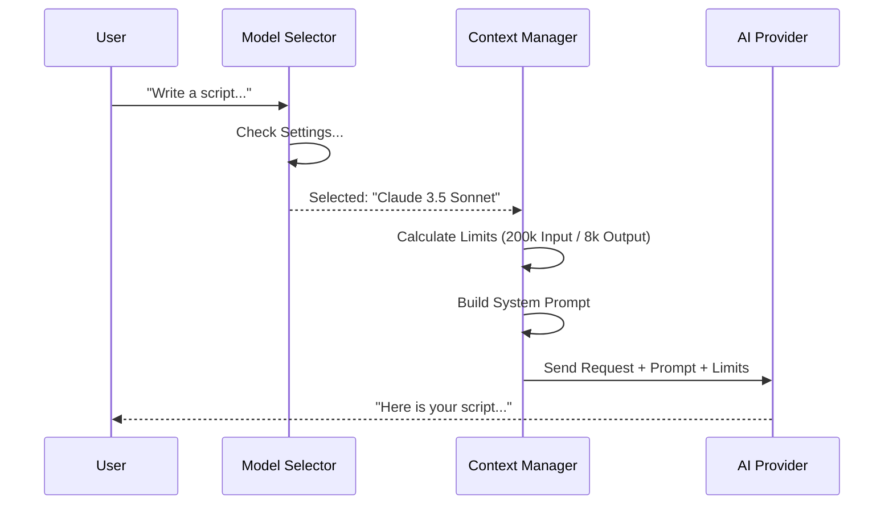

# Chapter 3: Model Context & Strategy

Welcome to the third chapter of the `utils` project tutorial.

In the previous chapter, [Authentication & Permissions](02_authentication___permissions.md), we set up the "Security Guard" to verify who you are and control what the agent is allowed to do.

Now that the agent is secure, we need to give it a "Brain." But not just any brain—we need to choose the *right* brain for the job, tell it who it is, and make sure it doesn't run out of memory.

## The Problem: The Forgetful Genius

Imagine you are hiring a genius consultant (the AI Model) to work on your project.
1.  **Selection:** Do you need a creative writer (Claude Opus) or a fast, efficient coder (Claude Haiku)?
2.  **Briefing:** You need to tell them their job description: "You are a senior developer, be concise." (This is the **System Prompt**).
3.  **Memory:** This consultant has a limited short-term memory. If the conversation gets too long, they start forgetting the beginning of the meeting. You need to manage this limit (The **Context Window**).

This chapter explains how the `utils` project handles these three challenges.

## Key Concept 1: Model Selection (Choosing the Brain)

Not all AI models are created equal. Some are smarter but slower; others are fast and cheap. The application allows users to switch models on the fly.

This logic lives in `model/model.ts`. Just like the Settings Hierarchy in Chapter 1, there is a specific order of priority for choosing the model.

### The Selection Hierarchy
1.  **Runtime Override:** Did the user type `/model opus` right now?
2.  **Flag:** Did the user start the app with `--model opus`?
3.  **Env Variable:** Is `ANTHROPIC_MODEL` set?
4.  **Settings:** Is it saved in `settings.json`?
5.  **Default:** If nothing else, use the built-in default (usually Sonnet).



Here is the code that makes this decision:

```typescript
// From model/model.ts - Simplified
export function getMainLoopModel(): string {
  // 1. Check for overrides or flags first
  const specifiedModel = getUserSpecifiedModelSetting()
  
  if (specifiedModel) {
    // 2. Resolve aliases (e.g., "sonnet" -> "claude-3-5-sonnet")
    return parseUserSpecifiedModel(specifiedModel)
  }

  // 3. Fallback to default
  return getDefaultMainLoopModel()
}
```
*Explanation: This function acts as the traffic controller. It looks for user preference first. If the user didn't specify anything, it grabs the default model (currently Sonnet 4.6).*

## Key Concept 2: The System Prompt (The Job Description)

Once we have a model, we need to tell it how to behave. This is done via the **System Prompt**.

You might think a prompt is just "Help me code," but in a complex application, the prompt is built from multiple layers:
1.  **Base Persona:** "You are an expert coding agent."
2.  **Environment:** "You are running on macOS."
3.  **Custom Instructions:** "Always write tests first" (from your settings).

This logic is found in `systemPrompt.ts`.

```typescript
// From systemPrompt.ts - Simplified
export function buildEffectiveSystemPrompt({
  customSystemPrompt,
  defaultSystemPrompt,
  agentDefinition
}): SystemPrompt {
  // 1. Start with the default instructions
  const promptParts = [...defaultSystemPrompt]

  // 2. If there are custom instructions, add them
  if (customSystemPrompt) {
    promptParts.push(customSystemPrompt)
  }

  // 3. Combine into one final block of text
  return asSystemPrompt(promptParts)
}
```
*Explanation: The code constructs an array of strings. It stacks the default instructions, agent-specific rules, and user customizations into one big text block that gets sent to the AI before the conversation starts.*

## Key Concept 3: Context & Token Budgets (Managing Memory)

AI models process text in chunks called **Tokens** (roughly 0.75 of a word). Every model has a "Context Window"—a maximum limit of tokens it can remember at once (e.g., 200,000 tokens).

If you send too much code, the model crashes or forgets instructions.

### Determining the Limit
The file `context.ts` figures out how big the model's memory is.

```typescript
// From context.ts - Simplified
export function getContextWindowForModel(model: string): number {
  // 1. Check for explicit 1 Million Context support
  if (model.includes('[1m]')) {
    return 1_000_000
  }

  // 2. Check model capabilities (Sonnet vs Haiku)
  if (model.includes('sonnet-4-6')) {
     return 200_000 // Standard limit
  }

  // 3. Default fallback
  return 200_000
}
```
*Explanation: The function looks at the model name. If it sees special flags like `[1m]` (1 million tokens), it expands the limit. Otherwise, it returns the standard safety limit.*

### Budgeting the Output
We also need to control how much the AI *writes* back to us. We don't want it to print 1 million lines of code and freeze the terminal. This is the **Output Token Limit**.

```typescript
// From context.ts - Simplified
export function getModelMaxOutputTokens(model: string) {
  // Newer models can write more
  if (model.includes('sonnet-3-7')) {
    return { default: 32_000, upperLimit: 64_000 }
  }

  // Older models are more restricted
  return { default: 8_192, upperLimit: 8_192 }
}
```
*Explanation: Different models have different "stamina." This code ensures we don't ask a smaller model to write a novel, which would cause an error.*

## Internal Implementation: The Brain Sequence

Let's visualize what happens when you type a message to the agent.



## Deep Dive: Handling Aliases

Users prefer typing `sonnet` instead of `claude-3-5-sonnet-20240620-v1:0`. The `model.ts` file handles this translation using a helper function called `parseUserSpecifiedModel`.

```typescript
// From model/model.ts - Simplified
export function parseUserSpecifiedModel(input: string): string {
  const cleanInput = input.toLowerCase().trim()

  // Map simple names to full versions
  if (cleanInput === 'sonnet') {
    return getDefaultSonnetModel() // e.g., claude-3-5-sonnet...
  }
  
  if (cleanInput === 'haiku') {
    return getDefaultHaikuModel()
  }

  return cleanInput // Return original if not an alias
}
```
*Explanation: This acts as a dictionary. It ensures that even if internal model IDs change (e.g., Anthropic releases Sonnet 3.6), the user can still just type "sonnet" and get the latest version automatically.*

## Deep Dive: Token Budget Parsing

Advanced users might want to tell the agent: "You have a budget of 50k tokens for this task." The file `tokenBudget.ts` uses Regular Expressions (Regex) to understand these natural language instructions.

```typescript
// From tokenBudget.ts - Simplified
export function parseTokenBudget(text: string): number | null {
  // Looks for patterns like "spend 50k tokens"
  const match = text.match(/spend\s+(\d+)(k|m)\s+tokens/i)
  
  if (match) {
    const amount = parseFloat(match[1])
    const multiplier = match[2] === 'k' ? 1000 : 1000000
    return amount * multiplier
  }
  
  return null
}
```
*Explanation: This allows the user to talk naturally. The code scans the text for numbers followed by 'k' (thousand) or 'm' (million) and converts it into a raw number for the system to track.*

## Summary

In this chapter, we learned how the application manages its "Brain":
1.  **Model Selection:** `model.ts` prioritizes user commands over global defaults to pick the right AI.
2.  **System Prompt:** `systemPrompt.ts` constructs the persona and rules the AI must follow.
3.  **Context Strategy:** `context.ts` calculates memory limits to prevent crashes and manage costs.

This infrastructure ensures that when we finally ask the AI to do work, it knows *who* it is, *what* limits it has, and *how* to behave.

Now that the AI is authenticated, configured, and has a strategy, we need to give it tools to interact with your code. The most important tool for a developer? Version Control.

[Next Chapter: Git Integration](04_git_integration.md)

---

Generated by [Code IQ](https://github.com/adityasoni99/Code-IQ)