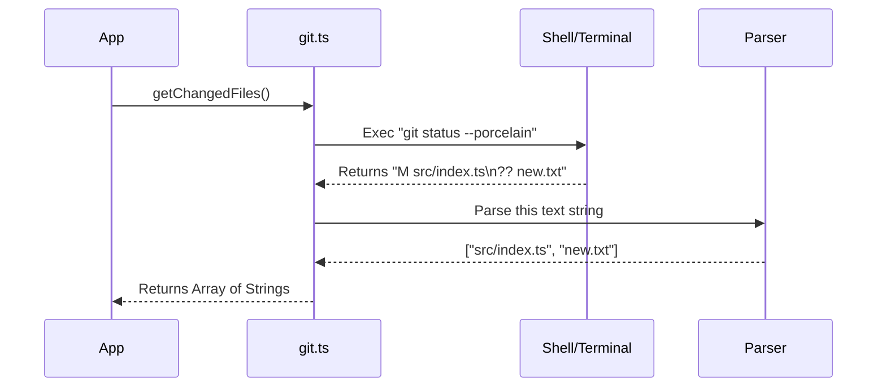

# Chapter 4: Git Integration

Welcome to Chapter 4 of the `utils` project tutorial.

In the previous chapter, [Model Context & Strategy](03_model_context___strategy.md), we gave our AI Agent a "Brain"—we taught it how to select the right model, manage its memory, and understand its persona.

Now that the AI knows *how* to think, it needs to understand the project it is working on. For developers, the history and state of a project live in **Git**.

## The Problem: The "Raw Text" Nightmare

Imagine you want to ask the computer: *"What files have changed?"*

If you were typing in a terminal, you would run `git status`. The computer might reply:
```text
On branch main
Your branch is up to date with 'origin/main'.

Changes not staged for commit:
  (use "git add <file>..." to update what will be committed)
  modified:   src/app.ts
```

This text is great for humans, but **terrible** for software. To make an app understand this, you would have to write code to read every line, look for the word "modified," and extract the filename. If Git updates and changes the text slightly, your code breaks.

We need a **Git Integration Layer**. This layer acts as a **Translator**. It runs Git commands behind the scenes and converts the messy text output into clean, structured data that our code can easily use.

## Key Concept 1: Finding the Anchor (Git Root)

Before we can run any Git commands, we need to know *where* the project is.

If you are currently working in a deep folder like `/Users/me/projects/my-app/src/components/button/`, simply running a command might not work if the system doesn't know where the `.git` folder lives.

The function `findGitRoot` solves this. It acts like a homing pigeon finding its way home.

### How to use it
```typescript
// From git.ts
import { findGitRoot } from './git.js'

// Imagine we are deep inside a subfolder
const currentFolder = '/Users/me/projects/app/src'

// This function hunts down the main folder
const root = findGitRoot(currentFolder)

console.log(root) // Output: "/Users/me/projects/app"
```
*Explanation: The function looks at the current folder. If it doesn't see `.git`, it moves to the parent folder. It keeps going up until it finds the repository root or hits the top of the file system.*

## Key Concept 2: The Dashboard (Reading State)

The Agent frequently needs a snapshot of the repository. It asks: *"Is the directory clean? What branch am I on? Are there new files?"*

Instead of running five different commands, we use `getGitState`. This consolidates everything into one object.

### How to use it
```typescript
// From git.ts
import { getGitState } from './git.js'

async function checkRepo() {
  const state = await getGitState()

  if (state.isClean) {
    console.log("Nothing to do here!")
  } else {
    console.log(`Working on branch: ${state.branchName}`)
  }
}
```
*Explanation: This function returns a structured object (JSON) with boolean flags (`isClean`) and strings (`branchName`). The rest of the app doesn't need to know `git status --porcelain` was run behind the scenes.*

## Key Concept 3: The Safety Net (Stashing)

One of the most dangerous things an automated tool can do is overwrite your uncommitted work.

Before the Agent tries to apply a complex patch or change branches, we often want to "save the game" so we don't lose progress. We use `stashToCleanState`.

### How to use it
```typescript
// From git.ts
import { stashToCleanState } from './git.js'

async function prepareForChanges() {
  // Save everything (including new 'untracked' files)
  const success = await stashToCleanState("Auto-save before AI run")
  
  if (success) {
    console.log("Work saved safely. Repository is now clean.")
  }
}
```
*Explanation: Standard `git stash` sometimes leaves new files behind. This wrapper explicitly finds "untracked" files and ensures they are included in the stash, preventing accidental data loss.*

## Internal Implementation: The Workflow

When the application asks for the Git status, it doesn't speak directly to the Git executable. It goes through our wrapper.



## Deep Dive: Walking the Tree

Let's look under the hood of `findGitRoot`. How does it actually find the folder? It uses a `while` loop to traverse the file system upwards.

```typescript
// From git.ts - Simplified
const findGitRootImpl = (startPath: string) => {
  let current = resolve(startPath)
  
  // Loop until we hit the top of the drive
  while (current !== root) {
    // Check if .git exists right here
    if (pathExists(join(current, '.git'))) {
      return current // Found it!
    }

    // Move one level up
    current = dirname(current)
  }
  return null // Not found
}
```
*Explanation: This is a classic "Tree Traversal." It checks `src/components`, then `src`, then `app`. It stops as soon as it finds the treasure (the `.git` folder). To make this fast, the real code uses "Memoization" (caching), so if we ask for the same path twice, it remembers the answer instantly.*

## Deep Dive: Privacy & Hashing

We often need to identify a repository for telemetry (logs), but we **cannot** upload the name of your private project (e.g., `secret-launch-v2`) to a server. That would be a privacy leak.

The solution is `getRepoRemoteHash`. It creates a unique "fingerprint" for the repository without revealing its name.

```typescript
// From git.ts - Simplified
export async function getRepoRemoteHash() {
  // 1. Get the URL: "git@github.com:MyCompany/SecretProject.git"
  const url = await getRemoteUrl()
  
  // 2. Normalize it: "github.com/mycompany/secretproject"
  const cleanUrl = normalizeGitRemoteUrl(url)

  // 3. Hash it: Turn it into random-looking characters
  const hash = createHash('sha256').update(cleanUrl).digest('hex')
  
  // Returns: "a1b2c3d4..." (The original name is gone)
  return hash.substring(0, 16)
}
```
*Explanation: We use a cryptographic hash (SHA-256). This is a one-way street. We can tell if two users are working on the same repo (the hashes will match), but we can never read the hash and figure out the original project name.*

## Deep Dive: Handling "Untracked" Files

Standard Git commands like `git diff` usually ignore files that haven't been added yet (Untracked files). But if you just created a new file and asked the AI to fix it, the AI needs to see it!

We have a special function `captureUntrackedFiles` that manually reads these files.

```typescript
// From git.ts - Simplified
async function captureUntrackedFiles() {
  // 1. Ask git for list of new files only
  const output = await exec('git ls-files --others --exclude-standard')
  const filePaths = output.split('\n')

  // 2. Read the content of each file manually
  const results = []
  for (const file of filePaths) {
    // Skip huge files or binary files (like images)
    if (isBinary(file) || isTooBig(file)) continue;

    const content = await readFile(file)
    results.push({ path: file, content: content })
  }

  return results
}
```
*Explanation: This bridges a gap in Git's default behavior. By combining `git ls-files` with manual file reading, we ensure the AI has the complete context, not just the stuff that has already been committed.*

## Summary

In this chapter, we explored how the application interacts with Version Control:
1.  **Finding the Root:** `findGitRoot` anchors us to the project base.
2.  **Reading State:** `getGitState` converts raw text output into easy-to-use data.
3.  **Safety:** `stashToCleanState` protects user data before automated actions occur.
4.  **Privacy:** Hashing ensures we can identify repositories in logs without spying on project names.

Now that the Agent can understand the project structure and history, it needs to interact with the machine itself—running commands and editing files.

[Next Chapter: Operating System Interface (Shell & FS)](05_operating_system_interface__shell___fs_.md)

---

Generated by [Code IQ](https://github.com/adityasoni99/Code-IQ)