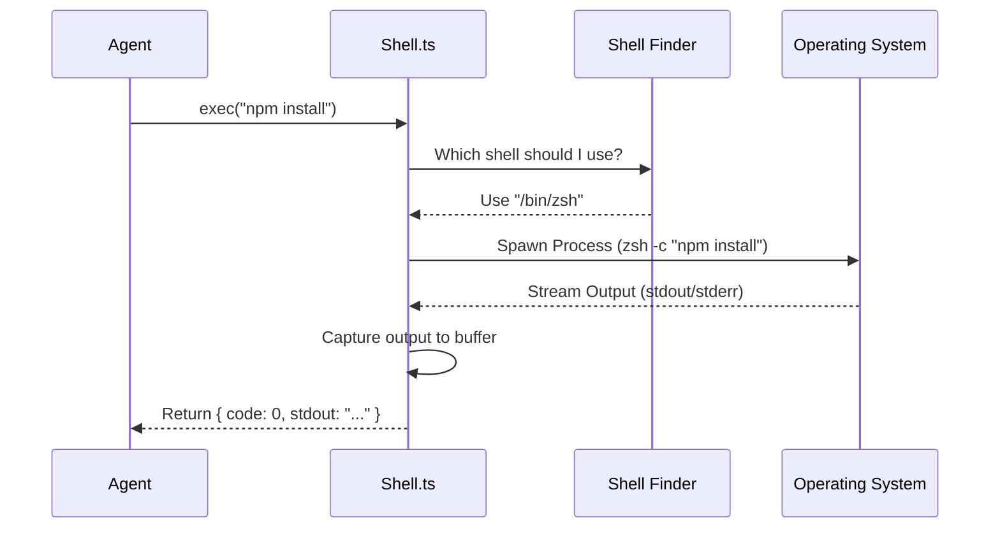

# Chapter 5: Operating System Interface (Shell & FS)

Welcome to Chapter 5 of the `utils` project tutorial.

In the previous chapter, [Git Integration](04_git_integration.md), we taught the Agent how to understand the history and structure of your project.

Now, we need to give the Agent **Hands**. It’s not enough to just *read* code; an autonomous agent needs to *run* commands (like installing packages or running tests) and *edit* files.

However, letting a computer program control your mouse and keyboard is dangerous and messy. Instead, we use a programmatic interface to the **Shell** (Terminal) and the **File System** (FS).

## The Problem: The "Works on My Machine" Chaos

Imagine you want the Agent to "List all files in the current folder."

*   **On Mac/Linux:** You run `ls -la`.
*   **On Windows:** You might need `dir`.
*   **On PowerShell:** It behaves differently than Bash.

If we just wrote raw code for every single operating system, our codebase would be a mess of `if (windows) { ... } else { ... }`.

Furthermore, what if the Agent tries to read a file that is actually a "Symlink" (shortcut) pointing to your private password file? We need a safety layer.

This chapter introduces the **Operating System Interface**—a safe, consistent wrapper around your computer's raw capabilities.

## Key Concept 1: The Shell Wrapper

The file `Shell.ts` is the Agent's way of typing into the terminal. Instead of just "running a command," it creates a controlled environment.

It handles:
1.  **Finding the right shell:** It automatically finds `bash` or `zsh` (or `powershell` on Windows).
2.  **Timeouts:** If a command hangs for 30 minutes, it kills it so your computer doesn't freeze.
3.  **Output:** It captures what the command prints (`stdout`) and any errors (`stderr`).

### How to use it
Here is how the application runs a command safely:

```typescript
// Importing the exec function from Shell.ts
import { exec } from './Shell.ts'

async function runTests() {
  // Run 'npm test' with a safety timeout
  const result = await exec('npm test', abortSignal, 'bash')

  if (result.code === 0) {
    console.log("Tests Passed!")
  } else {
    console.error("Tests Failed:", result.stderr)
  }
}
```
*Explanation: We don't worry about spawning child processes manually. We just pass the command string ('npm test'), and `exec` returns a clean object with the exit code and output.*

## Key Concept 2: The File System (FS) Wrapper

Node.js comes with a built-in `fs` module, but our project wraps it in `fsOperations.ts`.

Why wrap it?
1.  **Telemetry:** We can log exactly which files the Agent is touching (useful for debugging).
2.  **Abstraction:** We can easily swap the "Real" file system for a "Fake" one during testing, so the Agent doesn't actually delete your files while we are testing *it*.

### How to use it
We use `NodeFsOperations` to interact with files.

```typescript
// From fsOperations.ts
import { NodeFsOperations } from './fsOperations.js'

async function readFileSafely(path) {
  // Check if it exists first
  if (NodeFsOperations.existsSync(path)) {
    
    // Read the content as a string
    const content = await NodeFsOperations.readFile(path, { encoding: 'utf8' })
    return content
  }
  return null
}
```
*Explanation: This looks very similar to standard Node.js code, but by using `NodeFsOperations`, we ensure all reads go through our monitored system.*

## Key Concept 3: Symlink Safety

A common security vulnerability involves **Symlinks** (Symbolic Links). A malicious actor (or a confused Agent) might try to read a file named `./nice-image.jpg`, but that file is actually a shortcut pointing to `/etc/shadow` (system passwords).

Our system uses `safeResolvePath` to prevent this confusion.

```typescript
// From fsOperations.ts - Simplified
export function safeResolvePath(fs, filePath) {
  try {
    // 1. Ask the OS where this link REALLY points
    const realPath = fs.realpathSync(filePath)
    
    // 2. Return the true location
    return { resolvedPath: realPath, isSymlink: true }
  } catch {
    // If it's not a link or doesn't exist, return original
    return { resolvedPath: filePath, isSymlink: false }
  }
}
```
*Explanation: Before we read or write, we resolve the path. If the Agent thinks it's writing to a temp folder, but the path resolves to a system folder, we can catch it.*

## Internal Implementation: The Execution Flow

What happens when the Agent decides to run a command? It triggers a sequence in `Shell.ts`.



## Deep Dive: Finding the Right Shell

The function `findSuitableShell` is smarter than it looks. It doesn't just guess; it investigates your environment.

```typescript
// From Shell.ts - Simplified
export async function findSuitableShell(): Promise<string> {
  // 1. Check if the user forced a specific shell via env var
  if (process.env.CLAUDE_CODE_SHELL) {
    return process.env.CLAUDE_CODE_SHELL
  }

  // 2. Look for common shells in system paths
  const [zsh, bash] = await Promise.all([which('zsh'), which('bash')])

  // 3. Prefer User's default, otherwise default to Bash/Zsh
  return bash || zsh || '/bin/sh'
}
```
*Explanation: This ensures that if you are a Zsh user, the Agent uses Zsh (so your config files load). If you are on a minimal server with only Bash, it adapts automatically.*

## Deep Dive: The Bash Parser

Before running a command, we sometimes need to understand *what* it is. For example, is the command setting an environment variable?

We use a tool called `tree-sitter` in `bash/parser.ts` to convert the text command into a data structure.

```typescript
// From bash/parser.ts - Simplified
export async function parseCommand(command: string) {
  // 1. Initialize the parser (if available)
  await ensureParserInitialized()
  
  // 2. Parse the string into a syntax tree
  const rootNode = parser.parse(command)

  // 3. Extract useful info, like Environment Variables
  const envVars = extractEnvVars(rootNode)
  
  return { rootNode, envVars }
}
```
*Explanation: By parsing the command, we can see that `export API_KEY=123 && ./run.sh` isn't just a string; it's a variable assignment followed by an execution. This helps us track state.*

## Deep Dive: Reading Logs in Reverse

Agents often need to see "the last 10 lines of the error log." Reading a 5GB log file from start to finish just to see the end is slow and crashes memory.

`fsOperations.ts` includes a smart generator called `readLinesReverse`.

```typescript
// From fsOperations.ts - Simplified
export async function* readLinesReverse(path: string) {
  const fileHandle = await open(path, 'r')
  let position = fileSize

  // Read backwards in chunks of 4KB
  while (position > 0) {
    const chunk = await readPreviousChunk(fileHandle, position)
    const lines = chunk.split('\n')
    
    // Yield lines one by one, backwards
    for (let i = lines.length - 1; i >= 0; i--) {
      yield lines[i]
    }
  }
}
```
*Explanation: This function is an `AsyncGenerator`. It reads the file from the end to the beginning. The moment the Agent says "Stop, I found the error," the reading stops. This saves massive amounts of time and RAM.*

## Summary

In this chapter, we gave the Agent the ability to interact with the machine:
1.  **Shell Interface:** `Shell.ts` executes commands safely, handling timeouts and shell detection.
2.  **File System:** `fsOperations.ts` wraps Node.js file operations for logging and safety.
3.  **Parsers:** We analyze commands before running them to understand their intent.

We have a configured, authenticated Agent that knows the project history and can now touch files and run commands. But how do we manage the *lifecycle* of this interaction? How do we handle crashing, restarting, and cleaning up?

[Next Chapter: Session Lifecycle Management](06_session_lifecycle_management.md)

---

Generated by [Code IQ](https://github.com/adityasoni99/Code-IQ)