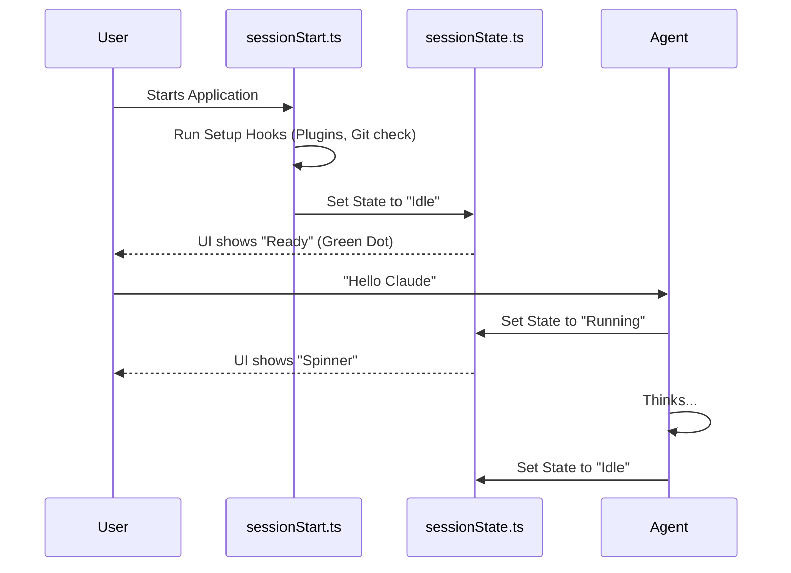

# Chapter 6: Session Lifecycle Management

Welcome to Chapter 6 of the `utils` project tutorial.

In the previous chapter, [Operating System Interface (Shell & FS)](05_operating_system_interface__shell___fs_.md), we gave our Agent "hands" to type commands and modify files.

However, an application isn't just a collection of tools. It needs a **Heartbeat**. It needs to wake up, stretch (run setup scripts), tell the user "I'm busy" when it's working, and log errors when things go wrong.

This is **Session Lifecycle Management**. It ensures the application flows logically from the moment you press "Enter" until the program exits.

## The Problem: The Zombie Application

Imagine an application without lifecycle management:
1.  **No Status:** You run a command. The cursor blinks. Is it thinking? Is it frozen? Did it crash? You have no idea.
2.  **No Startup Routine:** Every time you start, you have to manually check if you are logged in or if your plugins are loaded.
3.  **Lost Errors:** If the app crashes before the file system is ready, the error message vanishes into the void.

We need a **Central Nervous System**. This system tracks the "Mood" of the app (Idle, Running, Waiting) and ensures that startup tasks happen before real work begins.

## Key Concept 1: The Session State (The Mood Ring)

The core of this module is tracking the **State** of the application. At any given millisecond, the Agent is in one of three states:

1.  **Idle:** Waiting for you to type.
2.  **Running:** Thinking or executing a command.
3.  **Requires Action:** Paused, waiting for you to approve a dangerous command (like we learned in the Permissions chapter).

This logic lives in `sessionState.ts`.

### How to use it
The rest of the app doesn't guess the state; it asks the session manager.

```typescript
// From sessionState.ts - Simplified
let currentState = 'idle'

export function getSessionState() {
  return currentState
}

export function notifySessionStateChanged(newState) {
  currentState = newState
  // Tell the UI (like a spinner or status bar) to update
  broadcastToListeners(newState)
}
```
*Explanation: This is a global variable with superpowers. When we change `currentState`, it automatically triggers "Listeners" that update the user interface or send logs to the cloud.*

## Key Concept 2: The Morning Routine (Startup Hooks)

Before the Agent starts chatting, it might need to "get dressed." Maybe it needs to load a plugin, check your git branch, or run a maintenance script.

These are called **Hooks**. Specifically, we use `processSessionStartHooks` in `sessionStart.ts`.

### How to use it
When the app boots up, it runs this function before accepting user input.

```typescript
// From sessionStart.ts - Simplified
export async function processSessionStartHooks() {
  // 1. If running in "bare" mode (minimal), skip everything
  if (isBareMode()) return []

  // 2. Load plugins (like custom tools)
  await loadPluginHooks()

  // 3. Execute the startup scripts
  const results = await executeHooks('startup')
  
  return results
}
```
*Explanation: This acts like a pre-flight checklist. It ensures that all plugins and settings are loaded so the Agent doesn't start working with missing information.*

## Key Concept 3: The Black Box (Error Logging)

Errors happen. Maybe the internet goes down, or a file is locked. We need to record these errors safely.

The `log.ts` file implements a **Sink** pattern.
*   **The Problem:** What if an error happens *before* the logging system is ready?
*   **The Solution:** We put the error in a temporary "Queue." Once the logging system (the "Sink") is attached, we flush the queue and write everything to disk.

### How to use it
Developers use `logError` without worrying if the file system is ready.

```typescript
// From log.ts - Simplified
const errorQueue = []
let errorSink = null // The actual file writer

export function logError(error) {
  // 1. Always keep a copy in memory for immediate debugging
  addToInMemoryLog(error)

  // 2. If we can't write to disk yet, queue it
  if (errorSink === null) {
    errorQueue.push(error)
    return
  }

  // 3. Otherwise, write it immediately
  errorSink.write(error)
}
```
*Explanation: This prevents "Swallowed Errors." Even if the app crashes during the very first millisecond of startup, the error is caught in the queue and can be printed to the console.*

## Internal Implementation: The Life of a Session

Let's visualize the flow from the moment you start the application to the moment it waits for your input.



## Deep Dive: The Listener Pattern

How does the terminal know to stop spinning when the state changes? We don't want the UI constantly asking "Are you done yet? Are you done yet?"

Instead, we use a **Callback Listener** in `sessionState.ts`.

```typescript
// From sessionState.ts - Simplified
let stateListener = null

// 1. The UI registers a function here
export function setSessionStateChangedListener(callback) {
  stateListener = callback
}

// 2. When state changes, we call that function
function notifySessionStateChanged(state) {
  if (stateListener) {
    stateListener(state)
  }
}
```
*Explanation: This is an "Event-Driven" architecture. The UI registers a function. When the state changes, `sessionState.ts` calls that function. This keeps the different parts of the app decoupled.*

## Deep Dive: The "Bare Mode" Bypass

Sometimes you want the app to start instantly, skipping all the fancy plugins and checks (e.g., for automated testing). This is called **Bare Mode**.

In `sessionStart.ts`, we check this very early.

```typescript
// From sessionStart.ts - Simplified
import { isBareMode } from './envUtils.js'

export async function processSessionStartHooks() {
  // Optimization: specific flag to skip all overhead
  if (isBareMode()) {
    return [] 
  }

  // ... otherwise load heavy plugins ...
}
```
*Explanation: We check `process.env` or command line flags. If `isBareMode()` is true, we return an empty array immediately. This makes the startup time almost zero for automated scripts.*

## Deep Dive: "In-Memory" Error Logs

Writing to a file on disk is slow. If the app is crashing rapidly, we might not be able to write fast enough.

`log.ts` keeps a circular buffer of the last 100 errors in RAM (Random Access Memory).

```typescript
// From log.ts - Simplified
const MAX_ERRORS = 100
let inMemoryLog = []

function addToInMemoryErrorLog(error) {
  // If full, remove the oldest error (Shift)
  if (inMemoryLog.length >= MAX_ERRORS) {
    inMemoryLog.shift() 
  }
  
  // Add new error to the end
  inMemoryLog.push(error)
}
```
*Explanation: This ensures that if a user asks "What just happened?", we can show them the error instantly from memory without reading a file from the hard drive.*

## Conclusion

In this chapter, we learned how the application manages its own life:
1.  **Session State:** `sessionState.ts` tracks if the app is working or waiting, acting as the heartbeat.
2.  **Startup Hooks:** `sessionStart.ts` ensures the environment is prepared before the user interacts.
3.  **Logging:** `log.ts` provides a safe way to record errors using queues and sinks.

This brings us to the end of our deep dive into the `utils` project.

We have covered:
1.  **Configuration** (How the app loads settings)
2.  **Authentication** (Who you are)
3.  **Model Context** (How the AI thinks)
4.  **Git Integration** (How it sees your code)
5.  **OS Interface** (How it touches your files)
6.  **Lifecycle** (How it stays alive)

You now have a complete understanding of the infrastructure required to build a robust, secure, and context-aware AI agent!

---

Generated by [Code IQ](https://github.com/adityasoni99/Code-IQ)