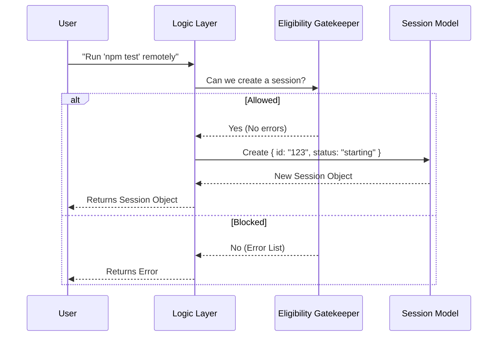

# Chapter 1: Remote Session Model

Welcome to the `background` project! In this first chapter, we are going to explore the foundation of running tasks remotely: the **Remote Session Model**.

## The Motivation

Imagine you have a heavy task you want to run, like a complex build process or a data migration that takes an hour. You don't want this running on your local machine, slowing down your editor, or stopping if you close your laptop. You want to "teleport" this task to a remote server.

But here is the problem: Once you send the task away, how do you keep track of it?
*   Is it still running?
*   Did it fail?
*   What is the output?
*   How do you cancel it?

We need a digital "receipt" or a "handle" that represents that remote process on our local machine. That is exactly what the **Remote Session Model** is.

## Core Concept: The Digital Receipt

Think of the Remote Session Model as a **Dry Cleaning Ticket**.

1.  You drop off your clothes (the **Command**) at the shop (the **Remote Environment**).
2.  They give you a ticket (the **Session Model**).
3.  You don't stand there watching the machine spin. You go home.
4.  Later, you look at the ticket number (**ID**) to check if it's ready (**Status**).

In our code, this "ticket" is a TypeScript object that holds all the essential information about the background task.

## The Data Structure

Let's look at the actual definition of this ticket. It is defined as `BackgroundRemoteSession`.

### The Session Type

Here is the simplified structure of our session model.

```typescript
// File: remote/remoteSession.ts

export type BackgroundRemoteSession = {
  id: string          // The unique ticket number
  command: string     // What we are doing (e.g., "npm install")
  startTime: number   // When we dropped it off
  // ... status and logs below
}
```
*   **id**: A unique string to identify this specific task.
*   **command**: The actual CLI command being executed remotely.

### Tracking Status

Just like a laundry ticket might be stamped "Washing," "Pressing," or "Done," our session has a specific set of statuses.

```typescript
// File: remote/remoteSession.ts

export type BackgroundRemoteSession = {
  // ... previous fields
  status: 'starting' | 'running' | 'completed' | 'failed' | 'killed'
  log: SDKMessage[] // The output text from the terminal
  // ... other metadata
}
```

*   **status**: Tells the UI exactly what state the remote process is in.
*   **log**: A history of messages (stdout/stderr) so we can see what happened.

## How It Works: The Flow

Before we can create this "ticket," the system needs to verify that the shop is open and we are allowed to use it.

### High-Level Walkthrough

1.  **User Request:** You ask to run a command remotely.
2.  **Eligibility Check:** The system checks the rules (Are you logged in? Is there a remote server available?).
3.  **Creation:** If all checks pass, the system creates a `BackgroundRemoteSession` object (the ticket).
4.  **Return:** The system gives you this object so you can track the progress.

### Visualizing the Process



## Internal Implementation

The code doesn't just define the type; it also includes a function to check if we *can* create a model. This is called **Eligibility**.

While we will cover the logic of checking these rules in detail in [Session Eligibility Gatekeeper](02_session_eligibility_gatekeeper.md), it is important to see the entry point here.

### Checking Eligibility

The function `checkBackgroundRemoteSessionEligibility` acts as the bouncer. It returns a list of reasons why a session *cannot* be created. If the list is empty, we are good to go.

```typescript
// File: remote/remoteSession.ts

export async function checkBackgroundRemoteSessionEligibility({
  skipBundle = false,
}: { skipBundle?: boolean } = {}) {
  const errors: BackgroundRemoteSessionPrecondition[] = []

  // ... Logic to check policies, login, and git repo ...
  
  return errors // Returns empty array [] if eligible
}
```

This function coordinates with several other components to make its decision:
1.  **Policy Limits**: Are remote sessions globally allowed?
2.  **Authentication**: Is the user logged in?
3.  **Environment**: Is there a remote environment connected?

We will dive into how these specific checks work in the next chapter.

## Summary

In this chapter, we learned:
1.  The **Remote Session Model** is a state container (a "digital receipt") for a task running elsewhere.
2.  It tracks critical data like `id`, `status`, and `log`.
3.  Before creating this model, we must pass an eligibility check.

Now that we understand what the "ticket" looks like, we need to understand the security guard checking us at the door.

[Next Chapter: Session Eligibility Gatekeeper](02_session_eligibility_gatekeeper.md)

---

Generated by [Code IQ](https://github.com/adityasoni99/Code-IQ)