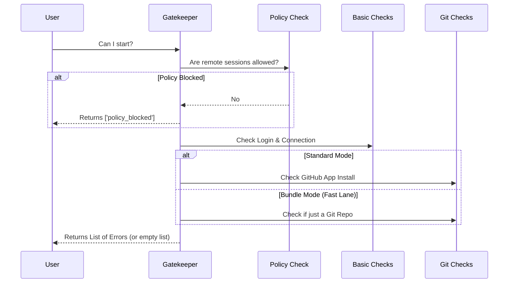

# Chapter 2: Session Eligibility Gatekeeper

Welcome back! In the previous chapter, [Remote Session Model](01_remote_session_model.md), we learned about the "Digital Receipt" (the Session object) that tracks a remote task.

But before we can hand out that receipt, we need to make sure the user is actually allowed to run the task. This brings us to the **Session Eligibility Gatekeeper**.

## The Motivation

Imagine a "Start Remote Session" button in your application.
*   Should this button be clickable?
*   Should it be disabled (grayed out)?
*   If it is disabled, **why**? (Is the user logged out? Is there no internet?)

We don't want to write messy `if/else` statements directly inside our UI code. Instead, we use a central **Gatekeeper** function. Its job is to run a checklist and return a list of reasons why the button might be blocked.

## Core Concept: The Error List

The Gatekeeper doesn't return `true` or `false`. It returns an **Array of Errors**.

*   **Empty Array `[]`**: Everything is perfect! The gate is open.
*   **Populated Array `['not_logged_in']`**: Stop! You cannot pass because you are not logged in.

### The Error Types

First, let's look at the specific blocking problems we might encounter. These are defined in `BackgroundRemoteSessionPrecondition`.

```typescript
// File: remote/remoteSession.ts

export type BackgroundRemoteSessionPrecondition =
  | { type: 'not_logged_in' }          // User needs to sign in
  | { type: 'no_remote_environment' }  // No server connection
  | { type: 'not_in_git_repo' }        // Not inside a project
  | { type: 'no_git_remote' }          // Project isn't on GitHub
  | { type: 'github_app_not_installed' } // Missing permissions
  | { type: 'policy_blocked' }         // Admin disabled this feature
```

By defining these types clearly, the UI knows exactly which error message to show the user.

## The Gatekeeper Logic

The main function is `checkBackgroundRemoteSessionEligibility`. It acts like a security guard performing a sequence of checks.

### Visualizing the Flow

Before looking at the code, let's trace the decision-making process.



## Internal Implementation

Now, let's break down the actual code implementation into small, manageable chunks.

### Step 1: The Master Switch

The very first thing we check is the global policy. If the administrator has turned off remote sessions entirely, we stop immediately. We don't care if you are logged in or not; the feature is off.

```typescript
// File: remote/remoteSession.ts

export async function checkBackgroundRemoteSessionEligibility() {
  const errors: BackgroundRemoteSessionPrecondition[] = []

  // 1. Check the "Master Switch"
  if (!isPolicyAllowed('allow_remote_sessions')) {
    errors.push({ type: 'policy_blocked' })
    return errors // STOP HERE. Do not pass go.
  }
  
  // ... continue to next checks
}
```

### Step 2: Gathering Basic Info

If the policy allows it, we gather three pieces of information at the same time (in parallel) to be fast:
1.  **Login Status:** Does the user need to log in?
2.  **Environment:** Is there a remote machine connected?
3.  **Repository:** What Git repo are we currently in?

```typescript
  // 2. Run independent checks in parallel
  const [needsLogin, hasRemoteEnv, repository] = await Promise.all([
    checkNeedsClaudeAiLogin(),
    checkHasRemoteEnvironment(),
    detectCurrentRepositoryWithHost(),
  ])

  if (needsLogin) errors.push({ type: 'not_logged_in' })
  if (!hasRemoteEnv) errors.push({ type: 'no_remote_environment' })
```

> **Note:** We will dive deep into how these individual verification functions work in [Precondition Verification](03_precondition_verification.md).

### Step 3: Git Context & The "Bundle" Shortcut

This part is slightly complex. Usually, to run a remote session, we need a GitHub Remote and the GitHub App installed.

However, there is a "Fast Lane" called **Bundle Seeding**. If this feature is on, the requirements are looser—we only need to be inside *any* Git folder, even if it's not on GitHub yet.

```typescript
  // 3. Determine if we are in the "Fast Lane" (Bundle Seeding)
  // ... (logic to check env vars for bundle seeding) ...

  if (!checkIsInGitRepo()) {
    // If not in a git folder at all, block it.
    errors.push({ type: 'not_in_git_repo' }) 
  } else if (bundleSeedGateOn) {
    // "Fast Lane": We are in a git repo, so we are good!
    // We skip the stricter GitHub checks below.
  } else if (repository === null) {
    // Standard Lane: Must have a remote origin
    errors.push({ type: 'no_git_remote' })
  }
```

### Step 4: The GitHub App Check

Finally, if we are in the "Standard Lane" (not using Bundle Seeding), and the repository is hosted on GitHub, we must ensure the GitHub App is installed.

```typescript
  // 4. If using standard GitHub, check for the App
  else if (repository.host === 'github.com') {
    const hasGithubApp = await checkGithubAppInstalled(
      repository.owner,
      repository.name,
    )
    
    if (!hasGithubApp) {
      errors.push({ type: 'github_app_not_installed' })
    }
  }

  return errors // Return the final list
```

## Summary

The **Session Eligibility Gatekeeper** is the bouncer of our system.
1.  It creates an empty list of errors.
2.  It checks the **Global Policy** first.
3.  It checks **Login** and **Environment** status.
4.  It checks **Git Requirements** (applying a "Fast Lane" logic if Bundle Seeding is active).
5.  It returns the list.

If the list is empty, the UI lights up the "Start" button!

But how exactly do we check if the user is logged in? And how do we know if there is a remote environment? In the next chapter, we will look at the specific functions that power these checks.

[Next Chapter: Precondition Verification](03_precondition_verification.md)

---

Generated by [Code IQ](https://github.com/adityasoni99/Code-IQ)