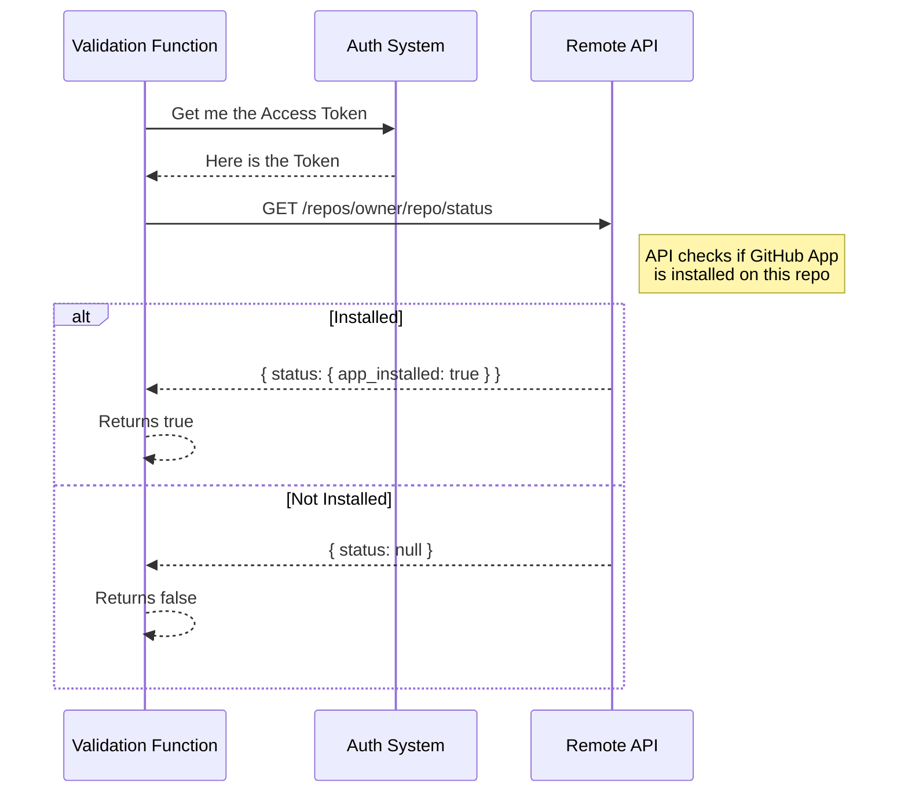

# Chapter 3: Precondition Verification

Welcome back! In the previous chapter, [Session Eligibility Gatekeeper](02_session_eligibility_gatekeeper.md), we met the "Bouncer" that decides if a user can start a remote session.

But how does the Bouncer actually know if your ID is valid or if the club is open? It relies on a set of specialized tools. In this chapter, we will explore **Precondition Verification**: the collection of specific, atomic checks that power our system.

## The Motivation

Imagine you are a pilot preparing for takeoff. You have a "Ready for Takeoff" light on your dashboard (this is the Gatekeeper from Chapter 2).

But that light is connected to many individual sensors:
1.  Is there fuel?
2.  Are the doors closed?
3.  Is the radio working?

We don't want to write one giant function that checks fuel, doors, and radio all at once. That would be messy and hard to fix. Instead, we create **Atomic Validation Functions**. Each function checks *one specific thing*.

This allows us to:
*   **Reuse code:** We can check if a user is logged in anywhere in the app, not just when starting a session.
*   **Debug easily:** If the "Ready" light is off, we can ask exactly which sensor failed.

## Core Concept: The Pre-Flight Checklist

Let's look at the specific sensors (functions) available in our `remote/preconditions.ts` toolbox.

### 1. The ID Check (Authentication)

First, we need to know if the user is who they say they are.

```typescript
// File: remote/preconditions.ts

export async function checkNeedsClaudeAiLogin(): Promise<boolean> {
  // If they aren't even a subscriber, no login needed for this specific check
  if (!isClaudeAISubscriber()) {
    return false
  }
  // Otherwise, check if their digital ID (Token) is valid
  return checkAndRefreshOAuthTokenIfNeeded()
}
```
*   **Input:** None (it checks global state).
*   **Output:** `true` if you need to log in, `false` if you are good to go.

### 2. The Engine Check (Remote Environment)

A remote session needs a remote computer to run on. This function calls home to see if any environments are available.

```typescript
// File: remote/preconditions.ts

export async function checkHasRemoteEnvironment(): Promise<boolean> {
  try {
    // Ask the server for a list of available machines
    const environments = await fetchEnvironments()
    
    // If the list has items, we have an engine!
    return environments.length > 0
  } catch (error) {
    return false
  }
}
```
*   **Output:** `true` if a remote server is ready.

### 3. The Flight Plan (Git Context)

This is a crucial distinction for beginners. We have **two** different checks for Git, and they mean very different things.

#### Check A: Are we in a car? (`checkIsInGitRepo`)
This simply checks if the current folder has a `.git` folder inside it.

```typescript
// File: remote/preconditions.ts

export function checkIsInGitRepo(): boolean {
  // Look for the root .git folder from where we are standing
  return findGitRoot(getCwd()) !== null
}
```

#### Check B: Does the car have a destination? (`checkHasGitRemote`)
You can have a Git repo on your laptop that isn't connected to the internet. This function checks if your repo is connected to a central server (like GitHub).

```typescript
// File: remote/preconditions.ts

export async function checkHasGitRemote(): Promise<boolean> {
  // Try to detect the repository details
  const repository = await detectCurrentRepository()
  
  // If we found details, it means a remote exists
  return repository !== null
}
```

## Internal Implementation: The GitHub App Check

The most complex check in our toolbox is verifying if the **GitHub App** is installed. This is like checking if you have a visa to enter a specific country.

### High-Level Walkthrough

When we call `checkGithubAppInstalled`, a conversation happens between your local machine and the server.



### The Code Breakdown

Let's look at how this is implemented. We break it down into small steps.

**Step 1: Security Clearance**
First, we ensure we have the keys to make the request.

```typescript
// Inside checkGithubAppInstalled...

const accessToken = getClaudeAIOAuthTokens()?.accessToken
const orgUUID = await getOrganizationUUID()

if (!accessToken || !orgUUID) {
  // If we don't have keys, we assume it's not installed
  return false
}
```

**Step 2: Constructing the Question**
We build the URL to ask the API specifically about *this* repository owner and name.

```typescript
// We build a specific URL for the repo we are checking
const url = `${BASE_API_URL}/api/.../repos/${owner}/${repo}`

const headers = {
  ...getOAuthHeaders(accessToken),
  'x-organization-uuid': orgUUID,
}
```

**Step 3: The Answer**
We wait for the response and check the boolean flag.

```typescript
const response = await axios.get(url, { headers })

if (response.status === 200 && response.data.status) {
  // The API explicitly tells us true or false
  return response.data.status.app_installed
}

return false
```

## Putting It All Together

These atomic functions are the building blocks.
*   **The Gatekeeper** (Chapter 2) orchestrates them.
*   **The UI** can use them individually (e.g., to show a warning icon next to a specific item).

By keeping `checkHasRemoteEnvironment` separate from `checkGithubAppInstalled`, we keep our code clean, readable, and easy to fix.

## Summary

In this chapter, we learned:
1.  **Precondition Verifications** are atomic "sensors" that check one specific requirement.
2.  We verify **Authentication** (User ID) and **Environment** (Server status).
3.  We distinguish between being in a Git repo versus having a Git remote.
4.  Complex checks, like the **GitHub App**, involve network requests to verify permissions.

Now that we know *how* to check the Git status, we need to understand *what* that status actually tells us. How does the system know which branch or commit we are on?

[Next Chapter: Git Context Awareness](04_git_context_awareness.md)

---

Generated by [Code IQ](https://github.com/adityasoni99/Code-IQ)