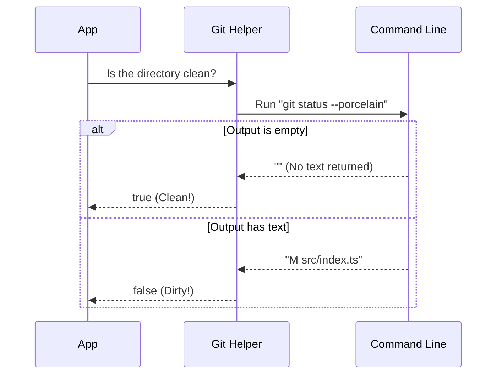

# Chapter 4: Git Context Awareness

Welcome to Chapter 4! In the previous chapter, [Precondition Verification](03_precondition_verification.md), we looked at the "Sensors" that check if the system is ready (like checking if the user is logged in).

Now, we need to look at the most important part of your project: **The Code itself.**

## The Motivation

Imagine you are working on a feature. You change 5 files on your laptop, but you haven't saved them to Git (committed) yet. You hit the "Run Remotely" button.

Here is the nightmare scenario:
1.  The system connects to the remote server.
2.  The remote server downloads your code from GitHub.
3.  **The Problem:** GitHub doesn't have your new changes yet! The remote server runs the *old* code.
4.  You stare at the screen, confused why your fix isn't working.

To prevent this, our system needs **Git Context Awareness**. It needs to look at your local folder and ask: "Is the user's code actually ready to be synced?"

## Core Concept: The Three States of Code

We can think of preparing your code for a remote session like **Mailing a Package**. There are three questions we must answer before the mailman takes it.

### 1. The Container (Is it a Git Repo?)
First, do you even have a box? You can't mail loose items.
*   **Concept:** We need to know if the current folder is initialized with Git (`git init`).
*   **Helper:** `checkIsInGitRepo()`

### 2. The Seal (Is it Clean?)
Is the box taped shut? If you have files that are modified but not committed, your box is "open." Contents might fall out or get lost during the trip.
*   **Concept:** A "Clean" directory means `git status` shows no modified files.
*   **Helper:** `checkIsGitClean()`

### 3. The Address (Does it have a Remote?)
Does the box have a destination label?
*   **Concept:** A "Remote" means your local Git repo is connected to a server like GitHub (`origin`).
*   **Helper:** `checkHasGitRemote()`

## Usage: Checking the States

Let's look at how we check these states using our helper functions.

### Checking for a Repository

This is the most basic check. It simply looks for a `.git` folder.

```typescript
import { checkIsInGitRepo } from 'remote/preconditions'

// Returns TRUE if we are inside a Git project
const hasBox = checkIsInGitRepo() 

if (!hasBox) {
  console.log("You must initialize Git first!")
}
```

### Checking for Unsaved Changes

This is crucial for data safety. We usually block remote sessions if the user has "dirty" (uncommitted) files, because we can't guarantee those changes will make it to the server safely.

```typescript
import { checkIsGitClean } from 'remote/preconditions'

async function validateSafety() {
  // Returns TRUE only if all changes are committed
  const isSealed = await checkIsGitClean()
  
  if (!isSealed) {
    console.log("Please commit your changes first.")
  }
}
```

### Checking for a Destination

Finally, we check if there is a link to GitHub.

```typescript
import { checkHasGitRemote } from 'remote/preconditions'

async function checkDestination() {
  // Returns TRUE if 'origin' exists
  const hasAddress = await checkHasGitRemote()
  
  return hasAddress
}
```

## Internal Implementation

How does the system actually know these things? It acts like a wrapper around the standard `git` command line tools you use every day.

### Visualizing the Inspection

When you call `checkIsGitClean`, the system has a conversation with the underlying OS.



### The Code Implementation

Let's peek under the hood at `remote/preconditions.ts`.

#### 1. The "Clean" Check

We use a helper `getIsClean`. Notice the option `ignoreUntracked: true`. This is a friendly setting: if you have a new file you haven't added yet, we generally don't stop you. We only care about *modified* files that track changes.

```typescript
// File: remote/preconditions.ts

export async function checkIsGitClean(): Promise<boolean> {
  // check if there are modifications to tracked files
  const isClean = await getIsClean({ ignoreUntracked: true })
  
  return isClean
}
```

#### 2. The "Repo" Check

This function is synchronous (no `async`) because it just looks at the file path string to see if it can find a root folder.

```typescript
// File: remote/preconditions.ts

export function checkIsInGitRepo(): boolean {
  // findGitRoot searches up the folder tree for .git/
  return findGitRoot(getCwd()) !== null
}
```

#### 3. The "Remote" Check

This check is smarter. It tries to detect details. If it finds details (like "owner: anthropics", "repo: claude"), it proves a remote exists.

```typescript
// File: remote/preconditions.ts

export async function checkHasGitRemote(): Promise<boolean> {
  // Try to parse the .git/config file
  const repository = await detectCurrentRepository()
  
  // If we found data, we have a remote!
  return repository !== null
}
```

## Putting it Together: The Safety Check

In [Session Eligibility Gatekeeper](02_session_eligibility_gatekeeper.md), we saw the "Bouncer." Now you understand exactly what the Bouncer is looking for when it asks about Git.

1.  **If `!checkIsInGitRepo()`**: Stop. We can't track code without Git.
2.  **If `!checkIsGitClean()`**: Warning. "You have uncommitted changes."
3.  **If `!checkHasGitRemote()`**: Logic branching.
    *   If we are in "Bundle Mode" (Fast Lane), we might proceed by zipping up your local files.
    *   If we are in "Standard Mode", we stop because we can't pull code from GitHub if there is no GitHub link.

## Summary

In this chapter, we learned:
1.  **Git Context Awareness** prevents us from running the wrong version of code remotely.
2.  We distinguish between an **Initialized Repo** (the box), a **Clean State** (the seal), and a **Remote Origin** (the address).
3.  We use helpers like `checkIsGitClean` to ensure the user has saved their work before teleporting.

Now we know the code is safe and ready. But wait—just because the code exists on GitHub (`checkHasGitRemote` is true), does that mean we are *allowed* to download it?

We need to check our permissions.

[Next Chapter: GitHub Repository Access](05_github_repository_access.md)

---

Generated by [Code IQ](https://github.com/adityasoni99/Code-IQ)