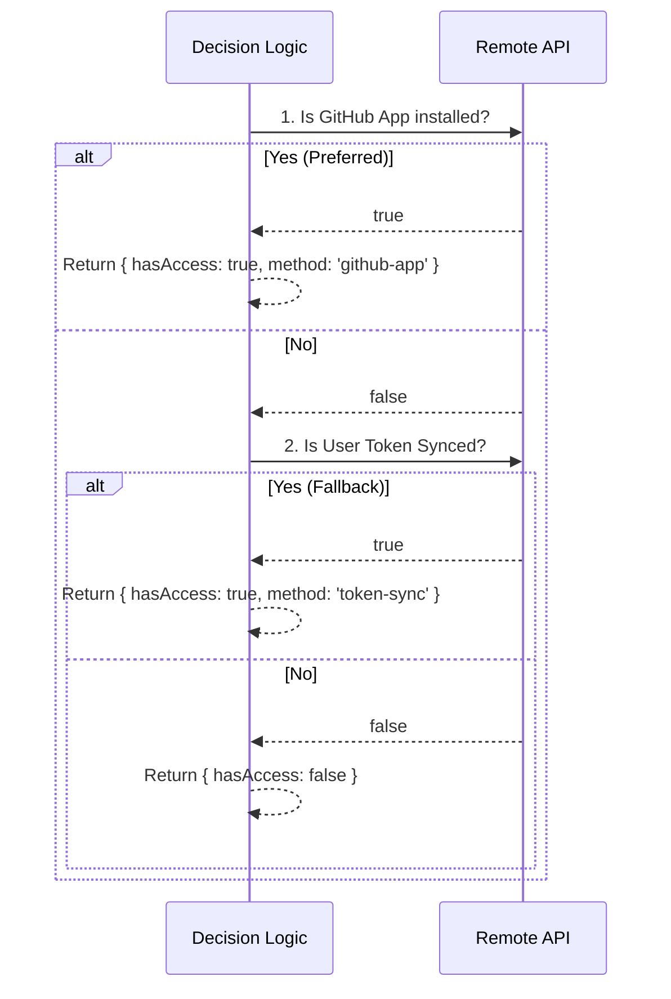

# Chapter 5: GitHub Repository Access

Welcome to the final chapter of our tutorial series!

In the previous chapter, [Git Context Awareness](04_git_context_awareness.md), we learned how to verify that our code is packed up and ready to ship. We ensured we have a "clean" Git status and a destination (Remote Origin).

However, having a destination isn't enough. Imagine driving a delivery truck to a secure warehouse. You know the address, but if you don't have the **Gate Key**, the security guard won't let you in.

In this chapter, we explore **GitHub Repository Access**: the logic that finds the right key to open the gate.

## The Motivation

You want to run a task remotely. The remote server needs to clone your code from GitHub to do this.
*   **Scenario:** You run `npm start` on a remote machine.
*   **The Barrier:** Your repository is private. Random servers cannot download it.
*   **The Goal:** We need to prove to GitHub that the remote server has permission to read your code.

We don't want the user to manually paste passwords every time. We want the system to automatically detect if it has permission.

## Core Concept: The Tiered Strategy

Our system uses a **Tiered Checking Strategy**. It's like having two different keys on your keychain. We try the best key first; if that doesn't work, we try the backup key.

### Priority 1: The GitHub App (The Master Key)
This is the preferred method. A GitHub App is installed directly on the repository.
*   **Pros:** It grants permissions to the *repo*, not just a specific user. It's stable and secure.
*   **Check:** "Is the `background` App installed on this repository?"

### Priority 2: User OAuth Token (The Visitor Pass)
If the App isn't installed, we check if *you* (the user) have authorized us personally via a web login.
*   **Pros:** Good for personal projects where you haven't installed the official App yet.
*   **Check:** "Has this user synced their personal GitHub token with us?"

## Usage: Checking Access

The main tool we use here is `checkRepoForRemoteAccess`. It handles the complexity of checking both keys for you.

### High-Level Example

Imagine you are writing the code that decides whether to launch the remote session. You just need to know if you can get in.

```typescript
import { checkRepoForRemoteAccess } from 'remote/preconditions'

async function validateAccess() {
  // Ask: Do we have access to "my-org/my-project"?
  const access = await checkRepoForRemoteAccess('my-org', 'my-project')
  
  if (access.hasAccess) {
    console.log(`Success! Using method: ${access.method}`)
  } else {
    console.log("Access Denied. Please install the GitHub App.")
  }
}
```

**What happens here?**
1.  **Input:** The repository owner and name.
2.  **Output:** An object telling us `true`/`false` and *how* we got in (`github-app` or `token-sync`).

## Internal Implementation

Now, let's look at how the decision is made under the hood.

### The Decision Flow

The system runs a sequence of checks. It stops as soon as it finds a working key.



### The Code Breakdown

The function `checkRepoForRemoteAccess` in `remote/preconditions.ts` acts as the coordinator.

```typescript
// File: remote/preconditions.ts

export async function checkRepoForRemoteAccess(
  owner: string,
  repo: string,
) {
  // 1. Try Priority 1: GitHub App
  if (await checkGithubAppInstalled(owner, repo)) {
    return { hasAccess: true, method: 'github-app' }
  }

  // 2. Try Priority 2: Token Sync (if feature is enabled)
  if (isFeatureEnabled() && await checkGithubTokenSynced()) {
    return { hasAccess: true, method: 'token-sync' }
  }

  // 3. Failure: No keys worked
  return { hasAccess: false, method: 'none' }
}
```

Now, let's look briefly at the two helper functions that do the heavy lifting.

#### Checking the GitHub App

This function calls our API, which in turn asks GitHub: "Is the App installed here?"

```typescript
// Inside checkGithubAppInstalled...

// We ask our API about this specific repo
const url = `${BASE_API_URL}/.../repos/${owner}/${repo}`

// We wait for the answer
const response = await axios.get(url, { headers })

// The API returns a status object
if (response.data.status) {
  return response.data.status.app_installed // true or false
}
```

#### Checking the User Token

This function asks our API: "Does the current user have a valid GitHub token connected to their account?"

```typescript
// Inside checkGithubTokenSynced...

// We check the user's sync status
const url = `${BASE_API_URL}/.../sync/github/auth`

const response = await axios.get(url, { headers })

// If is_authenticated is true, the user has synced their token
return response.data?.is_authenticated === true
```

## Summary

In this final chapter, we learned:
1.  **Repository Access** is the security gate ensuring the remote server can read your code.
2.  We use a **Tiered Strategy**: we prefer the **GitHub App** (Repository level), but fall back to the **User Token** (User level).
3.  The function `checkRepoForRemoteAccess` abstracts this complexity, giving us a simple yes/no answer.

### Tutorial Conclusion

Congratulations! You have navigated the entire architecture of the `background` remote task system.

1.  We started with the **Session Model** (the digital receipt).
2.  We met the **Gatekeeper** (the bouncer).
3.  We examined the **Sensors** (precondition verification).
4.  We learned to read **Git Context** (the package address).
5.  And finally, we solved **Repository Access** (the security keys).

You now understand the complete flow of how a local command safely "teleports" to a remote infrastructure! Happy coding!

---

Generated by [Code IQ](https://github.com/adityasoni99/Code-IQ)