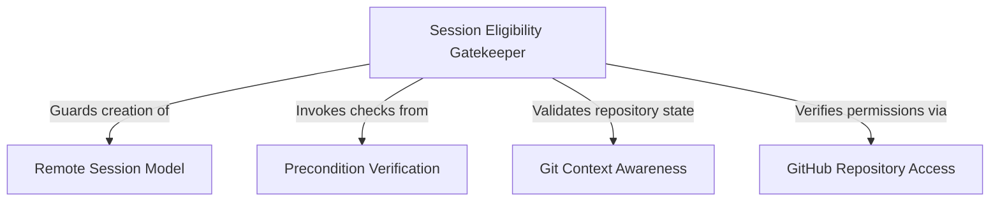

# Tutorial: background

This project manages the lifecycle and validation of **remote background sessions**, allowing users to execute long-running tasks in a cloud environment. It acts as a safety system that orchestrates a "pre-flight checklist" to verify **Git context**, *user authentication*, and GitHub permissions before authorizing the creation of a remote process handle.

## Chapters

1. [Remote Session Model](01_remote_session_model.md)
2. [Session Eligibility Gatekeeper](02_session_eligibility_gatekeeper.md)
3. [Precondition Verification](03_precondition_verification.md)
4. [Git Context Awareness](04_git_context_awareness.md)
5. [GitHub Repository Access](05_github_repository_access.md)

---

Generated by [Code IQ](https://github.com/adityasoni99/Code-IQ)