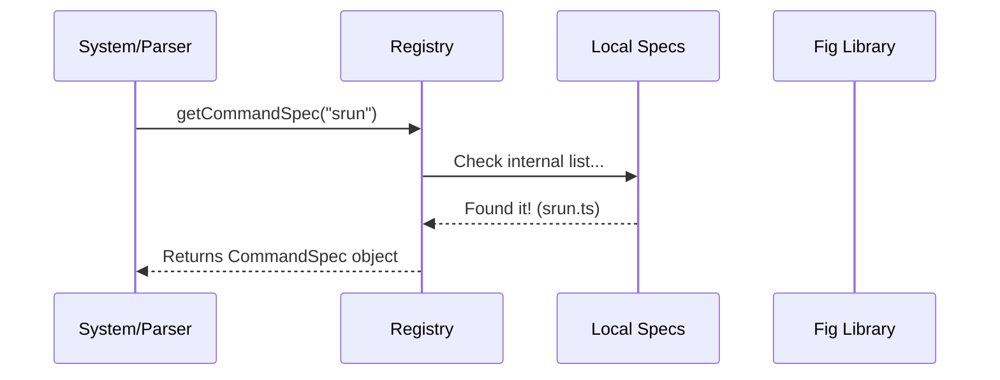

# Chapter 1: Command Semantic Registry (Specs)

Welcome to the first chapter of our journey into building a robust shell intelligence system!

## The Motivation: Why Syntax Isn't Enough

Imagine you are trying to understand a sentence in a foreign language. You might know the grammar (Subject -> Verb -> Object), but if you don't know the definitions of the words, you can't truly understand the meaning.

The same applies to shell commands. A basic parser sees a command line as a list of words. For example:

`timeout 5s echo "hello"`

To a "dumb" parser, this is just a list: `['timeout', '5s', 'echo', '"hello"']`.

**But we know better.** We know that:
1. `timeout` is a wrapper command.
2. `5s` is a duration argument for `timeout`.
3. `echo "hello"` is actually a **whole new command** running inside the first one!

If we want to build smart features (like autocomplete or deep parsing), we need a "Dictionary" that tells our system exactly what every command expects. We call this the **Command Semantic Registry**.

## What is a Command Spec?

A **Spec** (Specification) is like a user manual or a definition entry in our dictionary. It tells the system:
- The command's description.
- What arguments it accepts.
- Whether it accepts flags (like `-n` or `--help`).
- **Crucially:** Whether one of its arguments is actually *another command*.

### The Blueprint

Let's look at how we define a command in our system. We use TypeScript interfaces to create a blueprint.

```typescript
// From registry.ts
export type CommandSpec = {
  name: string
  description?: string
  args?: Argument | Argument[] // Positional arguments
  options?: Option[]           // Flags like -v or --force
}
```

This simple structure allows us to describe almost any CLI tool.

## A Concrete Example: The `timeout` Command

Let's solve the use case mentioned in the motivation. We need to tell the system that `timeout` takes a duration, and then a command.

Here is what the spec looks like in our code:

```typescript
// From specs/timeout.ts
const timeout: CommandSpec = {
  name: 'timeout',
  description: 'Run a command with a time limit',
  args: [
    {
      name: 'duration',
      isOptional: false,
    },
    {
      name: 'command',
      description: 'Command to run',
      isCommand: true, // <--- THE MAGIC SAUCE
    },
  ],
}
```

### Why is `isCommand: true` important?

The line `isCommand: true` is the most powerful part of this registry. It creates a recursive relationship.

When our parser (which we will build in [Chapter 3](03_robust_command_parsing__tree_sitter___ast_.md)) reads this spec, it realizes: *"Aha! After I read the duration, I should stop treating the rest as text strings and start parsing from scratch as a new command."*

This allows us to understand complex nesting like:
`sudo timeout 10s git commit`

## Under the Hood: The Registry

So, where do these specs live? They live in the **Registry**. Think of the Registry as the librarian. You give it a command name, and it finds the Spec for you.

It looks in two places:
1. **Internal Specs:** Hand-written specs we keep in our local `specs/` folder (like the `timeout` example above).
2. **Fig Autocomplete:** A massive open-source library of specs (so we don't have to write thousands of them manually).

### The Lookup Flow

Here is what happens when the system asks "What is `srun`?":



If it wasn't in our local folder, the Registry would try to import it dynamically from the Fig library.

### The Implementation

Let's look at the `getCommandSpec` function in `registry.ts`. We use a caching technique (memoization) so we don't have to look up the same command twice.

```typescript
// From registry.ts
export const getCommandSpec = memoizeWithLRU(
  async (command: string): Promise<CommandSpec | null> => {
    // 1. Check our internal manual specs first
    const internalSpec = specs.find(s => s.name === command) 
    if (internalSpec) return internalSpec

    // 2. Fallback: Try to load from external Fig library
    return (await loadFigSpec(command)) || null
  },
  (command: string) => command,
)
```

**Key Takeaway:** The `getCommandSpec` function ensures that whether a command is defined by us or by the community, the rest of our application gets a standardized `CommandSpec` object.

## Handling Options and Flags

Commands aren't just about positional arguments. They often have flags. Let's look at `srun` (a cluster job command), which is slightly more complex.

```typescript
// From specs/srun.ts
const srun: CommandSpec = {
  name: 'srun',
  options: [
    {
      name: ['-N', '--nodes'], // Can be short or long
      description: 'Number of nodes',
      args: { name: 'count' }, // The flag expects a value
    },
  ],
  // ... args definition
}
```

By defining `options`, we tell the system that if it sees `-N 4`, the `4` belongs to the `-N` flag, and isn't just a random word.

## Summary

In this chapter, we learned:
1.  **Syntax is distinct from Semantics:** Knowing *how* to read words isn't the same as knowing what they *mean*.
2.  **Specs:** We use declarative objects to define command behavior.
3.  **Recursive Parsing:** The `isCommand: true` property is essential for handling wrapper commands like `timeout`, `sudo`, or `watch`.
4.  **The Registry:** A central service that retrieves these definitions.

Now that our system understands *what* a command is, we need to understand the *context* in which it runs. To do that, we need to look at variables, aliases, and the current state of the shell.

[Next Chapter: Shell Environment Snapshotting](02_shell_environment_snapshotting.md)

---

Generated by [Code IQ](https://github.com/adityasoni99/Code-IQ)