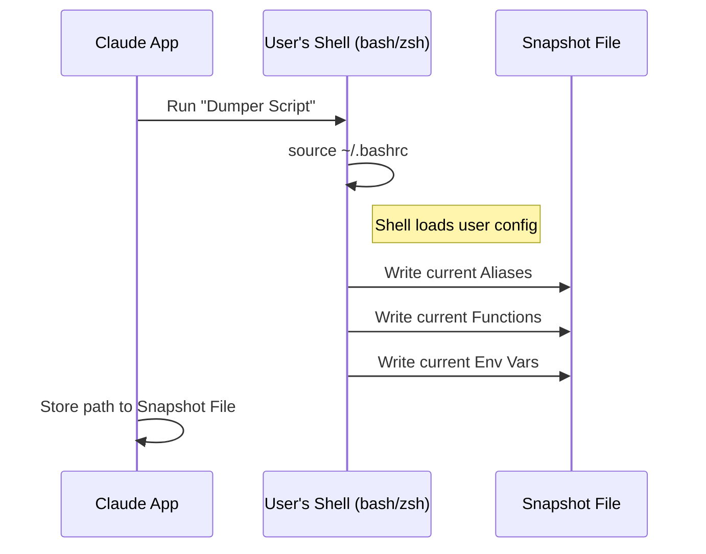

# Chapter 2: Shell Environment Snapshotting

In the [previous chapter](01_command_semantic_registry__specs_.md), we taught our system what commands *are* by building a dictionary (Registry).

Now, we face a new problem. Even if the system knows what `git` is, it doesn't know how **you** specifically use it.

## The Motivation: "It Works on My Machine"

Every developer has a unique setup. You might have:
1.  **Aliases:** `alias g='git'` or `alias ll='ls -la'`
2.  **Environment Variables:** `export API_KEY='secret123'`
3.  **Custom Functions:** A function `deploy()` that runs a complex script.

If our AI agent tries to run `g status` on your behalf, it will crash with `command not found: g`. The AI is like a guest entering your house; it doesn't know where the light switches are.

To fix this, we need **Shell Environment Snapshotting**.

## The Concept: The Photographer

Imagine a photographer entering a room (your terminal) and taking a high-resolution 360° photo.

Instead of trying to guess your configuration, our system:
1.  Starts a temporary shell.
2.  Loads your configuration file (like `.bashrc` or `.zshrc`).
3.  Asks the shell to "dump" everything it knows into a file.
4.  Saves this as a **Snapshot File**.

Whenever the AI wants to run a command later, it simply says: *"Load the snapshot file, then run the command."*

## The Strategy: How to "Dump" a Shell

We can't simply read your `.bashrc` file as text. Why? Because config files contain logic!

```bash
# .bashrc example
if [ -d "$HOME/bin" ]; then
    export PATH="$HOME/bin:$PATH"
fi
```

A text parser wouldn't know if that `if` statement is true or false.

**The Solution:** We must let the shell execute the config, and then ask the shell to report its final state.

### The Logic Flow

Here is how the snapshot process works:



## Implementation: Building the Dumper Script

We generate a small shell script dynamically using TypeScript. Let's look at how we handle the differences between shells (like Bash vs Zsh).

### Step 1: Detecting the Configuration File

First, we need to know where the user keeps their settings.

```typescript
// From ShellSnapshot.ts
function getConfigFile(shellPath: string): string {
  // If using zsh, look for .zshrc
  if (shellPath.includes('zsh')) return '.zshrc'
  
  // If using bash, look for .bashrc
  if (shellPath.includes('bash')) return '.bashrc'
  
  // Fallback
  return '.profile'
}
```

### Step 2: Dumping Functions

This is the tricky part. Bash and Zsh use different commands to list defined functions.

In **Zsh**, we use `typeset -f`. In **Bash**, we use `declare -f`.

```typescript
// Simplified from ShellSnapshot.ts
function getUserSnapshotContent(configFile: string): string {
  const isZsh = configFile.endsWith('.zshrc')
  let content = ''

  if (isZsh) {
    // Zsh specific command to dump functions
    content += `typeset -f >> "$SNAPSHOT_FILE"`
  } else {
    // Bash specific command to dump functions
    content += `declare -f >> "$SNAPSHOT_FILE"`
  }
  return content
}
```

*Explanation:* We are building a string of shell commands. When this runs, it appends the definition of every function in your memory to our `$SNAPSHOT_FILE`.

### Step 3: Dumping Aliases

Next, we want to capture shortcuts like `alias g='git'`.

```typescript
// Simplified from ShellSnapshot.ts
// We add this to our content string
content += `
  echo "# Aliases" >> "$SNAPSHOT_FILE"
  
  # List aliases, remove 'alias ' prefix, and re-format them
  alias | sed 's/^alias //g' | sed 's/^/alias -- /' >> "$SNAPSHOT_FILE"
`
```

*Explanation:* The `alias` command lists aliases. We use `sed` (stream editor) to format them so they can be easily re-read by another shell later.

### Step 4: Injecting Our Own Tools

Sometimes, we want to give the AI super-powers that the user *doesn't* have installed. For example, we might want to use a high-performance search tool like `ripgrep` (`rg`), even if the user doesn't have it.

We can inject this into the snapshot!

```typescript
// Simplified from ShellSnapshot.ts
export function createRipgrepShellIntegration() {
  const binaryPath = '/path/to/bundled/rg'
  
  // Create an alias inside the snapshot
  return { 
    type: 'alias', 
    snippet: `alias rg='${binaryPath}'` 
  }
}
```

Now, when the AI runs `rg`, it uses our bundled, high-speed version, but it feels native.

## Putting It All Together: The Execution

Finally, we run the script we just built. We use Node.js's `execFile` to run the shell and pass our script.

```typescript
// Simplified from ShellSnapshot.ts
export const createAndSaveSnapshot = async (binShell: string) => {
  // 1. Generate the script text
  const script = await getSnapshotScript(binShell, snapshotPath, true)
  
  // 2. Execute the shell with the script
  execFile(binShell, ['-c', script], {
    env: process.env,
    timeout: 10000 // Give it 10 seconds to finish
  }, (error) => {
    if (!error) console.log("Snapshot created!")
  })
}
```

## Using the Snapshot

Once this process is done, we have a file at `/tmp/snapshot-123.sh`.

Whenever the AI Agent needs to execute a command, it constructs a command line like this:

`source /tmp/snapshot-123.sh && g status`

Because we `source` the snapshot first:
1.  The alias `g` becomes available.
2.  The function `deploy` becomes available.
3.  The variable `API_KEY` is loaded.

The AI now acts exactly like you.

## Summary

In this chapter, we learned:
1.  **Context is King:** Knowing command syntax isn't enough; we need the user's environment.
2.  **Snapshotting:** We can't parse config files statically; we must execute them and capture the state.
3.  **Cross-Shell Compatibility:** We handle Bash and Zsh differences by generating specific dumping commands (`declare -f` vs `typeset -f`).
4.  **Injection:** We can inject our own tools into this environment effectively.

Now that we know *what* commands are (Chapter 1) and *where* they run (Chapter 2), we need to ensure we can parse complex, nested commands safely.

[Next Chapter: Robust Command Parsing (Tree-Sitter & AST)](03_robust_command_parsing__tree_sitter___ast_.md)

---

Generated by [Code IQ](https://github.com/adityasoni99/Code-IQ)