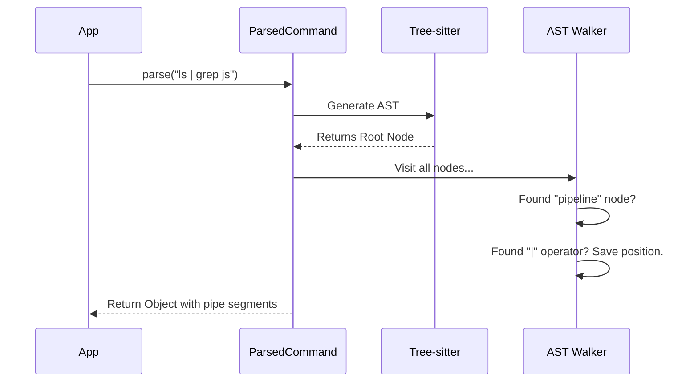

# Chapter 3: Robust Command Parsing (Tree-Sitter & AST)

In the [previous chapter](02_shell_environment_snapshotting.md), we learned how to snapshot the user's shell environment so we know *where* commands are running.

Now, we need to understand *what* the user is typing. You might think, "Can't we just split the string by spaces?"

This chapter explains why simple string splitting is dangerous and how we use a technology called **Tree-sitter** to parse commands like a true programming language compiler.

## The Motivation: The "Semicolon" Problem

Let's look at a simple problem. In Bash, the semicolon `;` separates two commands.

`echo hello; echo world` -> Runs `echo hello`, then runs `echo world`.

But what about this?

`git commit -m "Fix: typo; added tests"`

If we use a simple **Regular Expression (Regex)** to split by `;`, the computer thinks:
1.  Command 1: `git commit -m "Fix: typo`
2.  Command 2: `added tests"`

**This is wrong!** The semicolon is inside quotes, so it is just text, not a separator.

To solve this, we can't just look at characters; we need to understand the **grammar** of the command. We need to know where quotes start and end, and which parts are arguments versus operators.

## Concept: The Abstract Syntax Tree (AST)

To understand grammar, we use an **Abstract Syntax Tree (AST)**. Think of it like diagramming a sentence in English class.

Instead of a flat list of words, we turn the command into a tree structure.

**Input:** `echo "hello"`

**The AST:**
*   **Root Program**
    *   **Command Node**
        *   **Name:** `echo`
        *   **Argument:** `"hello"` (Type: String)

By looking at the "Type", we know that `"hello"` is a string. If there is a semicolon inside it, the parser knows it belongs to the string, not the program structure.

## The Tool: Tree-sitter

We use a library called **Tree-sitter**. It is an incremental parser that is incredibly fast and robust. It generates the AST for us.

We wrap this complexity in a unified interface called `IParsedCommand`. This ensures that the rest of our app doesn't need to know *how* parsing happens, just that it works.

### The Unified Interface

Here is the blueprint that any parsed command in our system must follow:

```typescript
// From ParsedCommand.ts
export interface IParsedCommand {
  readonly originalCommand: string
  // Returns the command split by pipes (|)
  getPipeSegments(): string[] 
  // Identifies file redirects like > output.txt
  getOutputRedirections(): OutputRedirection[]
  // Returns deep security analysis (if available)
  getTreeSitterAnalysis(): TreeSitterAnalysis | null
}
```

## How It Works: The Factory

We don't want to force our system to always rely on Tree-sitter (which uses WebAssembly), in case it fails to load. We use a "Factory" pattern that tries the smart parser first, and falls back to a "dumb" Regex parser if needed.

```typescript
// From ParsedCommand.ts (Simplified)
export const ParsedCommand = {
  parse: async (command: string): Promise<IParsedCommand | null> => {
    // 1. Try to use the smart Tree-sitter parser
    if (await getTreeSitterAvailable()) {
       const ast = await parseWithTreeSitter(command)
       if (ast) return new TreeSitterParsedCommand(ast)
    }

    // 2. Fallback: Use simple Regex if Tree-sitter fails
    return new RegexParsedCommand_DEPRECATED(command)
  }
}
```

*Explanation:* This function is the entry point. It acts like a traffic controller, directing the command to the best available parser.

## Internal Implementation: Walking the Tree

Once Tree-sitter gives us the AST, we need to extract useful information. We do this by "Walking" the tree—visiting every branch and leaf to find what we need.

Let's trace how we find pipelines (e.g., `ls | grep js`).



### Code: Finding Pipes in the AST

Here is how we look for pipe characters `|` specifically within the correct grammar structure (ensuring they aren't inside quotes).

```typescript
// From ParsedCommand.ts (Simplified)
function extractPipePositions(rootNode: Node): number[] {
  const pipePositions: number[] = []
  
  // Recursively visit every node in the tree
  visitNodes(rootNode, node => {
    // We only care if the grammar says this is a Pipe Operator
    if (node.type === '|') {
      pipePositions.push(node.startIndex)
    }
  })
  
  return pipePositions.sort((a, b) => a - b)
}
```

*Explanation:* `visitNodes` is a helper that goes through the entire tree. Because Tree-sitter has already done the hard work of labeling the nodes, we just have to ask: "Is this node a pipe operator?" If yes, we record its location.

## Advanced Analysis: Quote Scopes

One of the hardest things in parsing shells is **Nested Quotes**.

Example: `echo "My name is $(echo 'Bond')"`

*   Outer quotes: Double `"`
*   Inner quotes: Single `'`

Regex fails spectacularly here. Tree-sitter handles it natively.

```typescript
// From treeSitterAnalysis.ts (Simplified)
function collectQuoteSpans(node: Node, out: QuoteSpans): void {
  // If we find a single-quote string node
  if (node.type === 'raw_string') {
     out.raw.push([node.startIndex, node.endIndex])
     return // Stop looking inside (it's literal text)
  }
  
  // If we find a double-quote string node
  if (node.type === 'string') {
     out.double.push([node.startIndex, node.endIndex])
     // Keep looking inside! Double quotes can contain variables ($VAR)
  }

  // Check children nodes
  for (const child of node.children) collectQuoteSpans(child, out)
}
```

*Explanation:* This logic allows us to "sanitize" commands. If we want to know if a command is safe, we might want to ignore everything inside single quotes (since that code won't execute), but we *do* need to check inside double quotes (since `$()` can execute code there).

## Handling Dangerous Patterns

Because we understand the structure, we can detect dangerous things without false positives.

```typescript
// From treeSitterAnalysis.ts (Simplified)
export function extractDangerousPatterns(rootNode: Node) {
  let hasCommandSubstitution = false // e.g. $(...) or `...`

  function walk(node: Node) {
    if (node.type === 'command_substitution') {
      hasCommandSubstitution = true
    }
    // Continue walking children...
    for (const child of node.children) walk(child)
  }
  
  walk(rootNode)
  return { hasCommandSubstitution }
}
```

*Explanation:* A Regex might think `echo "Use $(..)"` looks like a command substitution. But what if the user typed `echo 'Use $(..)'` in single quotes? The AST knows that the second one is harmless text, while the first one executes code.

## Summary

In this chapter, we learned:
1.  **Regex is Fragile:** Simple string matching fails when commands get complex (nested quotes, semicolons in strings).
2.  **AST:** We use an Abstract Syntax Tree to understand the *grammar* of the command, not just the text.
3.  **Tree-sitter:** The engine that builds the AST for us.
4.  **Fallback Strategy:** We wrap everything in `IParsedCommand` so we can fall back to Regex if Tree-sitter isn't available.

Now that we can parse a command safely, we often need to figure out exactly *what* command acts as the "wrapper" (like `sudo` or `time`) and what is the "actual" command being run.

[Next Chapter: Command Prefix Extraction](04_command_prefix_extraction.md)

---

Generated by [Code IQ](https://github.com/adityasoni99/Code-IQ)