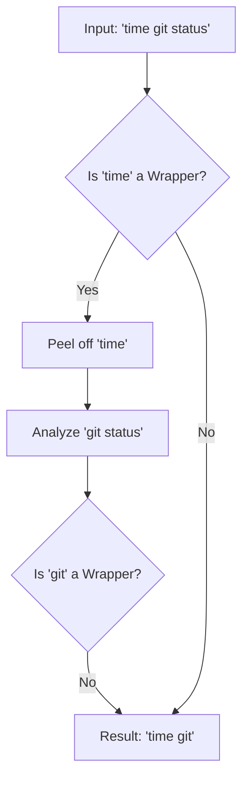

# Chapter 4: Command Prefix Extraction

In [Chapter 3: Robust Command Parsing](03_robust_command_parsing__tree_sitter___ast_.md), we learned how to turn a raw string of text into a structured tree (AST). We can now read the command safely.

However, reading the command isn't enough. We need to identify the **intent**.

## The Motivation: Peeling the Onion

Imagine you have a rule: *"Developers are allowed to run `git status`."*

If a developer runs:
`nice -n 10 git status`

A dumb system might say: *"Access Denied. You are running `nice`, not `git`."*

This is the problem of **Wrapper Commands**. Tools like `sudo`, `time`, `watch`, or `npm run` are just delivery vehicles. The "real" command is inside them. To apply security policies effectively, we need to peel back these layers to find the command's true identity.

## The Concept: Command Prefix

The **Command Prefix** is the canonical identity of a command.

*   **Input:** `sudo -E git commit -m "WIP"`
*   **The Noise:** `-E` (sudo flags), `-m "WIP"` (git arguments).
*   **The Prefix:** `sudo git commit`

By extracting this prefix, we can check our permission rules against a clean, standardized string, ignoring variable arguments like commit messages or file paths.

## How It Works: Recursive Discovery

We use the **Command Semantic Registry** (from [Chapter 1](01_command_semantic_registry__specs_.md)) to guide us.

When the system sees `sudo git status`:
1.  It looks up `sudo` in the Registry.
2.  The Spec for `sudo` says: *"My first argument is actually another command."*
3.  The system "steps inside" `sudo` and looks at `git`.
4.  It looks up `git`. The Spec says: *"I am a command, and `status` is my subcommand."*
5.  It combines them to form the identity: `sudo git status`.

### Visualizing the Logic



## Internal Implementation

The core logic lives in `prefix.ts`. The main function is `getCommandPrefixStatic`. It works recursively (a function that calls itself).

### Step 1: Parsing & Checking the Spec

First, we parse the command to separate the program name from its arguments. Then, we check our dictionary (Registry) to see if this program is a wrapper.

```typescript
// From prefix.ts
export async function getCommandPrefixStatic(command: string): Promise<Result | null> {
  // 1. Parse the command string (using logic from Chapter 3)
  const parsed = await parseCommand(command)
  const [cmd, ...args] = extractCommandArguments(parsed.commandNode)

  // 2. Check the Registry (from Chapter 1) for the Command Spec
  const spec = await getCommandSpec(cmd)

  // 3. Determine if this command wraps another command
  // (e.g., does it have an argument marked `isCommand: true`?)
  const isWrapper = spec?.args && spec.args.some(arg => arg?.isCommand)

  // 4. If it is a wrapper, peel it! If not, just build the prefix.
  return isWrapper
    ? await handleWrapper(cmd, args)
    : await buildPrefix(cmd, args, spec)
}
```

*Explanation:* We act like a detective. We ask the Spec: "Are you hiding another command inside you?" If the answer is yes (`isWrapper`), we dig deeper.

### Step 2: Digging Deeper (Recursion)

If we find a wrapper, we need to find *where* the inner command starts.

```typescript
// From prefix.ts (Simplified)
async function handleWrapper(command: string, args: string[]): Promise<string | null> {
  const spec = await getCommandSpec(command)

  // Find which argument index holds the inner command
  // e.g. for `sudo`, the inner command is usually the first argument
  const cmdIndex = spec.args.findIndex(arg => arg.isCommand)

  // Take the rest of the string starting from that argument
  const innerCommandString = args.slice(cmdIndex).join(' ')

  // RECURSION: Call the main function again on the inner part!
  const innerResult = await getCommandPrefixStatic(innerCommandString)

  // Combine the wrapper name with the inner result
  // Input: "sudo git", Inner Result: "git" -> Output: "sudo git"
  return `${command} ${innerResult.commandPrefix}`
}
```

*Explanation:* This is the magic loop. If we see `time sudo git`, the function calls itself three times:
1.  `time` wraps `sudo`...
2.  `sudo` wraps `git`...
3.  `git` wraps nothing. Stop.

### Step 3: Handling Compound Commands

What about commands joined by `&&` or `||`?
Example: `git fetch && git merge`

We need to know the identity of *both* parts to ensure the whole line is safe.

```typescript
// From prefix.ts (Simplified)
export async function getCompoundCommandPrefixesStatic(command: string): Promise<string[]> {
  // 1. Split by operators (&&, ||, ;)
  const subcommands = splitCommand_DEPRECATED(command)

  // 2. Calculate prefix for every single part
  const prefixes = []
  for (const sub of subcommands) {
    const result = await getCommandPrefixStatic(sub.trim())
    if (result) prefixes.push(result.commandPrefix)
  }

  // 3. Return the unique prefixes found
  return prefixes // e.g. ["git fetch", "git merge"]
}
```

## Formatting the Output

Sometimes the "raw" command isn't what we want to display to the user. We might want to quote paths to ensure they are valid copy-pasteable commands.

We use `shellPrefix.ts` to make the output pretty.

```typescript
// From shellPrefix.ts
export function formatShellPrefixCommand(prefix: string, command: string): string {
  // Check if there is a wrapper part (like "/bin/bash -c")
  const spaceBeforeDash = prefix.lastIndexOf(' -')
  
  if (spaceBeforeDash > 0) {
    // Quote the executable path, leave flags alone
    const exec = prefix.substring(0, spaceBeforeDash)
    return `${quote([exec])} ${prefix.substring(spaceBeforeDash + 1)}`
  }
  
  return quote([prefix])
}
```

*Explanation:* If the command is `/Program Files/Git/bin/git`, we ensure it becomes `'Program Files/Git/bin/git'` so spaces in the path don't break the shell.

## Summary

In this chapter, we learned:
1.  **Identity over Syntax:** Security rules care about *what* runs, not *how* it's typed.
2.  **Wrappers are Transparent:** We can look through commands like `sudo` to see the payload inside.
3.  **Recursive Logic:** We use the Registry specs to peel back layers of commands until we hit the core tool.
4.  **Compound Support:** We handle complex chained commands (`&&`, `|`) by analyzing each segment individually.

Now that we have extracted the **Core Identity** of the command, we can perform the most critical step: ensuring the arguments passed to that command aren't malicious.

[Next Chapter: Security & Tokenization Sanitization](05_security___tokenization_sanitization.md)

---

Generated by [Code IQ](https://github.com/adityasoni99/Code-IQ)