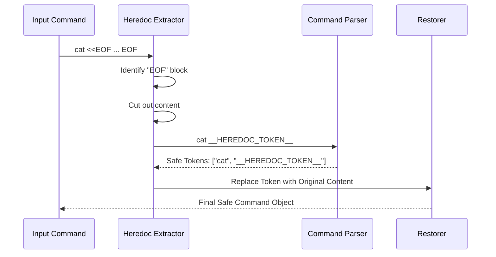

# Chapter 6: Heredoc Extraction & Restoration

In [Chapter 5: Security & Tokenization Sanitization](05_security___tokenization_sanitization.md), we built a "Security Guard" that inspects command arguments to ensure they are safe. We learned how to handle quotes and semicolons.

However, there is one feature in Bash that breaks almost every standard parser: **The Here Document** (Heredoc).

## The Motivation: The "Impossible" String

Imagine you want to create a file with multiple lines of text. In Bash, you often use a Heredoc, which looks like this:

```bash
cat <<EOF > config.txt
User: admin
Port: 8080
EOF
```

To a human, this is clear: "Write everything between the two `EOF` markers into `config.txt`."

To a standard parser (like the one we built in Chapter 5), this is a nightmare. It sees newlines, spaces, and weird symbols (`<<`) mixed together. It doesn't know where the command ends and the text begins. It often incorrectly splits the text into separate arguments, destroying the file's content.

We need a way to **safely remove** this complex block, parse the command, and then **put it back**.

## The Concept: The Fragile Letter

Think of a Heredoc as a **fragile, handwritten letter** inside a business envelope.

We need to scan the envelope to see where it's going (the command arguments), but the scanning machine might rip the letter (the Heredoc content) apart.

**Our Strategy:**
1.  **Extraction:** We carefully take the letter out of the envelope before scanning.
2.  **Placeholder:** We put a sturdy cardboard placeholder (e.g., `__HEREDOC_1__`) in the envelope.
3.  **Parsing:** We scan the envelope. The scanner sees `cat __HEREDOC_1__ > config.txt`. This is easy to parse!
4.  **Restoration:** Once safe, we swap the cardboard back for the original letter.

## The Abstraction: Pre-Process & Post-Process

This logic lives in `heredoc.ts`. It acts as a wrapper around our parsing logic.

### High-Level Flow



## Implementation: How It Works

Let's break down the code in `heredoc.ts`.

### Step 1: Generating Safe Placeholders

First, we need a placeholder that a user would never type by accident. We use "Salt" (random characters) to ensure uniqueness.

```typescript
// From heredoc.ts
function generatePlaceholderSalt(): string {
  // Generate random hex string (e.g., "a1b2c3d4")
  return randomBytes(8).toString('hex')
}
```

*Explanation:* If we just used `__HEREDOC__`, a malicious user could type that word to confuse our system. Adding random characters makes it unique for every command.

### Step 2: The Extraction Logic

This is the most complex part. We need to find the `<<` operator and the delimiter (like `EOF`), then find the matching closing line.

```typescript
// From heredoc.ts (Simplified)
export function extractHeredocs(command: string) {
  // 1. Quick check: Is there even a heredoc here?
  if (!command.includes('<<')) {
    return { processedCommand: command, heredocs: new Map() }
  }

  // 2. Setup storage for the extracted content
  const heredocs = new Map<string, HeredocInfo>()
  const salt = generatePlaceholderSalt()
  
  // ... (Complex scanning logic follows) ...
}
```

*Explanation:* We perform a quick check first for performance. If there are no `<<` symbols, we return immediately.

### Step 3: Finding the Boundaries

We iterate through the string to find the start and end of the Heredoc.

```typescript
// From heredoc.ts (Simplified Conceptual Logic)
while ((match = findNextHeredocOperator(command))) {
  const delimiter = match.delimiter // e.g., "EOF"
  
  // Find the line that matches "EOF" exactly
  const closingIndex = findClosingLine(command, delimiter)
  
  // Cut out the text
  const fullContent = command.slice(match.start, closingIndex)
  
  // Create the placeholder
  const placeholder = `__HEREDOC_${index}_${salt}__`
}
```

*Explanation:* We look for the delimiter key (like `EOF`). Then we scan forward until we find a line that contains *only* that key. Everything in between is the content we want to protect.

### Step 4: Swapping for Placeholders

Once we identify the block, we replace it in the string.

```typescript
// From heredoc.ts (Simplified)
// processedCommand starts as the original string
heredocs.set(placeholder, info)

processedCommand = 
  processedCommand.slice(0, start) + 
  placeholder + 
  processedCommand.slice(end)
```

*Explanation:* We slice the string. We keep the beginning, insert our `__HEREDOC_...__` token, and then append the rest of the string. The dangerous multi-line text is now safely stored in the `heredocs` Map.

### Step 5: Restoration

After the system has parsed the command (checked permissions, split arguments, etc.), we put the original text back.

```typescript
// From heredoc.ts
export function restoreHeredocs(
  parts: string[], 
  heredocs: Map<string, HeredocInfo>
): string[] {
  // Go through every argument in the parsed command
  return parts.map(part => {
    // If this part contains a placeholder, swap it back!
    for (const [placeholder, info] of heredocs) {
      part = part.replaceAll(placeholder, info.fullText)
    }
    return part
  })
}
```

*Explanation:* We loop through the tokens. If we see our secret placeholder, we look it up in our Map and paste the original text back in.

## Security Considerations

Heredocs are tricky because they can contain variables that execute code!

Example:
```bash
cat <<EOF
Current Date: $(date)
EOF
```

The `$(date)` part will actually run.

Our extractor checks for quoted delimiters.
*   `<<EOF` -> **Unsafe.** Variables inside are expanded (executed).
*   `<<'EOF'` -> **Safe.** Everything inside is treated as raw text.

In `heredoc.ts`, we handle these cases carefully to ensure we don't accidentally hide malicious commands inside a Heredoc during the extraction process.

## Summary

In this chapter, we solved the problem of multi-line input:

1.  **Complexity:** Heredocs break standard parsing because they don't follow normal syntax rules.
2.  **Extraction:** We act as a pre-processor, cutting out the complex blocks.
3.  **Placeholders:** We replace them with safe, unique tokens (`__HEREDOC_...__`).
4.  **Restoration:** After parsing is done, we put the content back.

This concludes our deep dive into the Parsing Pipeline!

We started with a **Registry** of commands, **Snapshot** the environment, **Parsed** the syntax tree, **Extracted** the command identity, **Sanitized** the arguments, and finally handled complex **Heredocs**.

Your system is now capable of reading, understanding, and securing shell commands like a pro.

[Back to Chapter 1: Command Semantic Registry](01_command_semantic_registry__specs_.md)

---

Generated by [Code IQ](https://github.com/adityasoni99/Code-IQ)