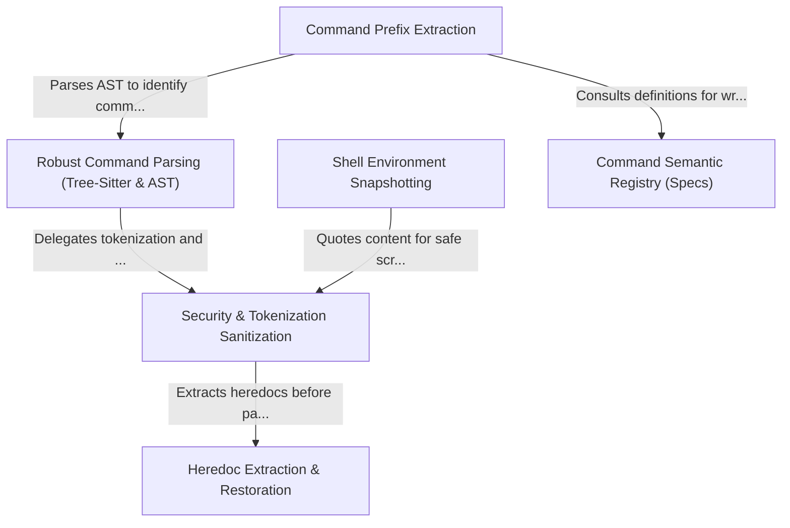

# Tutorial: bash

This project implements a secure and robust layer for interpreting and executing **shell** commands, designed to let an AI agent act safely on a user's behalf. It leverages **Tree-Sitter** to build an Abstract Syntax Tree (AST) for deep syntactic understanding, while a **Registry** defines the specific behavior and arguments of commands. To ensure security and reliability, the system performs rigorous **Sanitization**, handles complex **Heredoc** structures, and captures a **Snapshot** of the user's environment to preserve aliases and configurations.

## Chapters

1. [Command Semantic Registry (Specs)](01_command_semantic_registry__specs_.md)
2. [Shell Environment Snapshotting](02_shell_environment_snapshotting.md)
3. [Robust Command Parsing (Tree-Sitter & AST)](03_robust_command_parsing__tree_sitter___ast_.md)
4. [Command Prefix Extraction](04_command_prefix_extraction.md)
5. [Security & Tokenization Sanitization](05_security___tokenization_sanitization.md)
6. [Heredoc Extraction & Restoration](06_heredoc_extraction___restoration.md)

---

Generated by [Code IQ](https://github.com/adityasoni99/Code-IQ)