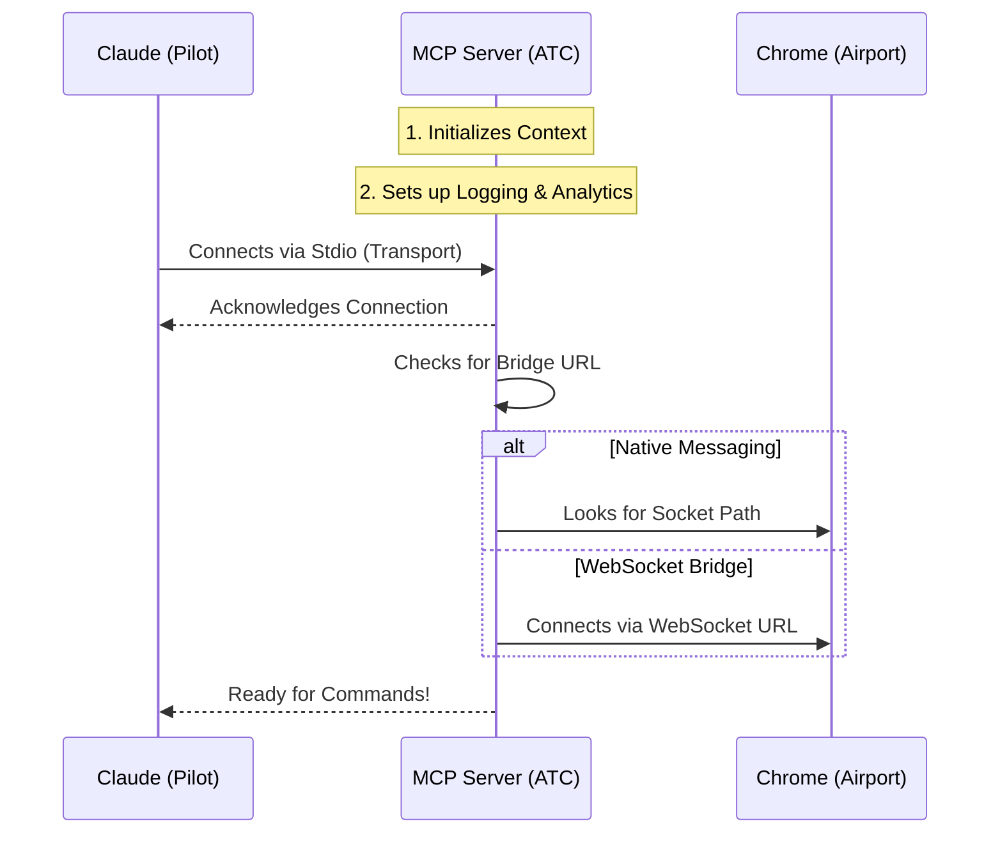

# Chapter 1: MCP Server Context

Welcome to the **Claude in Chrome** project! If you are new here, don't worry—we are going to build this understanding block by block.

## The Motivation: The Air Traffic Control Tower

Imagine Claude (the AI) is a **Pilot** flying a plane, and the Chrome Browser is the **Airport** where the plane needs to land.

The Pilot can't just yell out the window to the ground crew. They need a system to communicate effectively. They need an **Air Traffic Control (ATC)** tower to manage the radio frequencies, check the weather (status), and ensure instructions are received clearly.

In our project, the **MCP Server Context** is that Air Traffic Control tower.

### The Core Use Case
We want to allow Claude to send a command like "Click the 'Login' button" to Chrome.
**The Problem:** Claude runs on a server, and Chrome runs on your desktop. They don't speak the same language or live in the same place.

**The Solution:** We create a "Context" (a configuration object) that initializes a server. This server acts as the bridge, holding the state of the connection and routing messages back and forth.

## Key Concepts

Before we look at the code, let's understand the three main components of this chapter:

1.  **The Context Object:** This is the rulebook. It tells the server what its name is, how to log errors, and where to find the secure connection socket.
2.  **The Transport:** This is the radio frequency. We use "Stdio" (Standard Input/Output) so Claude can talk to our code via the command line.
3.  **The Bridge:** The actual pathway (WebSocket or Native Messaging) that sends data to the browser.

## How It Works: Building the Context

Let's look at how we build this "brain" in code. We will look at `mcpServer.ts`.

### Step 1: Defining the Logger
The server needs a voice to report what is happening. We create a simple logger that helps us debug issues.

```typescript
// A simple logger implementation
class DebugLogger implements Logger {
  info(message: string, ...args: unknown[]): void {
    // logs information to the debug console
    logForDebugging(format(message, ...args), { level: 'info' })
  }
  // ... other methods like warn() and error()
}
```
*Explanation: This `DebugLogger` is passed into our context so the server can shout "Hey, I'm connected!" or "Something went wrong!"*

### Step 2: Creating the Context Object
This is the most important part. We create a function `createChromeContext` that bundles our settings.

```typescript
export function createChromeContext(): ClaudeForChromeContext {
  const logger = new DebugLogger()
  
  return {
    serverName: 'Claude in Chrome', // Who are we?
    logger,                         // How do we talk?
    socketPath: getSecureSocketPath(), // Where is the pipe to Chrome?
    clientTypeId: 'claude-code',    // Who is using this?
    // ... event handlers below
  }
}
```
*Explanation: We return an object defining the server's identity. `socketPath` is crucial—it points to the specific file location used to talk to the [Native Messaging Host](03_native_messaging_host.md).*

### Step 3: Handling Events
The context also defines what to do when specific things happen, like a disconnection.

```typescript
    // Inside the return object of createChromeContext...
    onToolCallDisconnected: () => {
      return `Browser extension is not connected. 
              Please ensure the extension is installed and running.`
    },
    onExtensionPaired: (deviceId, name) => {
      logger.info(`Paired with "${name}"`)
      // Saves the pairing config so we remember this browser
    },
```
*Explanation: If the "radio signal" is lost, `onToolCallDisconnected` provides a helpful error message to Claude. If we connect successfully, `onExtensionPaired` logs it.*

### Step 4: Running the Server
Finally, we have the `runClaudeInChromeMcpServer` function. This turns on the lights in the ATC tower.

```typescript
export async function runClaudeInChromeMcpServer(): Promise<void> {
  // 1. Create the rulebook (Context)
  const context = createChromeContext()

  // 2. Create the Server using that context
  const server = createClaudeForChromeMcpServer(context)
  
  // 3. Define how we listen (Standard Input/Output)
  const transport = new StdioServerTransport()
```
*Explanation: We initialize the context, create the server instance, and prepare the transport layer.*

```typescript
  // 4. Connect and Start
  logForDebugging('[Claude in Chrome] Starting MCP server')
  await server.connect(transport)
  logForDebugging('[Claude in Chrome] MCP server started')
}
```
*Explanation: `server.connect(transport)` is the moment the server goes live and starts listening for instructions from Claude.*

## Internal Implementation: Under the Hood

When you run this code, a sequence of events triggers to establish the communication bridge.

### The Setup Sequence

Here is what happens the moment the `mcpServer.ts` file is executed:



### Deep Dive: The Bridge Decision
In the file `mcpServer.ts`, you might notice logic regarding `getChromeBridgeUrl()`.

The Context is smart. It decides **how** to talk to Chrome based on your environment:

1.  **Native Messaging:** This is the default for most users. It uses a file socket on your computer. We will cover this in detail in [Native Messaging Host](03_native_messaging_host.md).
2.  **WebSocket Bridge:** For internal users (Anthropics employees) or specific configurations, it might connect over the internet via `wss://bridge.claudeusercontent.com`.

The code handles this automatically:

```typescript
function getChromeBridgeUrl(): string | undefined {
  // Check if we should use the web bridge
  const bridgeEnabled = process.env.USER_TYPE === 'ant' 

  if (!bridgeEnabled) {
    return undefined // Use Native Messaging instead
  }
  return 'wss://bridge.claudeusercontent.com'
}
```
*Explanation: If the bridge isn't enabled, it returns `undefined`. The `createChromeContext` function sees this and defaults to using `socketPath` (Native Messaging).*

## Conclusion

You have successfully set up the **MCP Server Context**! You now have a running server that acts as the brain of the operation. It knows who it is, how to log errors, and has selected a method (Socket or WebSocket) to talk to the browser.

However, a brain is useless without thoughts. The server needs to know *what* to say to the AI to help it understand how to browse the web.

[Next Chapter: AI System Instructions](02_ai_system_instructions.md)

---

Generated by [Code IQ](https://github.com/adityasoni99/Code-IQ)