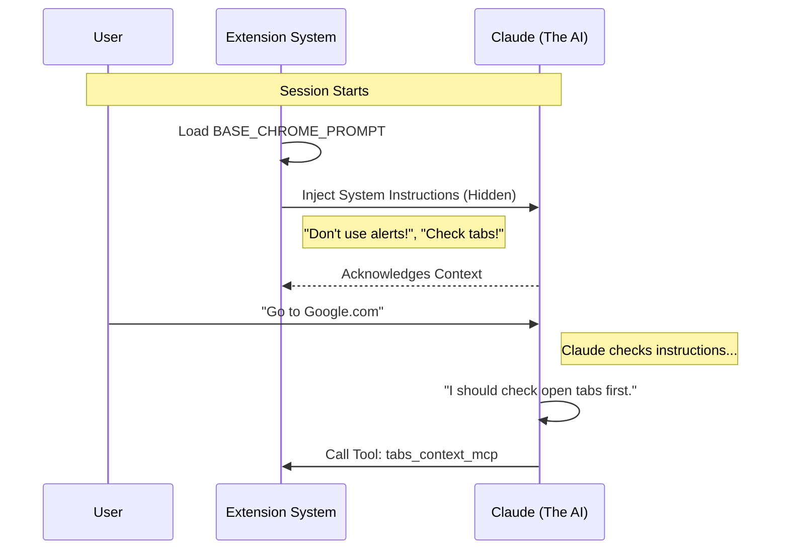

# Chapter 2: AI System Instructions

Welcome back! In the previous chapter, [MCP Server Context](01_mcp_server_context.md), we built the "brain" and the "ears" of our server. We established a way for Claude to talk to our code.

But having a connection isn't enough. If you hired a new intern and sat them at a desk without any instructions, they wouldn't know what to do—or worse, they might accidentally delete important files!

In this chapter, we will write the **AI System Instructions**.

## The Motivation: The Employee Handbook

**The Use Case:**
Imagine you ask Claude: *"Record a GIF of you logging into my test account."*

**The Problem:**
Without specific instructions, Claude interacts with the browser like a generic text bot. It might:
1.  Forget to wait for the page to load before recording.
2.  Click a button that triggers a "Are you sure?" popup, which freezes the browser and breaks the connection.
3.  Get stuck in a loop clicking the same button 50 times.

**The Solution:**
We create a **System Prompt**. Think of this as the **Standard Operating Procedures (SOP)** or the "Employee Handbook" we hand to Claude the moment the session starts. It defines safety rules, best practices, and "personality" traits for browser automation.

## Key Concepts

We define these instructions in a file called `prompt.ts`. There are three main areas we need to cover in our handbook:

1.  **Safety Guardrails:** Preventing Claude from breaking the browser (e.g., handling popups).
2.  **State Management:** Teaching Claude how to handle tabs (don't reuse old IDs).
3.  **Tool Guidance:** Specific tips on how to use complex tools (like the GIF recorder).

## Writing the Rules

Let's look at how we define these rules in code. We are essentially writing a long text string that gets fed to the AI.

### 1. The Base Prompt
This sets the stage. It tells Claude, "You are now a browser automation expert."

```typescript
// prompt.ts
export const BASE_CHROME_PROMPT = `# Claude in Chrome browser automation

You have access to browser automation tools... 
Follow these guidelines for effective browser automation.

## GIF recording
When performing multi-step interactions... use mcp__gif_creator.
You must ALWAYS:
* Capture extra frames before/after actions
* Name the file meaningfully (e.g., "login_process.gif")
`
```
*Explanation: We give clear instructions. For GIFs, we explicitly tell Claude to "Capture extra frames" so the video isn't jerky.*

### 2. The "Don't Touch That!" Rule (Alerts)
Browsers have "modal dialogs" (like `alert()` or `confirm()`). These are dangerous for automation because they block the entire browser until clicked. If Claude triggers one, our extension stops listening.

```typescript
/* Inside BASE_CHROME_PROMPT string */
`
## Alerts and dialogs

IMPORTANT: Do not trigger JavaScript alerts, confirms, or prompts.
These browser dialogs block all further browser events...

1. Avoid clicking buttons that trigger alerts
2. If you must, warn the user first
3. Use mcp__javascript_tool to check for dialogs
`
```
*Explanation: We explicitly warn Claude. If it sees a "Delete Account" button that usually asks "Are you sure?", it knows to be careful or check for dialogs first.*

### 3. Managing Tabs (Context)
One of the most common errors in browser automation is trying to click a button on a tab that was closed 5 minutes ago.

```typescript
/* Inside BASE_CHROME_PROMPT string */
`
## Tab context and session startup

IMPORTANT: At the start... call mcp__tabs_context_mcp first.
Never reuse tab IDs from a previous/other session.

1. Only reuse an existing tab if the user asks
2. Otherwise, create a new tab
3. If a tool fails, call tabs_context_mcp to get fresh IDs
`
```
*Explanation: We force Claude to "check the map" (`tabs_context_mcp`) before driving the car. This ensures it isn't hallucinating tab IDs.*

## How to Use It

So we have this giant string of text. How do we actually use it? We create a simple helper function to retrieve it.

```typescript
/**
 * Get the base chrome system prompt.
 */
export function getChromeSystemPrompt(): string {
  return BASE_CHROME_PROMPT
}
```

When our server initializes (which we will connect in later chapters), it calls this function and sends the text to Claude as a "System Message."

## Internal Implementation: Under the Hood

What happens when you start a conversation with Claude using this extension?

### The "Briefing" Sequence

Before you even type "Hello," the system is briefing Claude on the rules.



### Dynamic Instructions (Advanced)

Sometimes, we need to change instructions on the fly. For example, if we enable a feature called "Tool Search" (allowing Claude to search for tools it doesn't have loaded yet), we inject extra instructions.

```typescript
export const CHROME_TOOL_SEARCH_INSTRUCTIONS = `
**IMPORTANT: Before using any chrome tools, 
you MUST first load them using ToolSearch.**

1. Use ToolSearch with "select:mcp__claude-in-chrome__..."
2. Then call the tool
`
```

This modular approach allows us to assemble the "Employee Handbook" dynamically based on what features are turned on.

## Skill Hints

Finally, we have a "Skill Hint." This is a short message injected when the extension is first installed, just to let the model know the capability exists.

```typescript
export const CLAUDE_IN_CHROME_SKILL_HINT = `
**Browser Automation**: Chrome browser tools are available... 
CRITICAL: Invoke the skill by calling the Skill tool 
with skill: "claude-in-chrome".
`
```

*Explanation: This is like a sticky note on the monitor saying, "Hey, you can control Chrome now! Just ask."*

## Conclusion

You have now defined the **AI System Instructions**. You've created a rulebook that teaches Claude how to record GIFs, avoid freezing the browser with alerts, and manage tabs correctly. This transforms Claude from a generic chat bot into a specialized Browser Agent.

But rules are just words. For Claude to actually *execute* these rules (like "create a new tab"), it needs to talk to the Chrome browser application itself.

In the next chapter, we will build the communication pipeline that allows our code to speak directly to Chrome.

[Next Chapter: Native Messaging Host](03_native_messaging_host.md)

---

Generated by [Code IQ](https://github.com/adityasoni99/Code-IQ)