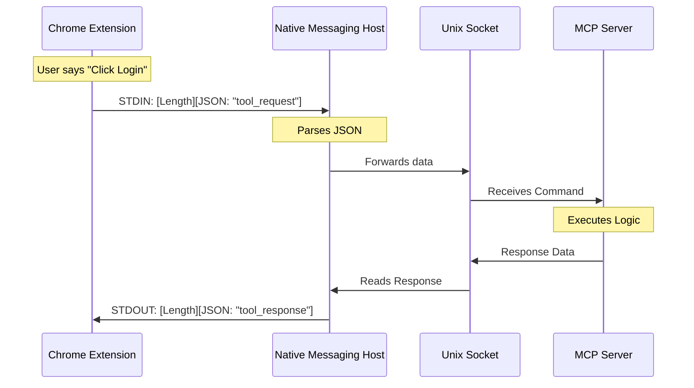

# Chapter 3: Native Messaging Host

Welcome to Chapter 3! In the previous chapter, [AI System Instructions](02_ai_system_instructions.md), we wrote the "Employee Handbook" that teaches Claude how to behave safely.

But there is a physical problem we haven't solved yet.

Chrome is a secure fortress. By design, websites and extensions cannot easily "reach out" to your computer to run programs or click things on your behalf. They are trapped in a sandbox.

In this chapter, we will build the **Native Messaging Host**. This is the secret tunnel out of the fortress.

## The Motivation: The Translator in the Booth

**The Use Case:**
Claude (running on your computer) wants to send a message to Chrome saying: *"Please open a new tab."*

**The Problem:**
Chrome doesn't speak "TCP Socket" (the language our server uses) easily due to security restrictions. Chrome speaks a very specific dialect called **Native Messaging**.

**The Analogy:**
Imagine Chrome is a person inside a soundproof glass booth.
*   **The Constraint:** They cannot hear you shouting from the outside.
*   **The Solution:** The **Native Messaging Host**.
    *   Think of this Host as a **Translator** sitting right against the glass.
    *   Chrome slides a note under the glass (Standard Input).
    *   The Translator reads the note, converts it, and calls the MCP Server on a phone (Socket).
    *   When the MCP Server answers, the Translator writes a reply note and slides it back under the glass (Standard Output).

## Key Concepts

We are looking at `chromeNativeHost.ts`. To build this translator, we need three things:

1.  **Standard Input/Output (Stdio):** This is the slot under the glass. Chrome "writes" data to our script's input and "reads" data from our script's output.
2.  **The Protocol:** Chrome is strict. You can't just send text. You must send **4 bytes** indicating the length of the message, followed by the JSON message itself.
3.  **The Socket Bridge:** Once we interpret the message from Chrome, we need to send it to the [MCP Server Context](01_mcp_server_context.md) we built in Chapter 1.

## How It Works: Speaking "Chrome"

Let's look at how we implement this protocol.

### 1. Sending Messages to Chrome
To talk to Chrome, we must format our data exactly how it expects.

```typescript
export function sendChromeMessage(message: string): void {
  const jsonBytes = Buffer.from(message, 'utf-8')
  
  // Create a 4-byte header to tell Chrome how long the message is
  const lengthBuffer = Buffer.alloc(4)
  lengthBuffer.writeUInt32LE(jsonBytes.length, 0)

  // 1. Send Length, 2. Send Message
  process.stdout.write(lengthBuffer)
  process.stdout.write(jsonBytes)
}
```
*Explanation: If we send the JSON `{ "hi": "chrome" }` directly, Chrome will ignore it. We calculate that the message is, say, 16 bytes long. We send the number `16` (in binary), and *then* the JSON. This is sliding the note under the glass.*

### 2. Reading Messages from Chrome
Reading is the reverse. We can't just read everything at once; we might get half a message. We need a "Reader" that buffers data.

```typescript
// Inside ChromeMessageReader class...
  private tryProcessMessage(): void {
    // We need at least 4 bytes to know the length
    if (this.buffer.length < 4) return

    // Read the first 4 bytes to get message size
    const length = this.buffer.readUInt32LE(0)

    // Do we have the full message yet?
    if (this.buffer.length < 4 + length) return // Wait for more data

    // Extract the message and parse it!
    const messageBytes = this.buffer.subarray(4, 4 + length)
    // ... pass message to the host ...
  }
```
*Explanation: This code acts like a bucket. It catches drops of data until the bucket is full enough to form a complete sentence. Only then does it pass the sentence to the main logic.*

### 3. The Main Loop
The Host script is essentially an infinite loop. It sits there waiting for notes from Chrome.

```typescript
export async function runChromeNativeHost(): Promise<void> {
  const host = new ChromeNativeHost()
  const messageReader = new ChromeMessageReader()

  await host.start() // Open the phone line to MCP Server

  // Keep reading notes until Chrome stops talking
  while (true) {
    const message = await messageReader.read()
    if (message === null) break
    
    await host.handleMessage(message)
  }
}
```
*Explanation: This is the heartbeat of the file. It starts the system and enters a "listening mode."*

## Internal Implementation: Under the Hood

When you ask Claude to perform an action, the data flows through a chain.

### The Relay Race



### The Logic Center: `ChromeNativeHost`

The `ChromeNativeHost` class is the decision maker. It decides what to do with the messages it receives.

#### Handling Specific Messages
Sometimes Chrome just wants to know if the Host is alive (`ping`), and sometimes it wants to send data to the AI (`tool_response`).

```typescript
// Inside ChromeNativeHost class
  async handleMessage(messageJson: string): Promise<void> {
    const message = JSON.parse(messageJson)

    switch (message.type) {
      case 'ping':
        sendChromeMessage(JSON.stringify({ type: 'pong' }))
        break

      case 'tool_response':
        // The browser finished an action! Tell the MCP Server.
        this.forwardToMcpClients(message)
        break
    }
  }
```
*Explanation: If Chrome says "Ping", we instantly reply "Pong". If Chrome sends a "tool_response" (like "I clicked the button!"), we forward that information to the socket connected to the [MCP Server Context](01_mcp_server_context.md).*

#### Managing the Socket Server
This Host also acts as a mini-server itself. It creates a "Unix Socket" (a special file on your disk) that the main MCP application connects to.

```typescript
  async start(): Promise<void> {
    this.socketPath = getSecureSocketPath()

    // Create a server that listens for the MCP app
    this.server = createServer(socket => {
        // When MCP connects, remember this connection
        this.handleMcpClient(socket)
    })

    this.server.listen(this.socketPath)
  }
```
*Explanation: This creates the "Phone Line." It opens a specific file path (defined in Chapter 1) and waits for the main Claude application to plug into it.*

## Conclusion

We have now built the **Native Messaging Host**.

*   We created a "Translator" that speaks Chrome's language (Length + JSON).
*   We set up a buffer to read incoming messages carefully.
*   We established a Socket Server to forward these messages to the main MCP Brain.

However, simply having this code on your computer isn't enough. Chrome doesn't know this file exists, and for security reasons, it won't run it unless we explicitly register it with a special "Manifest" file.

In the next chapter, we will learn how to register our Host with the operating system so Chrome allows it to run.

[Next Chapter: Installation & Manifest Registration](04_installation___manifest_registration.md)

---

Generated by [Code IQ](https://github.com/adityasoni99/Code-IQ)