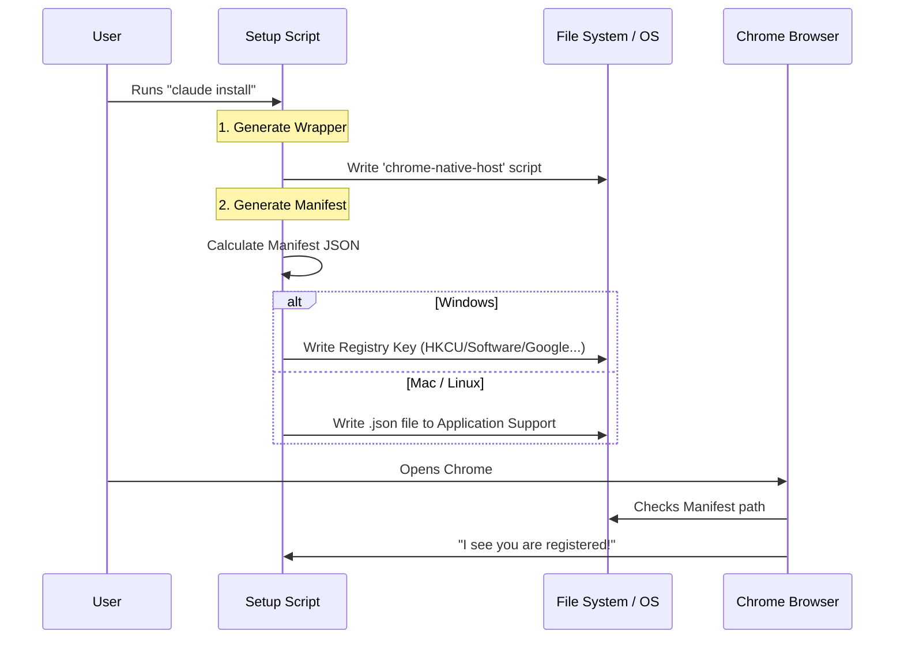

# Chapter 4: Installation & Manifest Registration

Welcome back! In the previous chapter, [Native Messaging Host](03_native_messaging_host.md), we built a "Translator" program that speaks Chrome's specific language.

However, if you tried to run that code right now, Chrome would completely ignore it.

## The Motivation: The Security Badge

**The Use Case:**
You have your Native Host running, and you have the Chrome Browser open. You want them to talk.

**The Problem:**
Chrome is designed to be a secure fortress. It does not allow random programs on your computer to send it commands. If it did, any virus could take over your browser! Chrome defaults to "Stranger Danger"—it ignores everyone.

**The Solution:**
We need to issue a **Security Badge**.
We must create a specific file (called a **Manifest**) and place it in a specific folder that Chrome monitors. This file tells Chrome:
1.  "This program is safe."
2.  "Here is exactly where the program is located."
3.  "Only *this specific* Chrome Extension is allowed to talk to it."

In this chapter, we will write the code that automatically creates and installs this security badge.

## Key Concepts

We are looking at `setup.ts`. This file handles the logistics of getting our code registered with the Operating System.

1.  **The Manifest File:** A JSON file that acts as the ID card. It contains the path to our executable.
2.  **The Wrapper Script:** Chrome has a quirk—it can't run a command with arguments (like `node server.js`). It can only run a single file. So, we create a simple script (a "wrapper") that points to our real code.
3.  **The Registry (Windows Only):** On macOS and Linux, we just paste the file in a folder. On Windows, we also have to tell the "Windows Registry" where that file is.

## How It Works: Creating the ID Card

Let's look at the structure of the "ID Card" we need to generate.

### 1. The Manifest Structure
This is the data Chrome requires to trust us.

```json
{
  "name": "com.anthropic.claude_code_browser_extension",
  "description": "Claude Code Browser Extension Native Host",
  "path": "/Users/me/.claude/chrome/chrome-native-host",
  "type": "stdio",
  "allowed_origins": [
    "chrome-extension://fcoeoabgfenejglbffodgkkbkcdhcgfn/"
  ]
}
```
*Explanation: `path` tells Chrome where our translator lives. `allowed_origins` is the VIP list—it contains the unique ID of our Chrome Extension. If a different extension tries to connect, Chrome checks this list and blocks it.*

### 2. The Wrapper Script
Since Chrome can't run complex commands, we generate a tiny script file that acts as a shortcut.

```typescript
// Inside createWrapperScript function...
  const scriptContent = platform === 'windows'
      ? `@echo off
         REM specific windows command
         ${command}`
      : `#!/bin/sh
         # specific mac/linux command
         exec ${command}`
  
  // Write this text to a file like "chrome-native-host.bat"
  await writeFile(wrapperPath, scriptContent)
```
*Explanation: We dynamically write a small text file. When Chrome runs this file, this file runs our actual complex Node.js server.*

## Usage: Automating the Installation

We don't want users to have to manually write JSON files. We create a setup function that does it all automatically.

### Finding the Security Office
First, we need to know *where* on the computer Chrome looks for these ID cards. This changes based on your Operating System.

```typescript
function getNativeMessagingHostsDirs(): string[] {
  const platform = getPlatform()

  if (platform === 'windows') {
    // Windows stores it in AppData
    return [join(process.env.APPDATA, 'Claude Code', 'ChromeNativeHost')]
  }

  // Mac/Linux return specific folder paths like:
  // ~/Library/Application Support/Google/Chrome/NativeMessagingHosts
  return getAllNativeMessagingHostsDirs().map(({ path }) => path)
}
```
*Explanation: We ask the OS, "Where is the security office?" On Mac, it's a folder in your Library. On Windows, it's in AppData.*

### Printing the Badge
Now we combine the location and the JSON content to "print" the badge.

```typescript
export async function installChromeNativeHostManifest(
  manifestBinaryPath: string,
): Promise<void> {
  // 1. Get the list of folders (Security Offices)
  const manifestDirs = getNativeMessagingHostsDirs()

  // 2. Create the JSON object
  const manifest = {
    name: 'com.anthropic.claude_code_browser_extension',
    path: manifestBinaryPath,
    // ... other fields
  }

  // 3. Write the file to disk
  const manifestContent = JSON.stringify(manifest, null, 2)
  await writeFile(join(manifestDirs[0], 'manifest.json'), manifestContent)
}
```
*Explanation: This function does the heavy lifting. It finds the folder, creates the JSON content pointing to our binary, and saves the file.*

## Internal Implementation: Under the Hood

What happens when the user installs the Claude tool?

### The Installation Sequence



### Deep Dive: Windows Registry
Windows is a bit more bureaucratic than Mac or Linux. Simply putting the file in a folder isn't enough; you have to register the location in the "Windows Registry."

```typescript
function registerWindowsNativeHosts(manifestPath: string): void {
  // We need to run a command line tool called 'reg'
  const command = 'reg'
  const args = [
      'add', 'HKCU\\Software\\Google\\Chrome\\NativeMessagingHosts\\...',
      '/d', manifestPath, // The path to our JSON file
      '/f' // Force overwrite
  ]

  // Execute the command
  execFileNoThrowWithCwd(command, args)
}
```
*Explanation: This uses the Windows command line to add a specific key. This key points to our JSON file. It's like filing paperwork in triplicate so Windows allows Chrome to see the file.*

### Deep Dive: Extension Detection
We also include logic to check if the user actually has the extension installed. There is no point in setting up the server if the user hasn't installed the Chrome Extension from the web store yet.

```typescript
export async function isChromeExtensionInstalled(): Promise<boolean> {
  // Look at the user's hard drive
  const browserPaths = getAllBrowserDataPaths()
  
  // Check typical installation folders for our specific Extension ID
  return isChromeExtensionInstalledPortable(browserPaths)
}
```
*Explanation: We snoop around the file system looking for the folder name matching our Extension ID (`fcoeoabgfenejglbffodgkkbkcdhcgfn`). If we find it, we know the user is ready.*

## Conclusion

You have successfully automated the **Installation & Manifest Registration**!

*   We created a **Wrapper Script** so Chrome can execute our code.
*   We generated a **Manifest JSON** that acts as a security badge.
*   We filed this badge in the correct OS directories (and Registry for Windows).

Now, Chrome knows who we are and where we live. When the extension tries to connect, Chrome will check this Manifest, see that the origin matches, and allow the connection to proceed.

But wait—users often have multiple versions of Chrome (Canary, Dev, Beta) or different browsers entirely (Brave, Edge). How do we find them all?

In the next chapter, we will learn how to handle different browser configurations.

[Next Chapter: Browser Discovery & Configuration](05_browser_discovery___configuration.md)

---

Generated by [Code IQ](https://github.com/adityasoni99/Code-IQ)