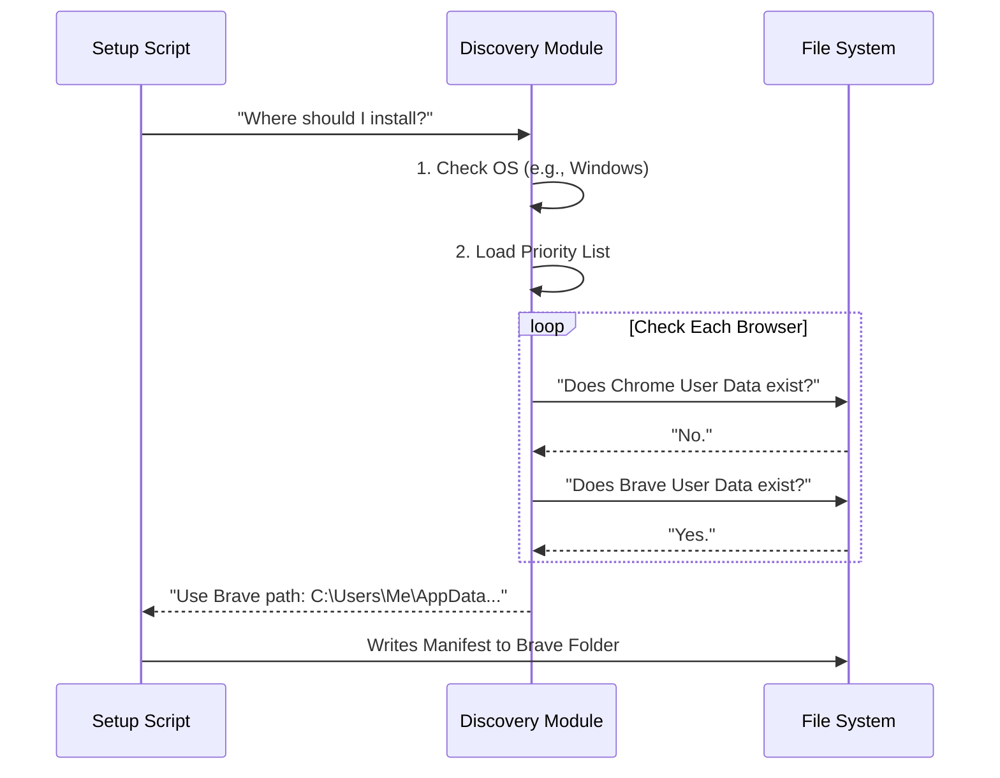

# Chapter 5: Browser Discovery & Configuration

Welcome to Chapter 5! In the previous chapter, [Installation & Manifest Registration](04_installation___manifest_registration.md), we created a "Security Badge" (the Manifest file) that allows our code to talk to Chrome.

But we have a logistical problem.

**The Problem:**
You might be using macOS with Google Chrome. Your friend might be using Windows with the Brave browser. Another user might be on Linux using Microsoft Edge.
Each of these combinations stores its files in a completely different place on the hard drive.

If our code only looks for "Google Chrome" on "macOS," it will crash for everyone else.

**The Solution:**
We need a **Universal Travel Adapter**. This chapter covers the **Browser Discovery** layer. It acts like a smart address book that knows exactly where every type of browser lives on every operating system.

## The Motivation: The Lost Delivery Driver

Imagine our Native Host (from Chapter 3) is a delivery driver trying to deliver the "Security Badge" (Manifest).

*   **Without Discovery:** The driver only knows one address: "123 Apple Street." If the user lives on "456 Windows Avenue," the delivery fails.
*   **With Discovery:** The driver looks at the environment, consults a map, and says, "Ah, we are on Windows, and this user prefers Brave. I will drive to the Brave folder in `AppData`."

## Key Concepts

We handle this logic in `common.ts` and `setupPortable.ts`. There are three main concepts to understand:

1.  **The Browser Config (The Address Book):** A massive list of definitions for every supported browser.
2.  **Platform Detection (The Compass):** Checking if we are on Mac, Windows, or Linux.
3.  **Detection Order (The Priority List):** If a user has both Chrome and Edge installed, which one do we pick?

## Concept 1: The Address Book

Computers aren't magic; they don't "know" where browsers are. We have to tell them. We create a large configuration object that maps browser names to file paths.

Here is a simplified look at how we define "Google Chrome" versus "Brave" in `common.ts`:

```typescript
export const CHROMIUM_BROWSERS = {
  chrome: {
    name: 'Google Chrome',
    macos: {
      appName: 'Google Chrome',
      dataPath: ['Library', 'Application Support', 'Google', 'Chrome'],
      // ... path to manifest folder
    },
    windows: {
      dataPath: ['Google', 'Chrome', 'User Data'],
      registryKey: 'HKCU\\Software\\Google\\Chrome\\...',
    },
  },
  // ... Brave, Edge, Arc defined similarly below
}
```
*Explanation: We manually define the paths. On Mac, Chrome is in `Library/...`. On Windows, it is in `User Data`. We repeat this for every browser we want to support.*

## Concept 2: The Priority List

What if you have Chrome *and* Brave installed? We need a rule to decide which one to check first. We define a simple array called `BROWSER_DETECTION_ORDER`.

```typescript
// Priority order: Most common first
export const BROWSER_DETECTION_ORDER = [
  'chrome',
  'brave',
  'arc',
  'edge',
  'chromium',
  'vivaldi',
  'opera',
]
```
*Explanation: The code will look for Chrome first. If it finds it, it stops. If not, it checks for Brave, then Arc, and so on.*

## How to Use It: Finding a Browser

Now that we have the definitions and the order, how do we actually find a browser?

We use a function called `detectAvailableBrowser`. It loops through our list and checks the user's hard drive.

```typescript
export async function detectAvailableBrowser() {
  const platform = getPlatform() // e.g., 'macos' or 'windows'

  // Loop through our priority list
  for (const browserId of BROWSER_DETECTION_ORDER) {
    const config = CHROMIUM_BROWSERS[browserId]

    // Check if the file/folder exists on the disk
    if (await checkBrowserExists(platform, config)) {
       return browserId // Found one! e.g., 'brave'
    }
  }
  return null // No supported browser found
}
```
*Explanation: This function acts like a checklist. "Is Chrome here? No. Is Brave here? Yes! Okay, we will use Brave."*

## Use Case: Opening a URL

One of the most common tasks is asking the OS to open a specific URL in the correct browser. Because Windows, Mac, and Linux use different commands to open files, we wrap this in a helper function.

```typescript
export async function openInChrome(url: string): Promise<boolean> {
  const platform = getPlatform()
  const browser = await detectAvailableBrowser()
  const config = CHROMIUM_BROWSERS[browser]

  switch (platform) {
    case 'macos':
      // Mac uses the 'open' command with the app name
      return execFile('open', ['-a', config.macos.appName, url])
      
    case 'windows':
      // Windows is tricky; we use 'rundll32' to open URLs safely
      return execFile('rundll32', ['url,OpenURL', url])
  }
}
```
*Explanation: If we are on Mac, we say `open -a "Google Chrome" google.com`. If we are on Windows, we use a system DLL command. The abstraction hides this complexity from the rest of the app.*

## Internal Implementation: Under the Hood

When the `setup.ts` script (from the previous chapter) runs, it relies heavily on this discovery module.

### The Discovery Sequence

Here is what happens when the application tries to install the Manifest file:



### Deep Dive: Portable Detection

In `setupPortable.ts`, we have a specialized function `detectExtensionInstallationPortable`. This is used to verify if the user has actually installed the Chrome Extension from the Web Store.

It performs a "Deep Search":

1.  It finds the Browser User Data folder (e.g., `.../Google/Chrome/User Data`).
2.  It looks inside that folder for **Profiles** (Default, Profile 1, Profile 2).
3.  Inside every profile, it looks into the `Extensions` folder.
4.  It checks for our specific Extension ID (`fcoeoab...`).

```typescript
// Inside detectExtensionInstallationPortable...

// 1. Get all potential browser paths
const browserPaths = getAllBrowserDataPathsPortable()

for (const { path } of browserPaths) {
    // 2. Find all profiles (Default, Profile 1...)
    const profiles = await getProfileDirectories(path)

    for (const profile of profiles) {
        // 3. Construct the full path to where extensions live
        const extensionPath = join(path, profile, 'Extensions', EXTENSION_ID)
        
        // 4. Check if it exists
        if (await exists(extensionPath)) {
            return { isInstalled: true }
        }
    }
}
```
*Explanation: This code digs deep. It doesn't just check if the browser exists; it checks if **our extension** is present inside any of the user's browser profiles.*

## Conclusion

You have now set up the **Browser Discovery & Configuration** layer.

*   You created an **Address Book** (`CHROMIUM_BROWSERS`) defining paths for Chrome, Brave, Edge, and more.
*   You implemented a **Priority List** to pick the best available browser.
*   You built a **Deep Search** to verifying if the extension is actually installed.

This "Universal Adapter" ensures that whether your user is a designer on a Mac using Arc, or a developer on Windows using Brave, the application connects seamlessly.

Now that the backend is fully connected, configured, and secure, it's time to look at what the user actually sees.

[Next Chapter: Tool UI Rendering](06_tool_ui_rendering.md)

---

Generated by [Code IQ](https://github.com/adityasoni99/Code-IQ)