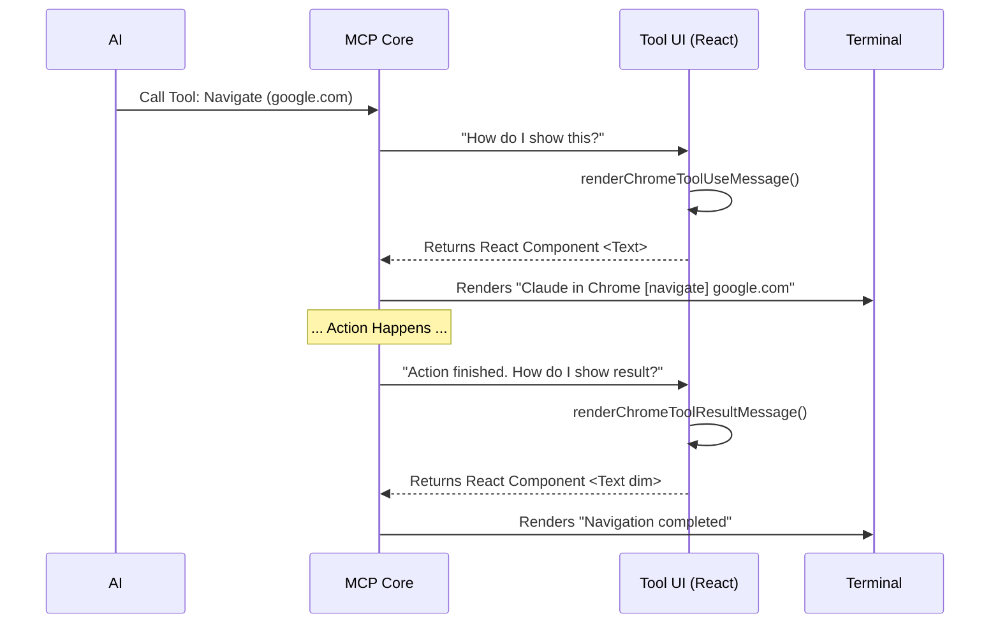

# Chapter 6: Tool UI Rendering

Welcome to the final chapter! In the previous chapter, [Browser Discovery & Configuration](05_browser_discovery___configuration.md), we built the "Universal Travel Adapter" that connects our code to any browser on your computer.

At this point, you have a fully functional engine. The AI can talk to the server, the server connects to the browser, and the browser executes commands.

But there is one piece missing: **You.**

## The Motivation: The Car Dashboard

**The Use Case:**
Claude decides to navigate to `google.com`.

**The Problem:**
Without a User Interface (UI), the only thing you would see in your terminal is raw machine code like this:
`{"jsonrpc": "2.0", "method": "call_tool", "params": {"name": "navigate", "args": {"url": "google.com"}}}`

This is hard to read. It’s like driving a car where the speedometer is just a laptop printing numbers.

**The Solution:**
We need a **Dashboard**.
The **Tool UI Rendering** layer takes that raw data and converts it into pretty, human-readable text like:
> `Claude in Chrome [navigate] google.com`

## Key Concepts

We define how tools look in `toolRendering.tsx`. Even though this runs in a terminal (Command Line), we use **React** to draw the text!

There are three main visual states we need to handle:

1.  **Tool Use (The Turn Signal):** This appears *before* the action happens. It tells you what Claude is trying to do.
2.  **Tool Result (The Arrival):** This appears *after* the action finishes. It confirms success (e.g., "Navigation completed").
3.  **View Tab Link:** A clickable link in your terminal that brings the specific browser tab to the front.

## Concept 1: The Tool List

First, our dashboard needs to know which buttons exist. We define a list of all supported tools.

```typescript
// The specific names of tools our dashboard recognizes
export type ChromeToolName = 
  | 'navigate' 
  | 'click' 
  | 'type' 
  | 'scroll'
  | 'find' 
  // ... and many others
```
*Explanation: This acts as a type check. If we try to render a tool called `make_coffee`, TypeScript will yell at us because our car doesn't have that button.*

## Concept 2: Rendering "Tool Use" (Input)

When Claude sends a command, we want to summarize it. If Claude sends a complex object for "clicking," we just want to show "Click at (x, y)".

We use a function called `renderChromeToolUseMessage`.

```typescript
function renderChromeToolUseMessage(input: any, toolName: ChromeToolName) {
  const secondaryInfo: string[] = [];

  switch (toolName) {
    case 'navigate':
      // If navigating, just show the URL hostname
      if (typeof input.url === 'string') {
          secondaryInfo.push(new URL(input.url).hostname);
      }
      break;
    // ... handles other tools below
```
*Explanation: We extract the most important information (like the URL) and ignore the rest. This keeps the dashboard clean.*

### Handling Complex Actions
Some tools, like `computer` (which handles mouse and keyboard), have many sub-actions. We handle them like this:

```typescript
    case 'computer':
      const action = input.action;
      
      if (action === 'type') {
        // Example output: type "hello world"
        secondaryInfo.push(`type "${truncate(input.text, 15)}"`);
      } else if (action === 'left_click') {
        secondaryInfo.push('left_click');
      }
      break;
```
*Explanation: Instead of showing the full JSON object, we show a short summary: `type "hello..."`.*

## Concept 3: Rendering "Tool Result" (Output)

Once the browser finishes the job, it sends back a result. We want to show a simple confirmation message.

We use `renderChromeToolResultMessage`.

```typescript
export function renderChromeToolResultMessage(toolName: ChromeToolName) {
  let summary: string | null = null;

  switch (toolName) {
    case 'navigate':
      summary = 'Navigation completed';
      break;
    case 'find':
      summary = 'Search completed';
      break;
  }
  // Returns a React Text component for the CLI
  return <Text dimColor>{summary}</Text>;
}
```
*Explanation: If the navigation succeeds, we print "Navigation completed" in a dimmed color so it doesn't distract the user.*

## Concept 4: The "View Tab" Link

This is a cool feature. We render a special link in the terminal. If you click it (using `Cmd+Click`), it tells the OS to open that specific tab.

```typescript
function renderChromeViewTabLink(input: any) {
  // Check if your terminal supports clickable links
  if (!supportsHyperlinks() || !input.tabId) return null;

  // Create a special URL like https://clau.de/chrome/tab/123
  const linkUrl = `${CHROME_EXTENSION_FOCUS_TAB_URL_BASE}${input.tabId}`;

  return (
    <Link url={linkUrl}>
      <Text color="subtle">[View Tab]</Text>
    </Link>
  );
}
```
*Explanation: We generate a custom URL. When clicked, the Chrome Extension (which listens for these URLs) intercepts it and brings the correct tab to the foreground.*

## Integrating the Dashboard

Finally, we bundle all these display functions into a single object and export it. The main MCP application calls this to "install" our dashboard visuals.

```typescript
export function getClaudeInChromeMCPToolOverrides(toolName: string) {
  return {
    // 1. How to name the tool in the UI
    userFacingName: () => `Claude in Chrome[${toolName}]`,

    // 2. How to display inputs
    renderToolUseMessage: (input) => renderChromeToolUseMessage(input, ...),

    // 3. How to display outputs
    renderToolResultMessage: (output) => renderChromeToolResultMessage(output, ...)
  };
}
```
*Explanation: This allows the main system to say, "Hey, I have a `navigate` tool. How should I draw it?" This function answers that question.*

## Internal Implementation: Under the Hood

How does a React component end up as text in your black-and-white terminal?

### The Rendering Pipeline



1.  **Interception:** The MCP Core receives a request.
2.  **Lookup:** It checks `getClaudeInChromeMCPToolOverrides` to see if we have custom UI logic for this tool.
3.  **Rendering:** It executes our React code (`renderChromeToolUseMessage`).
4.  **Ink Library:** A library called `ink` translates React components (like `<Text>`) into ANSI escape codes (colors and text) that the terminal understands.

## Conclusion

Congratulations! You have completed the **Claude in Chrome** tutorial series.

Let's review what you have built:
1.  **[MCP Server Context](01_mcp_server_context.md):** The brain that manages the connection.
2.  **[AI System Instructions](02_ai_system_instructions.md):** The rulebook teaching Claude how to behave.
3.  **[Native Messaging Host](03_native_messaging_host.md):** The translator enabling communication with Chrome.
4.  **[Installation & Manifest Registration](04_installation___manifest_registration.md):** The security badge allowing the connection.
5.  **[Browser Discovery & Configuration](05_browser_discovery___configuration.md):** The map to find the user's browser.
6.  **Tool UI Rendering (This Chapter):** The dashboard that visualizes the actions.

You now understand the full stack of how an AI agent on your server can securely, safely, and visibly control a web browser on your desktop.

**Project Complete.**

---

Generated by [Code IQ](https://github.com/adityasoni99/Code-IQ)