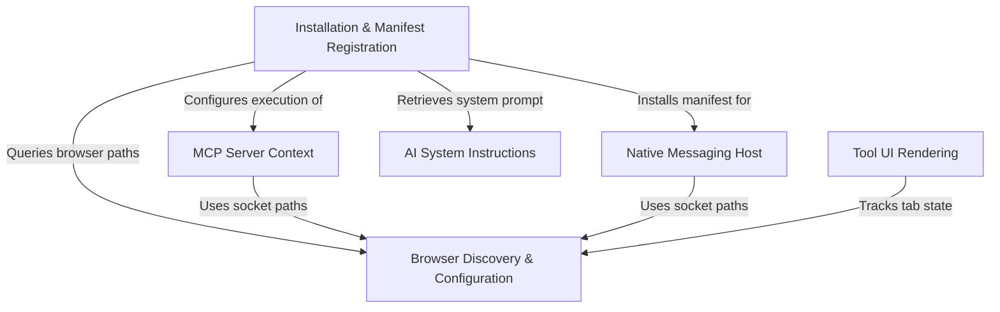

# Tutorial: claudeInChrome

This project acts as a secure **bridge** between the Claude AI model and a local **Chrome browser**. It utilizes the *Model Context Protocol (MCP)* and a **Native Messaging Host** to allow the AI to perform web automation tasks—such as navigating URLs, clicking elements, and managing tabs—directly from the command line, while handling cross-platform complexities and security permissions.

## Chapters

1. [MCP Server Context](01_mcp_server_context.md)
2. [AI System Instructions](02_ai_system_instructions.md)
3. [Native Messaging Host](03_native_messaging_host.md)
4. [Installation & Manifest Registration](04_installation___manifest_registration.md)
5. [Browser Discovery & Configuration](05_browser_discovery___configuration.md)
6. [Tool UI Rendering](06_tool_ui_rendering.md)

---

Generated by [Code IQ](https://github.com/adityasoni99/Code-IQ)