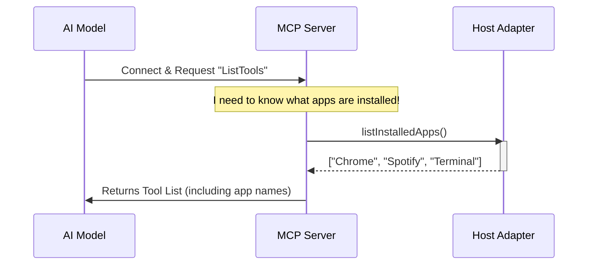

# Chapter 1: MCP Server Integration

Welcome to the **Computer Use** project! This tutorial will guide you through building a system that allows an AI to control a computer just like a human does.

## What is the MCP Server?

Imagine an AI model (like Claude) is a brilliant chef, and your computer is a kitchen filled with appliances (tools). The problem is, the chef is in another room and can't see what appliances you have or how to switch them on.

The **MCP (Model Context Protocol) Server** is the **Waiters**.

1.  **It takes inventory:** It checks the kitchen (your computer) to see what tools are available (e.g., "Google Chrome," "Calculator").
2.  **It translates:** It takes the chef's order ("Open Calculator") and translates it into a language the computer understands.
3.  **It communicates:** It handles the back-and-forth messages safely.

### Central Use Case: "What can I do?"

Before the AI can click a mouse or type text, it needs to know **what tools are available**.

**The Goal:** When the AI starts a session, the MCP Server scans your computer for installed applications and sends a menu of available tools to the AI.

## Key Concepts

1.  **The Transport:** The "phone line" between the AI and the server. We use `Stdio` (Standard Input/Output), meaning they talk via simple text messages in the terminal.
2.  **Tool Discovery:** The process of listing capabilities. The AI asks, "ListTools," and the server replies with JSON definitions (e.g., "I have a tool called `computer_use`").
3.  **Dynamic Context:** Sometimes the list of tools changes. For example, our server dynamically checks which apps (like Spotify or VS Code) are installed to tell the AI exactly what it can open.

---

## Setting Up the Integration

First, let's look at how we configure the system to recognize our MCP server. We need to tell the system, "Hey, use this specific code to handle computer commands."

### Step 1: Defining the Configuration
We define the server configuration and list the tools we want to allow. This happens in `setup.ts`.

```typescript
// From setup.ts
export function setupComputerUseMCP() {
  // 1. Define the allowed tools (capabilities)
  const allowedTools = buildComputerUseTools(
    CLI_CU_CAPABILITIES, 
    getChicagoCoordinateMode()
  ).map(t => buildMcpToolName(COMPUTER_USE_MCP_SERVER_NAME, t.name))
  
  // ... (setup continues below)
```
*Explanation:* Here we are building a list of "allowed tools." This is like printing the menu for the waiter to hand to the AI.

### Step 2: Configuring the Execution Command
Next, we tell the system how to actually launch this server using standard input/output (`stdio`).

```typescript
// From setup.ts
  return {
    mcpConfig: {
      [COMPUTER_USE_MCP_SERVER_NAME]: {
        type: 'stdio',            // We talk via standard IO
        command: process.execPath, // Run the current Node process
        args: ['--computer-use-mcp'], // The flag to start server mode
        scope: 'dynamic',
      },
    },
    allowedTools,
  }
}
```
*Explanation:* We create a configuration object. When the main application sees this, it knows to spawn a subprocess (a background worker) that runs our MCP server code.

---

## Under the Hood: The Initialization Flow

What actually happens when the AI connects? The server doesn't just say "Hello"; it runs a quick diagnostic to see what apps are installed.

### Visualizing the Process



In the diagram above, the **Host Adapter** is the piece of code that actually touches the Operating System. We will build that in [Host Adapter](04_host_adapter.md).

### Internal Implementation details

Let's look at `mcpServer.ts` to see how the server handles the "Inventory Check" without slowing down.

#### 1. The Safety Timeout
Scanning all apps on a computer can be slow. We don't want the AI to wait forever. We use a "race" to limit the time.

```typescript
// From mcpServer.ts
async function tryGetInstalledAppNames(): Promise<string[] | undefined> {
  const adapter = getComputerUseHostAdapter()
  
  // 1. Start listing apps
  const enumP = adapter.executor.listInstalledApps()
  
  // 2. Start a 1-second timer
  const timeoutP = new Promise<undefined>(resolve => {
    setTimeout(resolve, 1000, undefined) // 1000ms timeout
  })
```
*Explanation:* We start two races: asking the computer for apps (`enumP`) and a simple 1-second timer (`timeoutP`).

#### 2. Determining the Winner
We wait to see who finishes first. If the computer is too slow, we just give up on the list so the server starts quickly.

```typescript
// From mcpServer.ts
  // 3. Race them!
  const installed = await Promise.race([enumP, timeoutP])
    .catch(() => undefined)

  if (!installed) {
    // If we timed out, log it and return nothing
    return undefined
  }
  return filterAppsForDescription(installed, homedir())
}
```
*Explanation:* `Promise.race` picks the winner. If `timeoutP` wins, `installed` is undefined. The show must go on!

#### 3. Creating the Server
Finally, we create the server and attach our tool definitions.

```typescript
// From mcpServer.ts
export async function createComputerUseMcpServerForCli() {
  const adapter = getComputerUseHostAdapter()
  const server = createComputerUseMcpServer(adapter, /*...*/)

  // Get the apps (maybe undefined if too slow)
  const installedAppNames = await tryGetInstalledAppNames()

  // Register the handler for when AI asks "ListTools"
  server.setRequestHandler(ListToolsRequestSchema, async () =>
    adapter.isDisabled() ? { tools: [] } : { tools: /* build tools here */ }
  )
  return server
}
```
*Explanation:* This is the heart of the integration. We build the server, try to get the app list, and then tell the server: "When the AI asks for `ListTools`, give them this specific list we just built."

## Summary

In this chapter, we learned:
1.  **MCP Server** acts as the translator between the AI and your computer.
2.  It uses **Stdio** to communicate.
3.  It attempts to **dynamically list installed apps** so the AI knows what software it can use.
4.  It implements a **timeout safety mechanism** so a slow computer doesn't block the AI from starting.

Now that the AI knows *what* tools are available, it needs a way to actually *use* them (like moving the mouse or typing).

[Next Chapter: The Executor (Computer Control)](02_the_executor__computer_control_.md)

---

Generated by [Code IQ](https://github.com/adityasoni99/Code-IQ)