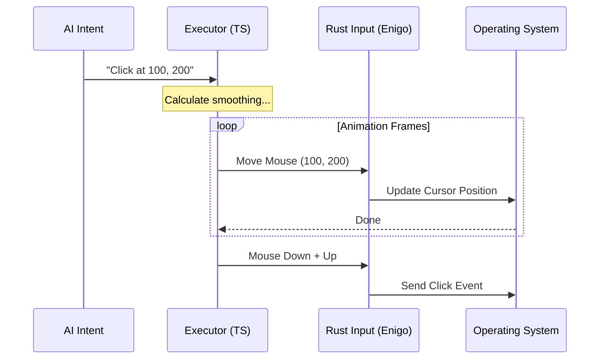

# Chapter 2: The Executor (Computer Control)

Welcome back! In [Chapter 1: MCP Server Integration](01_mcp_server_integration.md), we built the "Waiters" (the MCP Server) that list the available tools on your computer.

Now, we need to build the **Hands and Eyes**. Knowing that "Google Chrome" is installed is useless if the AI cannot physically click the icon or see the window.

## What is the Executor?

The **Executor** is the bridge between the AI's intent (e.g., "I want to check my email") and the low-level signals your hardware understands (e.g., "Move mouse to pixel 500, 300 and send a 'down' event").

### Central Use Case: "Click the Submit Button"

Imagine the AI wants to click a "Submit" button on a webpage. To do this, the system must:
1.  **See:** Take a screenshot to find the button's coordinates.
2.  **Move:** Smoothly move the mouse cursor to those coordinates.
3.  **Click:** Simulate a physical mouse click.

## Key Concepts

To control a computer programmatically, we need to handle three specific challenges:

1.  **Native Modules (Rust & Swift):** JavaScript (which we are using) cannot directly control your mouse hardware. We wrap "Native Modules" (written in Rust and Swift) to do the heavy lifting.
    *   *Rust:* Handles input (keyboard/mouse) using a library called `enigo`.
    *   *Swift:* Handles macOS specifics (screenshots, window management).
2.  **Coordinate Scaling:** Computers have "Logical" pixels (what code sees) and "Physical" pixels (the actual dots on the screen). On Retina displays, these are different. The Executor does the math to ensure the AI clicks exactly where it intends to.
3.  **Human-Like Movement:** If the mouse teleports instantly, some apps ignore it or behave strangely. The Executor adds "smoothing" to mimic human hand motion.

---

## How to Use the Executor

Let's look at how we instantiate and use this powerful tool.

### Step 1: Creating the Executor
We use a factory function to create our executor. This loads the necessary native drivers.

```typescript
// From executor.ts
import { createCliExecutor } from './executor'

const executor = createCliExecutor({
  // Should we smooth out mouse movements? Yes.
  getMouseAnimationEnabled: () => true, 
  // Should we hide our terminal window before acting? Yes.
  getHideBeforeActionEnabled: () => true 
})
```
*Explanation:* We create the executor and tell it: "Please act like a human (animate movement)" and "Don't let the terminal block the view."

### Step 2: Moving and Clicking
Once we have the executor, moving the mouse is simple.

```typescript
// Example usage
async function clickSubmitButton() {
  // 1. Move the mouse to x=500, y=300
  await executor.moveMouse(500, 300)
  
  // 2. Click the left button
  // "left" button, 1 click (single click), no modifiers (like Ctrl/Alt)
  await executor.click(500, 300, 'left', 1, [])
}
```
*Explanation:* The executor handles the low-level details. Note that `click` usually performs a move first to ensure accuracy, but explicit moving is safer.

### Step 3: Typing Text
Typing can be done character-by-character or via the clipboard (paste).

```typescript
// Example usage
async function typeMessage() {
  // Option A: Type like a human (one key at a time)
  await executor.type("Hello World", { viaClipboard: false })

  // Option B: Fast paste (great for long code blocks)
  await executor.type("This is a long block of text...", { viaClipboard: true })
}
```
*Explanation:* `viaClipboard: true` is a clever trick. Instead of pressing keys 100 times, we copy the text to the clipboard and press `Command+V`.

---

## Under the Hood: The Internal Implementation

How does `executor.ts` actually talk to the hardware? It relies heavily on "Native Wrappers."

### Visualizing the Flow



### 1. Human-Like Mouse Movement
Apps get confused if a mouse jumps from A to B instantly. We use basic physics to smooth the path.

```typescript
// From executor.ts
async function animatedMove(input: Input, targetX: number, targetY: number) {
  // Calculate distance
  const start = await input.mouseLocation()
  const distance = Math.hypot(targetX - start.x, targetY - start.y)

  // Calculate duration (capped at 0.5 seconds)
  const durationSec = Math.min(distance / 2000, 0.5)
  
  // Loop through frames (simplified)
  for (let frame = 1; frame <= totalFrames; frame++) {
    // ... calculate intermediate positions ...
    await input.moveMouse(newX, newY, false)
    await sleep(frameIntervalMs) // Wait a tiny bit
  }
}
```
*Explanation:* We break the movement into small steps (frames). We calculate a new position for every frame and sleep for a few milliseconds between them, creating a smooth glide.

### 2. The "Fast Paste" Trick
Typing long text by simulating key presses is slow and prone to errors (e.g., if a popup appears). The Executor implements a robust "Paste" strategy.

```typescript
// From executor.ts
async function typeViaClipboard(input: Input, text: string): Promise<void> {
  // 1. Save user's current clipboard content
  const saved = await readClipboardViaPbpaste()

  // 2. Put our AI's text into clipboard
  await writeClipboardViaPbcopy(text)

  // 3. Press Command + V
  await input.keys(['command', 'v'])
  
  // 4. Restore user's original clipboard content (cleanup)
  await writeClipboardViaPbcopy(saved)
}
```
*Explanation:* This is respectful to the user. We borrow the clipboard for a split second to paste the text, then immediately put back whatever the user had copied before.

### 3. The `drainRunLoop` (macOS Magic)
You might see `drainRunLoop` in the code. This is crucial for macOS.

On macOS, things like taking screenshots or moving windows are asynchronous events that live on the main "Loop." If we just run our code without "draining" (processing) this loop, the window might not update in time for the screenshot.

```typescript
// From executor.ts
// Wraps native Swift calls to ensure the OS processes the event
return drainRunLoop(() =>
  cu.screenshot.captureExcluding(
    withoutTerminal(opts.allowedBundleIds),
    // ... options
  )
)
```
*Explanation:* Think of `drainRunLoop` as pausing to let the Operating System take a breath and finish its paperwork (drawing the screen) before we take a picture.

## Summary

In this chapter, we learned:
1.  **The Executor** wraps low-level Rust and Swift modules to control the hardware.
2.  It handles **Mouse Animation** to make movements look human and work correctly with apps.
3.  It implements smart **Typing** via the clipboard for speed and reliability.
4.  It manages **macOS nuances** like the Run Loop to ensure screenshots are accurate.

However, giving an AI control over your mouse is dangerous! What if it starts clicking wildly? We need a way to stop it immediately.

[Next Chapter: Safety & Abort Mechanism (Esc Hotkey)](03_safety___abort_mechanism__esc_hotkey_.md)

---

Generated by [Code IQ](https://github.com/adityasoni99/Code-IQ)