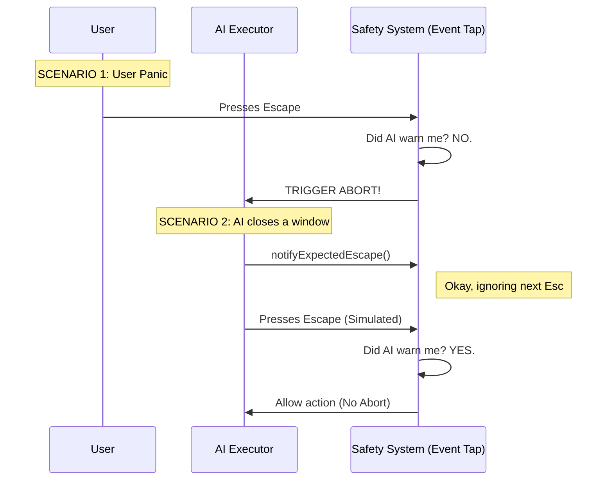

# Chapter 3: Safety & Abort Mechanism (Esc Hotkey)

Welcome back! In [Chapter 2: The Executor (Computer Control)](02_the_executor__computer_control_.md), we gave the AI the power to control your mouse and keyboard. It can now click buttons, type text, and drag files.

But as Spider-Man knows: **"With great power comes great responsibility."**

What happens if the AI gets confused and starts clicking wildly? Or gets stuck in a loop opening 100 Calculator windows? You need a way to stop it **immediately**.

## The Emergency Stop Button

The **Safety & Abort Mechanism** is a global "Kill Switch."

### Central Use Case: The "Runaway Robot"

Imagine the AI is trying to drag a file, but it miscalculates and keeps holding the mouse button down while moving the cursor endlessly.

**The Goal:** You, the user, press the **`Escape`** key on your physical keyboard. The system immediately detects this—no matter which window is focused—and completely shuts down the AI's current action.

## Key Concepts

To build this safety net, we need to understand three concepts:

1.  **Global Event Tap:** Standard programs only hear key presses when they are "focused" (active). Our safety mechanism needs to sit at the Operating System level, listening for `Escape` even if you are using Chrome or Spotify.
2.  **Priority Interception:** The safety mechanism must catch the `Escape` key *before* the current app sees it. This prevents the AI from accidentally dismissing a dialog box when you actually intended to stop the AI.
3.  **The "Friendly Fire" Problem:** Sometimes, the **AI** needs to press Escape (e.g., to close a popup window). We must distinguish between the **User** pressing Escape (STOP!) and the **AI** pressing Escape (keep going).

---

## How to Use the Safety Mechanism

Using this mechanism is designed to be simple. We register a "callback" function that runs whenever the user hits Escape.

### Step 1: Registering the Listener
We usually set this up when the session starts.

```typescript
// From escHotkey.ts
import { registerEscHotkey } from './escHotkey'

// Start listening for the Escape key
const success = registerEscHotkey(() => {
  console.log("ABORT! User pressed Escape!")
  // Logic to stop the executor goes here
})
```
*Explanation:* We pass a function to `registerEscHotkey`. If the user presses Escape, that function runs immediately.

### Step 2: Unregistering
When the AI finishes its task successfully, we stop listening so the Escape key goes back to normal behavior.

```typescript
// From escHotkey.ts
import { unregisterEscHotkey } from './escHotkey'

// Stop listening
unregisterEscHotkey()
```
*Explanation:* Always clean up after yourself! If we don't unregister, the user won't be able to use their Escape key normally.

---

## Under the Hood: The Internal Implementation

How does the system know the difference between *you* pressing Escape and the *AI* pressing Escape?

### Visualizing the "Hole Punch" Logic

We use a technique I call the **"I'm Doing It" Notification**. Before the AI presses Escape, it raises its hand and tells the safety system, "Hey, this next key press is me. Don't abort."



### Deep Dive: The Code

Let's look at `escHotkey.ts` to see how this is implemented.

#### 1. The Registration
We use a native Swift module to tap into the OS event stream.

```typescript
// From escHotkey.ts
let registered = false

export function registerEscHotkey(onEscape: () => void): boolean {
  if (registered) return true
  
  // Call the native Swift code to listen for KeyDown
  const cu = requireComputerUseSwift()
  if (!cu.hotkey.registerEscape(onEscape)) {
    return false // Failed (maybe permissions issue)
  }
  
  registered = true
  return true
}
```
*Explanation:* `cu.hotkey.registerEscape` is the bridge to the Operating System. It tells macOS: "Send me a signal whenever Escape is pressed."

#### 2. The "Friendly Fire" Prevention
This is the clever part. We export a function called `notifyExpectedEscape`.

```typescript
// From escHotkey.ts
export function notifyExpectedEscape(): void {
  if (!registered) return
  
  // Tell native code: "The next Escape is from the AI"
  requireComputerUseSwift().hotkey.notifyExpectedEscape()
}
```
*Explanation:* This sets a temporary flag (usually with a tiny timeout, like 100ms). If an Escape event comes in while that flag is up, it's ignored.

### Connecting it to the Executor

Now, let's look back at [Chapter 2](02_the_executor__computer_control_.md)'s `executor.ts`. When the AI wants to type a key, it checks if that key is "Escape".

```typescript
// From executor.ts
    async key(keySequence: string): Promise<void> {
      const parts = keySequence.split('+')
      
      // Check: Is the AI trying to press Escape?
      const isEsc = isBareEscape(parts)

      await drainRunLoop(async () => {
          // If yes, warn the safety system first!
          if (isEsc) {
            notifyExpectedEscape()
          }
          // Now actually press the key
          await input.keys(parts)
      })
    }
```
*Explanation:*
1.  The Executor sees the AI wants to press `Escape`.
2.  It calls `notifyExpectedEscape()` defined in our safety module.
3.  **Immediately** after, it simulates the key press.
4.  The Safety System sees the press, checks the notification, and says, "Safe, carry on."

## Summary

In this chapter, we added a critical layer of safety to our application:

1.  We created a **Global Hotkey** that listens for the Escape key system-wide.
2.  We implemented an **Abort Mechanism** to stop the AI if it misbehaves.
3.  We solved the **"Friendly Fire"** issue by having the Executor notify the safety system before it simulates an Escape key press.

Now the AI can control the computer (Chapter 2) and we can stop it if it goes rogue (Chapter 3). But how do these pieces effectively talk to the Operating System to find windows and take screenshots?

[Next Chapter: Host Adapter](04_host_adapter.md)

---

Generated by [Code IQ](https://github.com/adityasoni99/Code-IQ)