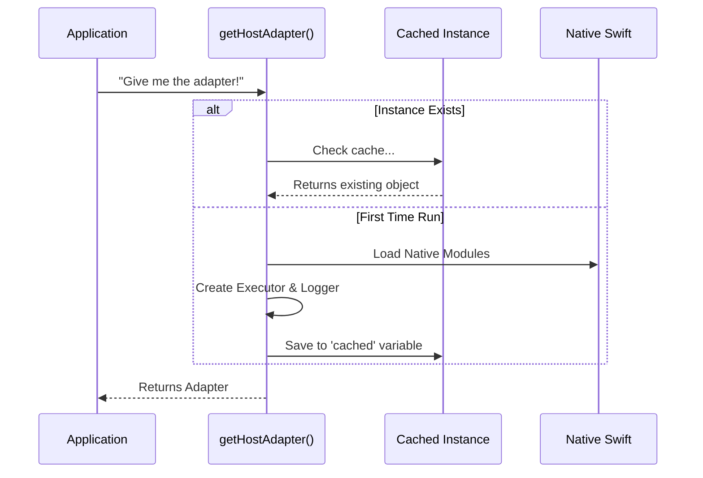

# Chapter 4: Host Adapter

Welcome back! In [Chapter 3: Safety & Abort Mechanism (Esc Hotkey)](03_safety___abort_mechanism__esc_hotkey_.md), we implemented a "Kill Switch" to stop the AI if it starts behaving erratically.

We now have the **Brain** (MCP Server), the **Hands** (Executor), and the **Emergency Brake** (Safety). However, these parts are currently floating around separately. We need a central hub to connect them all to the specific environment we are running in (the Command Line Interface).

## What is the Host Adapter?

Think of the core Computer Use library as a **Universal Travel Appliance** (like a hair dryer). It knows how to blow air, but it doesn't fit into the wall socket of every country.

The **Host Adapter** is the **Travel Adapter**.

1.  **It connects:** It bridges the generic logic of the library to the specific "wall socket" of our CLI application.
2.  **It provides resources:** It tells the library, "Here is the specific Logger to use," and "Here is the specific Mouse Executor to use."
3.  **It acts as a Gatekeeper:** It checks permissions and handles configuration settings (Feature Flags).

### Central Use Case: "The Singleton Cockpit"

Imagine the application is a plane. You don't want two different pilots (Executors) fighting over the controls, or two different black boxes (Loggers) recording data in different formats.

**The Goal:** We need a **Singleton** (a single, unique instance) that acts as the source of truth for the entire application lifecycle. Whenever any part of the app asks, "How do I click the mouse?" or "Am I allowed to record the screen?", they ask the Host Adapter.

## Key Concepts

1.  **The Singleton Pattern:** This ensures that no matter how many times you ask for the adapter, you always get the exact same object. This prevents memory leaks and conflicting states.
2.  **Dependency Injection:** The core library doesn't know *how* to log to a CLI. The Adapter injects a `DebugLogger` that translates generic log messages into the format our CLI tools understand.
3.  **OS Permissions:** Before the AI tries to take a screenshot, the Adapter checks if the Operating System (macOS) has actually granted permission to record the screen.

---

## How to Use the Host Adapter

The usage is designed to be incredibly simple: just ask for it.

### Step 1: Getting the Adapter
Anywhere in your code (like in the MCP Server or the Executor), you can call this function:

```typescript
// From any file in the project
import { getComputerUseHostAdapter } from './hostAdapter'

// Get the one-and-only instance
const adapter = getComputerUseHostAdapter()
```
*Explanation:* This function guarantees you get the initialized adapter. If it doesn't exist yet, it creates it.

### Step 2: Using its Capabilities
Once you have the adapter, you can access the tools we built in previous chapters.

```typescript
// Example: Using the adapter to check permissions
async function startSession() {
  const adapter = getComputerUseHostAdapter()
  
  // Ask the adapter: "Are we allowed to see the screen?"
  const permissions = await adapter.ensureOsPermissions()
  
  if (!permissions.granted) {
    console.error("Please grant Screen Recording permissions!")
  }
}
```
*Explanation:* The generic code doesn't need to know *how* to check macOS permissions; it just asks the adapter to do it.

---

## Under the Hood: The Internal Implementation

How does `hostAdapter.ts` ensure there is only one instance and that everything is wired up correctly?

### Visualizing the Initialization



### Deep Dive: The Code

Let's look at how we build this "Universal Adapter" in `hostAdapter.ts`.

#### 1. The Logger Translation
First, we define how logging should work in this specific CLI environment. We implement a `Logger` interface that routes messages to our debug file.

```typescript
// From hostAdapter.ts
class DebugLogger implements Logger {
  info(message: string, ...args: unknown[]): void {
    // Redirect generic info logs to our specific debug tool
    logForDebugging(format(message, ...args), { level: 'info' })
  }
  
  error(message: string, ...args: unknown[]): void {
    logForDebugging(format(message, ...args), { level: 'error' })
  }
  // ... other log levels (debug, warn) follow the same pattern
}
```
*Explanation:* The core library just calls `logger.info("...")`. This class catches that call and sends it to `logForDebugging`, which writes to our CLI's output stream.

#### 2. The Singleton Factory
This is the most important part of the file. It ensures we only build the adapter once.

```typescript
// From hostAdapter.ts
let cached: ComputerUseHostAdapter | undefined

export function getComputerUseHostAdapter(): ComputerUseHostAdapter {
  // 1. If we already built it, return it immediately!
  if (cached) return cached
  
  // 2. Otherwise, build the object
  cached = {
    serverName: COMPUTER_USE_MCP_SERVER_NAME,
    logger: new DebugLogger(),
    // ... (continued below)
```
*Explanation:* The variable `cached` sits outside the function. It remembers the result between calls.

#### 3. Wiring the Executor
We connect the Executor we built in [Chapter 2](02_the_executor__computer_control_.md) and configure its settings (Gates).

```typescript
// From hostAdapter.ts
    // Connect the Executor (Hands)
    executor: createCliExecutor({
      // Check feature flags (Gates) for animation preferences
      getMouseAnimationEnabled: () => getChicagoSubGates().mouseAnimation,
      getHideBeforeActionEnabled: () => getChicagoSubGates().hideBeforeAction,
    }),
    
    // Connect the Feature Flags
    isDisabled: () => !getChicagoEnabled(),
    getSubGates: getChicagoSubGates,
```
*Explanation:* We pass functions (callbacks) for settings. This allows us to change settings like `mouseAnimation` on the fly without restarting the adapter.

#### 4. Checking Permissions
Finally, the adapter provides a way to check if the OS is happy.

```typescript
// From hostAdapter.ts
    ensureOsPermissions: async () => {
      // Load the native Swift module
      const cu = requireComputerUseSwift()
      
      // Check macOS specific permissions
      const accessibility = cu.tcc.checkAccessibility()
      const screenRecording = cu.tcc.checkScreenRecording()
      
      // Return a simple Summary
      return accessibility && screenRecording
        ? { granted: true }
        : { granted: false, accessibility, screenRecording }
    },
```
*Explanation:* This abstracts the complex Swift calls into a simple `granted: true/false` result.

#### 5. A Note on `cropRawPatch`
You might notice this property in the code:

```typescript
    // From hostAdapter.ts
    cropRawPatch: () => null,
```
*Explanation:* Some environments verify clicks by decoding images pixel-by-pixel. This is heavy and slow. In our CLI adapter, we return `null` to say, "Skip the pixel validation, trust the coordinates." This keeps our adapter fast and lightweight.

## Summary

In this chapter, we built the **Host Adapter**, the central nervous system of our application.

1.  It implements the **Singleton Pattern** to ensure the app has one unified state.
2.  It acts as a **Bridge**, connecting the generic "Computer Use" library to our specific CLI logger and Executor.
3.  It manages **OS Permissions** and **Feature Flags**.

Now that we have a central adapter, we face a new problem. Since this is an async environment, what happens if the user tries to type something while the AI is moving the mouse? We need to prevent collisions.

[Next Chapter: Session Locking (Concurrency Control)](05_session_locking__concurrency_control_.md)

---

Generated by [Code IQ](https://github.com/adityasoni99/Code-IQ)