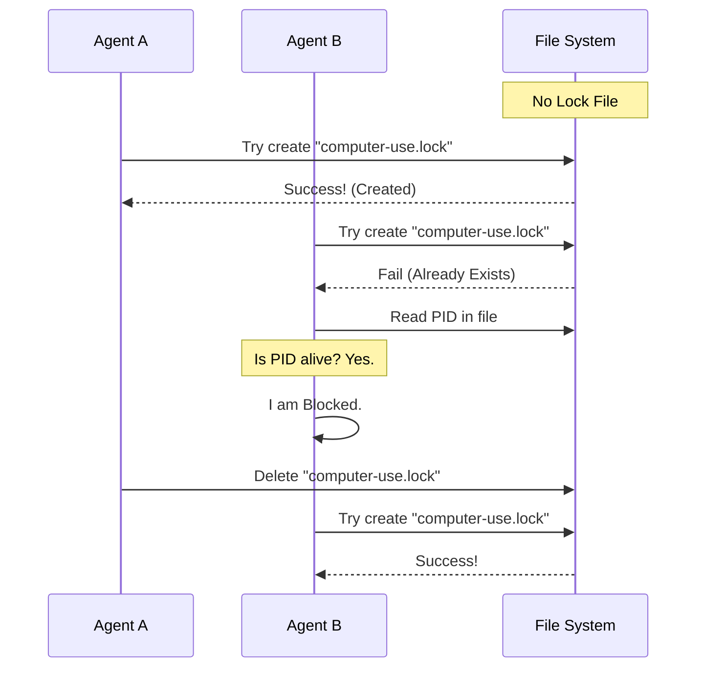

# Chapter 5: Session Locking (Concurrency Control)

Welcome back! in [Chapter 4: Host Adapter](04_host_adapter.md), we built the central hub that connects our AI to the Operating System. We can now control the mouse, check permissions, and log actions.

However, computers are multitasking environments. What happens if you accidentally open **two** terminal windows and run the AI agent in both of them simultaneously?

## The Problem: The Steering Wheel Fight

Imagine two people sitting in the driver's seat of a car.
*   **Driver A (AI Session 1)** wants to turn **Left**.
*   **Driver B (AI Session 2)** wants to turn **Right**.

If they both grab the steering wheel at the same time, the car crashes. Similarly, if two AI agents try to control your mouse simultaneously, the cursor will jitter wildly, clicking things neither of them intended.

### Central Use Case: " The Occupied Sign"

To prevent this, we need a "Bathroom Door" system:
1.  **Check:** Is the door locked?
2.  **Lock:** If open, go in and lock it immediately.
3.  **Unlock:** When finished, unlock it for the next person.
4.  **Emergency:** If the person inside disappears (the app crashes), the lock effectively dissolves so the door isn't stuck forever.

## Key Concepts

To implement this, we use the File System as our source of truth.

1.  **The Lock File:** We create a specific file named `computer-use.lock`. If this file exists, the computer is "Occupied."
2.  **Atomic Creation:** We use a special command that says, "Create this file *only if* it doesn't exist yet." This prevents two programs from creating the lock at the exact same millisecond.
3.  **Process ID (PID):** Every program running on your computer has a unique number (e.g., `12345`). We write this number inside the lock file.
4.  **Liveness Check:** If we see a lock file, we check the PID inside. Is Process `12345` still alive? If not, it means the previous session crashed, and we can safely delete the lock (break down the door).

---

## How to Use the Lock

In our application, we don't manually manage the file. We use two simple functions exported from `computerUseLock.ts`.

### Step 1: Trying to Acquire the Lock
Before the AI performs a "Turn" (a sequence of actions), it tries to get the lock.

```typescript
// From your main loop
import { tryAcquireComputerUseLock } from './computerUseLock'

// Try to grab the "steering wheel"
const result = await tryAcquireComputerUseLock()

if (result.kind === 'blocked') {
  console.log(`System occupied by session: ${result.by}`)
  // Stop! Do not move the mouse.
} else {
  // Safe to proceed!
}
```
*Explanation:* `tryAcquire` does all the hard work. It returns `acquired` if you got it, or `blocked` if someone else has it.

### Step 2: Releasing the Lock
When the AI finishes its turn or the user exits the application, we must release the lock.

```typescript
// From your cleanup logic
import { releaseComputerUseLock } from './computerUseLock'

// We are done driving
await releaseComputerUseLock()
console.log("Steering wheel released.")
```
*Explanation:* This deletes the lock file, allowing other sessions to take control.

---

## Under the Hood: The Internal Implementation

How do we ensure this is safe even if the computer crashes?

### Visualizing the Logic



### Deep Dive: The Code

Let's look at `computerUseLock.ts` to see the three critical mechanisms.

#### 1. Atomic Creation (`O_EXCL`)
The most dangerous bug in concurrency is a "Race Condition" (two people checking the door at the same time). We solve this using the filesystem flag `wx`.

```typescript
// From computerUseLock.ts
async function tryCreateExclusive(lock: ComputerUseLock): Promise<boolean> {
  try {
    // 'w' = write, 'x' = fail if path exists (Exclusive)
    await writeFile(getLockPath(), jsonStringify(lock), { flag: 'wx' })
    return true
  } catch (e: unknown) {
    // If error is "EEXIST", it means file is there
    if (getErrnoCode(e) === 'EEXIST') return false
    throw e
  }
}
```
*Explanation:* The `'wx'` flag is the magic. The Operating System guarantees that only one process can succeed in this write.

#### 2. The "Pulse" Check (Is the process alive?)
What if the lock file exists, but the program that made it crashed? We don't want to be locked out forever.

```typescript
// From computerUseLock.ts
function isProcessRunning(pid: number): boolean {
  try {
    // Sending signal 0 doesn't kill the process, 
    // it just checks if it exists.
    process.kill(pid, 0)
    return true
  } catch {
    return false // Process is dead/gone
  }
}
```
*Explanation:* `process.kill(pid, 0)` is a standard Unix trick. It asks the OS, "Can I signal this process?" If the process is gone, this throws an error, and we know the lock is "Stale" (abandoned).

#### 3. The Recovery Logic
Here is the main logic that ties it together.

```typescript
// From computerUseLock.ts
export async function tryAcquireComputerUseLock(): Promise<AcquireResult> {
  // 1. Try to create the file fresh
  if (await tryCreateExclusive(myLockData)) {
    return FRESH
  }

  // 2. If failed, read who is holding it
  const existing = await readLock()
  
  // 3. Check if that process is actually alive
  if (existing && isProcessRunning(existing.pid)) {
    return { kind: 'blocked', by: existing.sessionId }
  }

  // 4. If dead, delete the file and try again!
  await unlink(getLockPath()).catch(() => {})
  if (await tryCreateExclusive(myLockData)) {
    return FRESH
  }
  return { kind: 'blocked', by: 'unknown' }
}
```
*Explanation:*
1.  Try to create the lock.
2.  If it exists, check the PID inside.
3.  If the PID is running, we are blocked.
4.  If the PID is dead, delete the file (Recover) and try to create it again.

## Summary

In this chapter, we added a critical safety layer for multitasking:

1.  **Session Locking** prevents multiple AI agents from fighting over the mouse.
2.  We use **Atomic Filesystem Operations** to guarantee race-free locking.
3.  We implemented **Stale Lock Recovery** by checking Process IDs, ensuring we never get stuck waiting for a crashed program.

We have the Brain, the Hands, the Safety Switch, the Adapter, and the Lock. The system is fully operational.

But wait—when the AI does something, how do we show the user what's happening? A raw JSON log isn't very pretty. We need a way to render the output nicely.

[Next Chapter: Tool Rendering](06_tool_rendering.md)

---

Generated by [Code IQ](https://github.com/adityasoni99/Code-IQ)