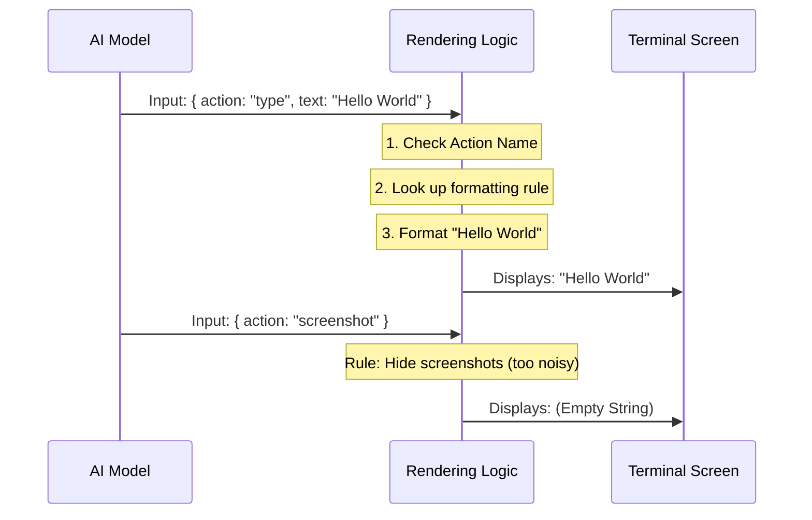

# Chapter 6: Tool Rendering

Welcome to the final chapter of our beginner's guide!

In [Chapter 5: Session Locking (Concurrency Control)](05_session_locking__concurrency_control_.md), we ensured that multiple AI sessions wouldn't fight over your mouse. The system is safe, controlled, and robust.

However, there is one final piece of the puzzle. When the AI is working, it communicates in raw data (JSON). Watching a stream of brackets and coordinates scroll by in your terminal is exhausting.

We need a **Dashboard**. We need to translate "Robot Speak" into "Human Speak."

## What is Tool Rendering?

**Tool Rendering** is the UI (User Interface) layer of our command-line application. It takes the complex instructions the AI sends and formats them into clean, readable summaries.

### Central Use Case: "The Drag and Drop"

Imagine the AI decides to drag a file from one side of the screen to the other.

**Without Tool Rendering (Raw Data):**
```json
{
  "tool": "computer_use",
  "action": "left_click_drag",
  "start_coordinate": [100, 200],
  "coordinate": [500, 600]
}
```
*Problem:* This takes 5 lines of screen space and requires mental effort to parse.

**With Tool Rendering:**
```text
Computer Use[left_click_drag] (100, 200) → (500, 600)
```
*Solution:* One line. Instantly understandable.

## Key Concepts

1.  **Rendering Overrides:** By default, the MCP system displays generic logs. We "override" this behavior specifically for computer tools to make them look better.
2.  **Tool Use (The Request):** This is what the AI *wants* to do (e.g., "Type 'Hello'"). We want to show the specific arguments clearly.
3.  **Tool Result (The Outcome):** This is what *happened* (e.g., "Key Pressed"). We usually want to keep this very minimal (dimmed text) so it doesn't clutter the screen.

---

## How to Use the Renderer

In our project, we don't manually print strings. We plug our logic into the MCP display system.

### The Rendering Factory
We use a function that takes a tool name (like `type` or `mouse_move`) and returns a set of formatting rules.

```typescript
// From toolRendering.tsx
import { getComputerUseMCPRenderingOverrides } from './toolRendering'

// Get the formatter for the "type" tool
const overrides = getComputerUseMCPRenderingOverrides('type')

// It gives us a friendly name
console.log(overrides.userFacingName()) 
// Output: "Computer Use[type]"
```
*Explanation:* This allows the main interface to ask, "Hey, I have a `type` tool. What should I call it in the UI?"

---

## Under the Hood: The Internal Implementation

How does the code decide what to show? It essentially acts as a switchboard.

### Visualizing the Transformation



### Deep Dive: The Code

Let's look at `toolRendering.tsx`. This file uses a library called `Ink` (React for the Command Line), but the logic is pure JavaScript string manipulation.

#### 1. Formatting Coordinates
First, we need a helper to make coordinates look like math tuples `(x, y)`.

```typescript
// From toolRendering.tsx
function fmtCoord(c: [number, number] | undefined): string {
  // If c exists, return "(x, y)", otherwise empty string
  return c ? `(${c[0]}, ${c[1]})` : '';
}
```
*Explanation:* A simple utility to keep our main code clean.

#### 2. Rendering the Input (The Request)
This is the core logic. We switch based on the `toolName`.

```typescript
// From toolRendering.tsx
    renderToolUseMessage(input: CuToolInput) {
      switch (toolName) {
        // ... other cases ...
        case 'mouse_move':
          return fmtCoord(input.coordinate);

        case 'type':
          // Truncate long text so it doesn't fill the screen
          return typeof input.text === 'string' 
            ? `"${truncateToWidth(input.text, 40)}"` 
            : '';
```
*Explanation:*
*   If the AI moves the mouse, we show `(x, y)`.
*   If the AI types, we show the text (cut off at 40 characters to stay neat).

#### 3. Handling Complex Actions
Some actions, like dragging, have a start and an end point.

```typescript
// From toolRendering.tsx
        case 'left_click_drag':
          return input.start_coordinate 
            ? `${fmtCoord(input.start_coordinate)} → ${fmtCoord(input.coordinate)}` 
            : `to ${fmtCoord(input.coordinate)}`;
```
*Explanation:* We check if we have a start coordinate. If so, we render an arrow `→` showing the path.

#### 4. Rendering the Result (The Outcome)
Once the tool finishes, we want a tiny confirmation. We use a lookup table for this.

```typescript
// From toolRendering.tsx
const RESULT_SUMMARY = {
  screenshot: 'Captured',
  left_click: 'Clicked',
  type: 'Typed',
  // ...
};

// Inside renderToolResultMessage...
const summary = RESULT_SUMMARY[toolName];
return <Text dimColor>{summary}</Text>;
```
*Explanation:*
*   We map `left_click` to just "Clicked".
*   We use `<Text dimColor>` (an Ink component) to make the text grey and subtle in the terminal. We don't want the success message to distract from the next action.

## Summary

In this final chapter, we learned:
1.  **Tool Rendering** translates raw JSON into human-readable text.
2.  We use **Switch Logic** to format different tools differently (e.g., showing text for typing, arrows for dragging).
3.  We provide **Visual Hierarchies**, making the AI's *intent* bright and visible, while the *success confirmation* is subtle and dimmed.

### Conclusion

Congratulations! You have completed the **Computer Use** tutorial series.

You now understand the full architecture:
1.  **MCP Server:** The Waiter taking orders ([Chapter 1](01_mcp_server_integration.md)).
2.  **Executor:** The Hands moving the mouse ([Chapter 2](02_the_executor__computer_control_.md)).
3.  **Safety:** The Emergency Stop button ([Chapter 3](03_safety___abort_mechanism__esc_hotkey_.md)).
4.  **Host Adapter:** The Power Strip connecting it all ([Chapter 4](04_host_adapter.md)).
5.  **Session Locking:** The Traffic Controller ([Chapter 5](05_session_locking__concurrency_control_.md)).
6.  **Rendering:** The Dashboard showing you what's happening ([Chapter 6](06_tool_rendering.md)).

You are now ready to build, debug, and extend your own AI agents that can control computers. Happy coding!

---

Generated by [Code IQ](https://github.com/adityasoni99/Code-IQ)