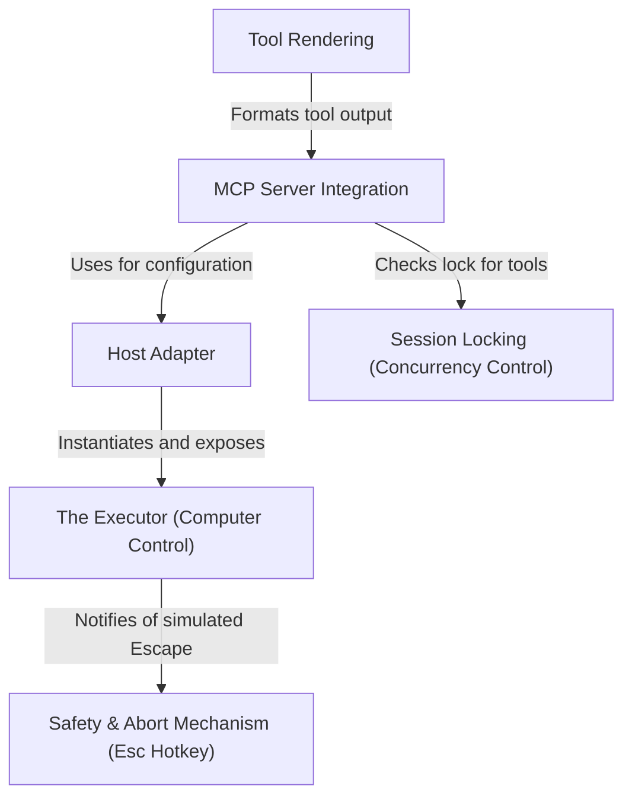

# Tutorial: computerUse

The project enables an AI model to **control a computer** by translating high-level intents (like clicking or typing) into low-level OS events on macOS. It integrates this capability via an **MCP Server**, manages concurrency with **session locking**, and ensures user safety through a dedicated **abort hotkey**. A host adapter bridges the generic computer-control logic with the specific CLI environment, while a rendering layer formats tool activities for the terminal user interface.

## Chapters

1. [MCP Server Integration](01_mcp_server_integration.md)
2. [The Executor (Computer Control)](02_the_executor__computer_control_.md)
3. [Safety & Abort Mechanism (Esc Hotkey)](03_safety___abort_mechanism__esc_hotkey_.md)
4. [Host Adapter](04_host_adapter.md)
5. [Session Locking (Concurrency Control)](05_session_locking__concurrency_control_.md)
6. [Tool Rendering](06_tool_rendering.md)

---

Generated by [Code IQ](https://github.com/adityasoni99/Code-IQ)