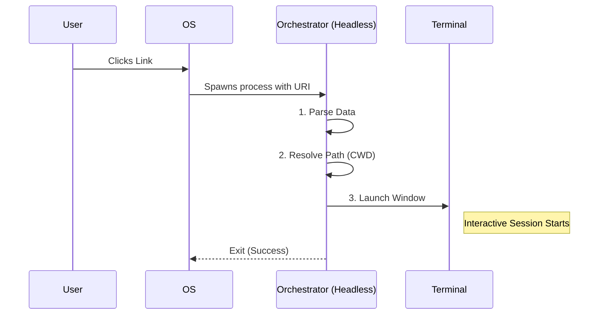

# Chapter 1: Deep Link Orchestration

Welcome to the first chapter of the **deepLink** project!

In this tutorial series, we are building a system that allows a user to click a link in their browser (like `claude-cli://start?q=hello`) and automatically open a terminal window running a CLI application, initialized with that specific query.

## The Motivation

Imagine you are browsing a GitHub repository on the web. You see a button that says **"Open in Claude CLI"**.

When you click that button, you don't just want the application to open. You want it to:
1.  Open your favorite **Terminal** (like iTerm2, VS Code, or Windows Terminal).
2.  Navigate automatically to the correct **folder** on your computer where you cloned that code.
3.  Start the CLI with the **context** from the web page.

The browser doesn't know where your files are, and it certainly doesn't know how to control your terminal. This is where **Deep Link Orchestration** comes in.

It acts like an **Air Traffic Controller**. It identifies the incoming plane (the link), determines which runway is clear (the working directory/repo), and signals the ground crew (the terminal launcher) to guide the plane in safely.

## Key Concepts

Before we look at code, let's understand the two main jobs of the Orchestrator.

### 1. The "Trampoline" Process
When you click a link, the Operating System (OS) starts our application in the background. It creates a "headless" process (one without a visible window).

We call this a **Trampoline** because its only job is to bounce the user into a *real* terminal window. Once it successfully launches the terminal, this process disappears.

### 2. Context Resolution
The link might contain a request to open a specific project, like `repo=my-cool-project`. The Orchestrator checks your hard drive:
*   *Do you have this repo?* -> **Yes**: Open the terminal in that folder.
*   *Do you have this repo?* -> **No**: Open the terminal in your Home directory as a fallback.

## Implementation Walkthrough

Let's trace what happens when a user clicks a link.

### The Flow
1.  **Incoming:** The OS receives `claude-cli://...` and launches our binary.
2.  **Parsing:** The Orchestrator takes the text URL and turns it into an object (URI Parsing).
3.  **Routing:** It looks at the parsed data to decide the "Current Working Directory" (CWD).
4.  **Handoff:** It commands the installed Terminal Emulator to open a new window running the interactive app.



## The Code: Under the Hood

The logic lives in `protocolHandler.ts`. Let's break it down into small, manageable pieces.

### Step 1: Receiving and Parsing
The entry point is `handleDeepLinkUri`. It takes the raw text string from the OS.

```typescript
import { parseDeepLink } from './parseDeepLink.js'

export async function handleDeepLinkUri(uri: string): Promise<number> {
  // 1. Convert string URI to a structured Action object
  let action
  try {
    action = parseDeepLink(uri)
  } catch (error) {
    console.error(`Deep link error: ${error}`)
    return 1 // Return error code
  }
  
  // ... continue to Step 2
```

Here, we delegate the messy work of string manipulation to a specialized parser. You can learn exactly how that works in [URI Parsing and Sanitization](03_uri_parsing_and_sanitization.md).

### Step 2: Resolving the Destination
Now that we have the `action` object (which might look like `{ repo: 'react', query: 'fix bug' }`), we need to figure out which folder on the computer matches that repository.

```typescript
// Inside handleDeepLinkUri...

  // 2. Determine where on the disk we should launch
  const { cwd, resolvedRepo } = await resolveCwd(action)

  // (Optional) Check git status of that folder immediately
  const lastFetch = resolvedRepo ? await readLastFetchTime(cwd) : undefined
```

We separate the "where" logic into a helper function called `resolveCwd`. This keeps our main controller clean.

### Step 3: Determining the Directory
Let's look at that helper function `resolveCwd`. It prioritizes explicit paths, then tries to find a matching Git repository, and finally falls back to the user's Home directory.

```typescript
async function resolveCwd(action: { cwd?: string; repo?: string }) {
  // Priority 1: Did the link specify an exact path?
  if (action.cwd) return { cwd: action.cwd }

  // Priority 2: Did the link specify a repo name?
  if (action.repo) {
    // Look up where this repo lives on your computer
    const known = getKnownPathsForRepo(action.repo) 
    const existing = await filterExistingPaths(known)
    
    if (existing[0]) return { cwd: existing[0], resolvedRepo: action.repo }
  }
  
  // Priority 3: Fallback to Home Directory
  return { cwd: homedir() }
}
```

This logic ensures the terminal always opens *somewhere* valid, even if the user hasn't downloaded the requested project yet.

### Step 4: Launching the Terminal
Finally, the "Trampoline" executes the jump. It calls `launchInTerminal`.

```typescript
import { launchInTerminal } from './terminalLauncher.js'

// Back in handleDeepLinkUri...

  // 3. Delegate to the Terminal Launcher
  const launched = await launchInTerminal(process.execPath, {
    query: action.query,
    cwd,
    repo: resolvedRepo,
    lastFetchMs: lastFetch?.getTime(),
  })

  // 4. Report success or failure back to the OS
  return launched ? 0 : 1
}
```

This function abstracts away the complexity of dealing with different operating systems and terminal apps (like cmd.exe vs /bin/zsh). We will cover this extensively in [Terminal Emulator Abstraction](05_terminal_emulator_abstraction.md).

## Special Case: macOS Launch Events
On Windows and Linux, deep links usually come in as command-line arguments (e.g., `myapp --handle-uri "..."`). macOS is different; it often sends links via system events to the running application bundle.

We handle this with a special check:

```typescript
export async function handleUrlSchemeLaunch(): Promise<number | null> {
  // Check if macOS launched us specifically to handle a URL
  if (process.env.__CFBundleIdentifier !== MACOS_BUNDLE_ID) {
    return null
  }

  // Wait for the Apple Event containing the URL
  const { waitForUrlEvent } = await import('url-handler-napi')
  const url = waitForUrlEvent(5000)
  
  return url ? await handleDeepLinkUri(url) : null
}
```

To understand how the OS knows to call us in the first place, check out [OS Protocol Registration](02_os_protocol_registration.md).

## Conclusion

In this chapter, we built the **Orchestrator**. It serves as the brain of the operation, receiving a raw link and making intelligent decisions about where and how to start the user's session.

It connects:
1.  **The Input:** By calling the parser ([Chapter 3](03_uri_parsing_and_sanitization.md)).
2.  **The Environment:** By resolving local file paths.
3.  **The Output:** By invoking the terminal launcher ([Chapter 5](05_terminal_emulator_abstraction.md)).

But before any of this can happen, the Operating System needs to know that `claude-cli://` belongs to us.

[Next Chapter: OS Protocol Registration](02_os_protocol_registration.md)

---

Generated by [Code IQ](https://github.com/adityasoni99/Code-IQ)