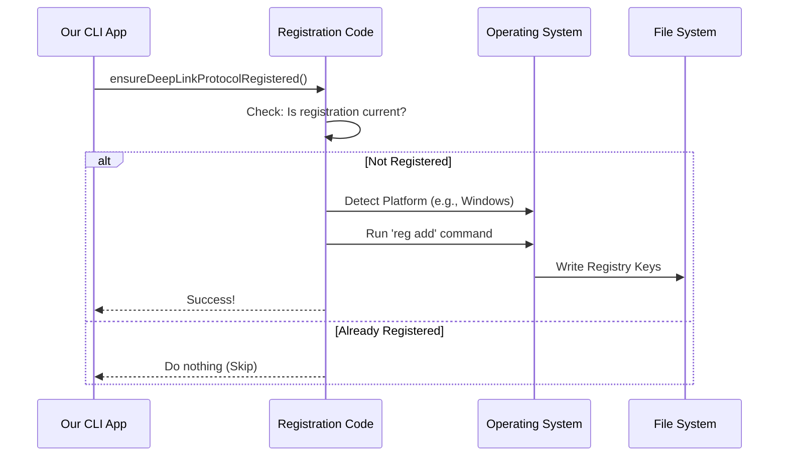

# Chapter 2: OS Protocol Registration

Welcome to Chapter 2! 

In the previous chapter, [Deep Link Orchestration](01_deep_link_orchestration.md), we built the "brain" of our system. We created code that knows exactly what to do when it receives a command like `claude-cli://start`.

But there is a missing link. If you type that URL into your browser right now, nothing happens. Why? Because your Operating System (OS) has no idea who "claude-cli" is.

In this chapter, we will build the bridge between the OS and our application.

## The Motivation

Imagine you move into a new house. You are ready to receive mail, but you haven't told the Post Office your name yet. If someone sends a letter to "The Smith Family," the Post Office will just throw it away because they don't know which house belongs to the Smiths.

**OS Protocol Registration** is the act of going to the Post Office (the OS) and filling out a form that says:
> "Whenever you get a package labeled `claude-cli://`, please deliver it to **this specific program path** on my hard drive."

Without this step, our deep link logic is useless because it will never be invoked.

## Key Concepts

Different operating systems handle this "Post Office" registry very differently. To support everyone, we need to write code for the "Big Three":

1.  **Windows:** Uses a massive database called the **Registry**.
2.  **Linux:** Uses small text files called **.desktop entries**.
3.  **macOS:** Uses an **Info.plist** file inside an Application Bundle.

We need a main controller that detects which computer we are on and calls the right registration method.

## Implementation: The Main Switch

Let's look at the entry point of our registration logic. This function runs when our CLI application starts up.

It simply asks: "Where am I running?"

```typescript
// registerProtocol.ts

export async function registerProtocolHandler(path: string): Promise<void> {
  // 1. Check the Operating System
  switch (process.platform) {
    case 'darwin': // macOS
      await registerMacos(path)
      break
    case 'linux':  // Ubuntu, Fedora, etc.
      await registerLinux(path)
      break
    case 'win32':  // Windows
      await registerWindows(path)
      break
  }
}
```

*Explanation:* `process.platform` is a built-in Node.js variable that tells us the OS. We simply route the request to a platform-specific function.

---

### 1. Windows: Editing the Registry

On Windows, everything is stored in the Registry. We need to run a command-line tool called `reg` to add our keys.

We need to add a key at `HKEY_CURRENT_USER\Software\Classes\claude-cli`.

```typescript
// Inside registerWindows...

async function registerWindows(claudePath: string): Promise<void> {
  const REG_KEY = `HKEY_CURRENT_USER\\Software\\Classes\\claude-cli`
  const command = `"${claudePath}" --handle-uri "%1"`

  // We use the 'reg' command line tool to write keys
  // 1. Register the protocol name
  await execFileNoThrow('reg', ['add', REG_KEY, '/d', 'URL:Claude', '/f'])
  
  // 2. Tell Windows exactly what command to run
  const CMD_KEY = `${REG_KEY}\\shell\\open\\command`
  await execFileNoThrow('reg', ['add', CMD_KEY, '/d', command, '/f'])
}
```

*Explanation:*
1.  We define where in the registry we want to write.
2.  We define the **command**: `myapp.exe --handle-uri "%1"`. The `%1` is a placeholder where Windows pastes the URL you clicked.
3.  We run `reg add` to save these settings.

---

### 2. Linux: The .desktop File

Linux uses a more file-based approach. We create a standard shortcut file in a specific folder that the OS watches (`~/.local/share/applications`).

```typescript
// Inside registerLinux...

async function registerLinux(claudePath: string): Promise<void> {
  const desktopPath = path.join(xdgDataHome, 'applications', 'claude.desktop')
  
  // 1. Create the content of the shortcut file
  const content = `[Desktop Entry]
    Name=Claude Code URL Handler
    Exec="${claudePath}" --handle-uri %u
    Type=Application
    MimeType=x-scheme-handler/claude-cli;`

  // 2. Write the file to disk
  await fs.writeFile(desktopPath, content)
  
  // 3. Register it with the system tool
  await execFileNoThrow('xdg-mime', ['default', 'claude.desktop', 'x-scheme-handler/claude-cli'])
}
```

*Explanation:*
1.  We construct a text string following the `.desktop` standard.
2.  `%u` is the Linux equivalent of Windows' `%1`—it's where the URL goes.
3.  We use `xdg-mime` to tell the OS: "This file handles `claude-cli` links."

---

### 3. macOS: The App Bundle

macOS is the strictest platform. You cannot simply register a command-line binary (like a script) to handle URLs. It *must* be a proper `.app` package (like `Safari.app` or `Slack.app`).

To solve this, we create a fake, minimal `.app` folder structure on the fly.

```typescript
// Inside registerMacos...

async function registerMacos(claudePath: string): Promise<void> {
  const appDir = path.join(os.homedir(), 'Applications', 'ClaudeHandler.app')
  
  // 1. Create the folder structure
  await fs.mkdir(path.join(appDir, 'Contents', 'MacOS'), { recursive: true })

  // 2. Create Info.plist (The ID card of the app)
  // This tells macOS: "I handle claude-cli:// links!"
  await fs.writeFile(path.join(appDir, 'Contents', 'Info.plist'), PLIST_CONTENT)

  // 3. Create a symlink (shortcut) to our real binary
  const linkPath = path.join(appDir, 'Contents', 'MacOS', 'claude')
  await fs.symlink(claudePath, linkPath)
}
```

*Explanation:*
1.  We create a folder that looks like an app to macOS.
2.  The `Info.plist` (not shown fully for brevity) contains a `CFBundleURLTypes` entry. This is the official registration.
3.  Instead of copying our program, we create a **Symbolic Link** pointing to it. When macOS runs this "App," it actually runs our CLI!

## The Orchestration Flow

How does this fit into the bigger picture? Let's look at the flow when the application updates or installs.



## Idempotency: "Don't Do It Twice"

Modifying the registry or creating app bundles is "expensive" (it takes time and disk IO). We shouldn't do it every single time the user runs a command.

We need a check to see if we are *already* registered correctly.

```typescript
export async function isProtocolHandlerCurrent(myPath: string): Promise<boolean> {
  try {
    // Example for Linux: Read the file and check if path matches
    if (process.platform === 'linux') {
      const content = await fs.readFile(linuxDesktopPath(), 'utf8')
      // Does the file on disk point to where I am right now?
      return content.includes(myPath)
    }
    // ... similar logic for Windows/Mac
    return false
  } catch {
    return false // If file doesn't exist, we aren't registered
  }
}
```

*Explanation:*
This function acts as a guard. Before we try to register, we read the existing configuration. If the file on disk already points to our current executable path, we return `true`, and the main registration function skips the heavy work.

## Conclusion

In this chapter, we learned how to "introduce" our application to the Operating System.

*   We learned that **Windows**, **Linux**, and **macOS** speak different languages when it comes to links.
*   We wrote a **polymorphic** function that handles each OS differently.
*   We ensured we don't spam the OS with updates by checking **idempotency**.

Now that the OS knows *how* to call us, and our Orchestrator ([Chapter 1](01_deep_link_orchestration.md)) knows *what* to do, there is one major security risk remaining.

Users can put *anything* in a URL. What if they put a malicious command?

In the next chapter, we will learn how to safely read and clean these inputs.

[Next Chapter: URI Parsing and Sanitization](03_uri_parsing_and_sanitization.md)

---

Generated by [Code IQ](https://github.com/adityasoni99/Code-IQ)