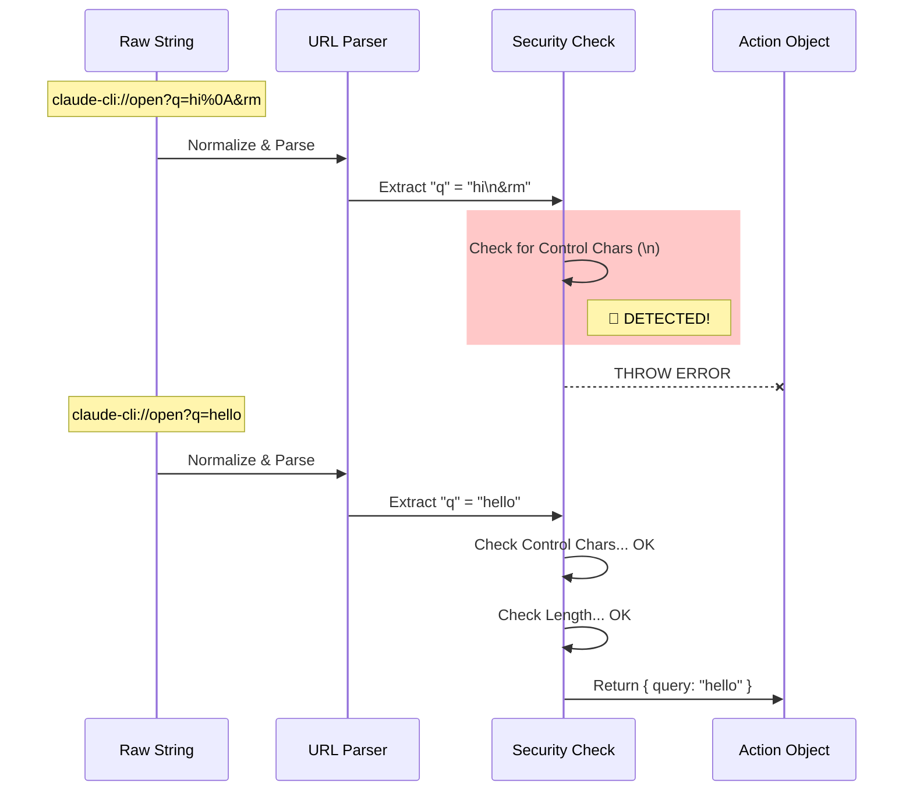

# Chapter 3: URI Parsing and Sanitization

Welcome to Chapter 3!

In the previous chapter, [OS Protocol Registration](02_os_protocol_registration.md), we taught the Operating System how to recognize our links. When a user clicks `claude-cli://...`, the OS now launches our application and passes that link as a string.

But here is the problem: **We cannot trust that string.**

In this chapter, we will build the security layer. We will take that raw, potentially dangerous text and convert it into a safe, clean "Action Object" that our application can understand.

## The Motivation: The Club Bouncer

Think of your application as an exclusive **Club**.
*   **The OS** is the street outside.
*   **The Terminal** is the dance floor inside.
*   **The Link** is the visitor trying to get in.

If you let everyone in without checking them, someone might bring in something dangerous. In the world of programming, a malicious user might craft a link that looks like this:

`claude-cli://open?q=Hello & rm -rf /`

If we just blindly passed this to a terminal, the computer might interpret `&` as "and then," and `rm -rf /` as "delete everything." This is called **Command Injection**.

We need a **Bouncer** at the door. The bouncer's job is to:
1.  **Check the ID:** Is this a valid link format?
2.  **Pat Down:** Are there any hidden weapons (control characters)?
3.  **Issue a Pass:** Write down *exactly* where the visitor is allowed to go (structured data).

## Key Concepts

To build our Bouncer, we need to understand three concepts.

### 1. The Protocol Structure
Our links follow a strict format. If the link doesn't look like this, we reject it immediately.

```text
  Protocol      Action      Parameters
     ↓            ↓             ↓
claude-cli://   open    ?q=hello&repo=my-app
```

### 2. Control Characters
Computers have invisible characters that control text.
*   **0x0A** is a "New Line" (The Enter Key).
*   **0x00** is a "Null Byte" (End of string).

If a URL contains a "New Line" character, the terminal might think the user pressed "Enter" to execute a command. We must **reject** any string containing these characters.

### 3. The "Action Object"
We don't want to pass strings around our app. We want an object.
*   **Input:** `"claude-cli://open?q=hi"`
*   **Output:** `{ query: "hi", repo: undefined }`

## Implementation Walkthrough

Let's look at `parseDeepLink.ts`. This is where our Bouncer lives.

### Step 1: The Entry Point
The function `parseDeepLink` is the main door. The first thing it does is ensure the ID card is valid.

```typescript
// parseDeepLink.ts

export function parseDeepLink(uri: string): DeepLinkAction {
  // 1. Normalize and Check Protocol
  const normalized = uri.startsWith('claude-cli://') ? uri : null

  if (!normalized) {
    throw new Error(`Invalid deep link: expected claude-cli://`)
  }

  // ... continue to Step 2
```

*Explanation:* If the link doesn't start with our specific protocol, we throw an error immediately. We don't even look at the rest of it.

### Step 2: Parsing with standard tools
We don't want to write our own complex text parser. Browsers and Node.js have a built-in `URL` class that is very good at breaking strings apart.

```typescript
  // 2. Use the built-in URL parser
  let url: URL
  try {
    url = new URL(normalized)
  } catch {
    throw new Error(`Invalid deep link structure`)
  }
  
  // 3. Extract the raw parameters
  const rawQuery = url.searchParams.get('q')
  const repo = url.searchParams.get('repo')
```

*Explanation:* The `URL` class handles the messy work of finding where `?` starts and where `&` separates items. It gives us the values directly.

### Step 3: The Security Pat Down
Now we have the values. But are they safe? We need a helper function to check for those dangerous invisible characters we talked about.

```typescript
// Helper: Returns true if string has dangerous ASCII codes
function containsControlChars(s: string): boolean {
  for (let i = 0; i < s.length; i++) {
    const code = s.charCodeAt(i)
    // 0x1f and below are control chars (like New Line)
    if (code <= 0x1f || code === 0x7f) {
      return true
    }
  }
  return false
}
```

*Explanation:* We loop through every single letter. If we find a character code that represents a system command (like "Backspace" or "Escape"), we flag it.

### Step 4: Validation and Sanitization
Now we apply the rules to our specific parameters.

```typescript
  // Inside parseDeepLink...

  // Rule: Repo must look like "owner/name"
  if (repo && !/^[\w.-]+\/[\w.-]+$/.test(repo)) {
     throw new Error(`Invalid repo format`)
  }

  // Rule: Query must not be too long or contain control chars
  if (rawQuery) {
    if (containsControlChars(rawQuery)) {
      throw new Error('Security: Query contains control characters')
    }
    
    // Prevent massive buffers crashing the terminal
    if (rawQuery.length > 5000) {
      throw new Error('Security: Query too long')
    }
  }
```

*Explanation:*
1.  **Repo Check:** We use a "Regular Expression" (Regex) to ensure the repo name only contains safe letters and numbers. This prevents people from typing `../` to navigate up your file system.
2.  **Length Check:** We limit the query to 5000 characters. This prevents a "Buffer Overflow" attack where a link is so long it crashes the terminal.

### Step 5: The Safe Return
Finally, if everything passes, we create the structured object.

```typescript
  // Return the safe, structured object
  return { 
    query: rawQuery, 
    repo: repo 
  }
}
```

This object is now "clean." It has passed the security checkpoint.

## Visualizing the Flow

Here is how the data transforms from a dangerous string to a safe object.



## Internal Implementation Details

While the code above is simplified, our production `parseDeepLink.ts` handles a few extra edge cases:

1.  **Unicode Sanitization:** Sometimes hackers use weird invisible emojis or "Right-to-Left" override characters to trick users. We run `partiallySanitizeUnicode()` to strip these out.
2.  **CWD (Current Working Directory):** Users can specify a folder path. We strictly enforce that this path is absolute (starts with `/` or `C:\`) to prevent ambiguity.

## Conclusion

In this chapter, we built the **Parser and Sanitizer**.

We learned:
*   **Never trust input** from the OS.
*   **Control characters** (like Newline) are dangerous in terminals.
*   **Strict parsing** converts messy strings into clean objects.

Now that we have a clean object, we know *what* the user wants to do. But before we actually execute it, we need to show the user exactly what is about to happen. We need to be transparent.

In the next chapter, we will build the UI that displays this "Action Object" to the user for final confirmation.

[Next Chapter: Session Provenance & Security UI](04_session_provenance___security_ui.md)

---

Generated by [Code IQ](https://github.com/adityasoni99/Code-IQ)