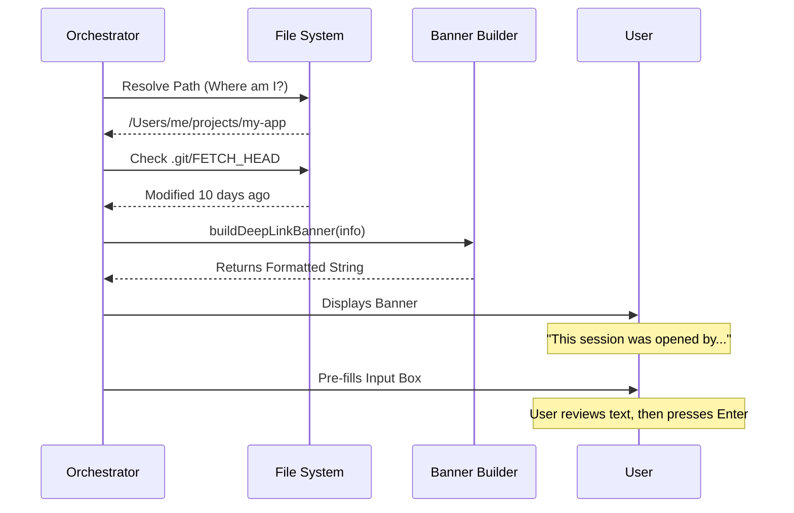

# Chapter 4: Session Provenance & Security UI

Welcome to Chapter 4!

In the previous chapter, [URI Parsing and Sanitization](03_uri_parsing_and_sanitization.md), we acted as the "Bouncer." We took a messy input string, checked IDs, removed dangerous characters, and produced a clean "Action Object."

However, just because the input is "clean" (doesn't contain code that crashes the system) doesn't mean it is **safe** (doesn't contain instructions you didn't intend to run).

In this chapter, we will build the **Security UI**. This is the visual feedback layer that tells the user: *"Hey, this terminal window was opened by a link, not by you manually. Please check the text before you press Enter."*

## The Motivation: The "External Sender" Banner

Have you ever received an email at work from outside your company? Most email systems put a big yellow banner at the top: **"EXTERNAL SENDER."**

Why do they do that?
1.  **Context:** It tells you the origin of the message.
2.  **Vigilance:** It reminds you to be careful before clicking links or downloading attachments.

We need the exact same thing for our CLI.

Imagine a user clicks a link: `claude-cli://start?q=Delete all my files`.
Our parser (Chapter 3) says this is valid text. But if we just paste that into the terminal and hit Enter automatically, the user loses all their files.

**We never auto-execute.** Instead, we auto-fill the text and show a **Provenance Banner**.

## Key Concepts

To build this UI, we need to gather three pieces of evidence to present to the user.

### 1. Provenance (The Source)
We need to explicitly state that this session was triggered by a Deep Link. This differentiates it from a normal terminal window the user opened themselves.

### 2. Context (The Location)
Deep links often select a specific folder (Repository) to open in. The user needs to verify: *"Did this link open the project I expected, or did it drop me into a sensitive internal folder?"*

### 3. Staleness (The Freshness)
If the link opens a collaborative coding project, we check the Git history. If the user hasn't pulled the latest code in weeks, we warn them: *"Your local files are old. The prompt in this link might rely on code you don't have yet."*

## Implementation Walkthrough

The logic lives in `banner.ts`. The main function is `buildDeepLinkBanner`. It takes a data object and returns a formatted string to display.

### Step 1: The Input Data
First, let's look at the data we need to build the banner. We define a simple type called `DeepLinkBannerInfo`.

```typescript
// banner.ts

export type DeepLinkBannerInfo = {
  cwd: string              // Where are we? (e.g., /Users/me/project)
  prefillLength?: number   // How much text is in the prompt?
  repo?: string            // The name of the repo (e.g., facebook/react)
  lastFetch?: Date         // When did we last run 'git fetch'?
}
```

*Explanation:* This is our "evidence bag." The Orchestrator collects these facts and hands them to the UI generator.

### Step 2: The Basic Warning
Now, let's start building the text. The first line is mandatory: tell the user where they are.

```typescript
export function buildDeepLinkBanner(info: DeepLinkBannerInfo): string {
  // 1. Establish Provenance
  // tildify() converts "/Users/alice" to "~" to save space
  const lines = [
    `This session was opened by an external deep link in ${tildify(info.cwd)}`,
  ]
  
  // ... continue to Step 3
```

*Explanation:* Even if nothing else is wrong, the user must know this is an external session.

### Step 3: Adding Context and Staleness
If we know which Git repository requested this, we show that info. We also check if the repo is "stale" (hasn't been fetched in a week).

```typescript
  // 2. Add Repo Context
  if (info.repo) {
    const age = info.lastFetch ? formatRelativeTimeAgo(info.lastFetch) : 'never'
    
    // Warn if older than 7 days
    const isStale = !info.lastFetch || (Date.now() - info.lastFetch.getTime() > 604800000)
    
    lines.push(
      `Resolved ${info.repo} · last fetched ${age}${isStale ? ' — May be stale' : ''}`
    )
  }
```

*Explanation:* This helps the user orient themselves. "Oh, this link opened my `frontend-react` repo, but I haven't updated it in a month."

### Step 4: The "Scroll to Review" Warning
This is the most critical security feature.

Malicious actors might try a **"Scroll Padding Attack."** They send a prompt with 100 empty lines followed by a dangerous command. If the user only sees the top lines, they might press Enter safely, unaware of the command hidden at the bottom.

We detect long prompts and change the warning message.

```typescript
  // 3. Security Warning
  if (info.prefillLength) {
    // If prompt is massive (>1000 chars), warn explicitly about scrolling
    const msg = info.prefillLength > 1000
        ? `Long prompt (${info.prefillLength} chars) — scroll to review entirely.`
        : 'The prompt below was supplied by the link — review carefully.'

    lines.push(msg)
  }
  
  return lines.join('\n')
}
```

*Explanation:* If the text is short, we say "Review carefully." If it's long, we explicitly say "Scroll down!"

## Under the Hood: Checking "Staleness"

How do we know when a folder was last updated? We peek into the hidden `.git` folder.

Git updates a file called `FETCH_HEAD` every time you run `git fetch` or `git pull`. We simply read the "Modified Time" (mtime) of that file.

```typescript
// Inside readLastFetchTime...

export async function readLastFetchTime(cwd: string): Promise<Date | undefined> {
  // 1. Find the hidden .git folder
  const gitDir = await getGitDir(cwd)
  if (!gitDir) return undefined

  // 2. Read the timestamp of the FETCH_HEAD file
  try {
    const { mtime } = await stat(join(gitDir, 'FETCH_HEAD'))
    return mtime
  } catch {
    return undefined // Never fetched or file missing
  }
}
```

*Explanation:* This is a lightweight way to check repo health without running slow git commands.

## The Sequence of Events

Here is how the system gathers the evidence and presents the banner.



## Example Outputs

Let's look at what the user actually sees.

**Scenario A: A normal, safe link**
```text
This session was opened by an external deep link in ~/projects/my-app
Resolved facebook/react · last fetched 2 hours ago
The prompt below was supplied by the link — review carefully before pressing Enter.
```

**Scenario B: A potentially dangerous, long link in an old repo**
```text
This session was opened by an external deep link in ~/projects/legacy-code
Resolved old-corp/backend · last fetched 2 years ago — CLAUDE.md may be stale
The prompt below (5200 chars) was supplied by the link — scroll to review the entire prompt before pressing Enter.
```

## Conclusion

In this chapter, we built the **Session Provenance & Security UI**.

We learned:
*   We must **inform** the user that the session started automatically.
*   We must **identify** the context (repo and folder) clearly.
*   We must **warn** the user about hidden content in long prompts (Scroll Padding Attacks).

We have now handled the Input (Parsing), the Registration (OS), and the Feedback (UI). Ideally, we want to launch this into a real terminal window.

But wait... which terminal? iTerm2? VS Code? Command Prompt? PowerShell?

Every user has a different setup. In the final chapter, we will build the abstraction layer that handles the chaos of launching different terminal emulators on different operating systems.

[Next Chapter: Terminal Emulator Abstraction](05_terminal_emulator_abstraction.md)

---

Generated by [Code IQ](https://github.com/adityasoni99/Code-IQ)