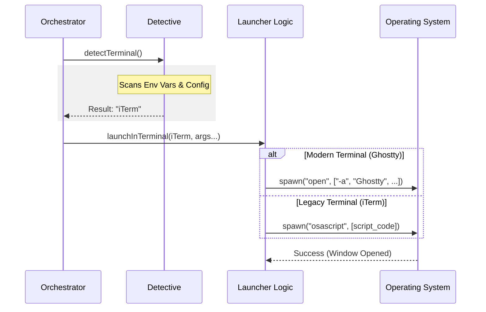

# Chapter 5: Terminal Emulator Abstraction

Welcome to the final chapter of the **deepLink** tutorial series!

In the previous chapter, [Session Provenance & Security UI](04_session_provenance___security_ui.md), we built the security layer. We parsed the link, checked for danger, and prepared a "warning banner" to show the user.

Now we face the final hurdle. We have a command ready to go, but **where do we run it?**

If we just run the command in Node.js, it runs in the background (invisible). We need to pop open a **visible window** so the user can actually type and interact with Claude.

## The Motivation

This sounds simple: "Just open a terminal." But in the world of Operating Systems, this is a nightmare.

*   **Alice** uses **iTerm2** on macOS.
*   **Bob** uses **PowerShell** on Windows.
*   **Charlie** uses **Ghostty** on Linux.
*   **Dave** uses the default **Command Prompt**.

Each of these programs speaks a completely different language.
*   To open iTerm, you might need to write **AppleScript**.
*   To open GNOME Terminal, you pass flags like `--working-directory`.
*   To open cmd.exe, you use `/k`.

If we tried to write this logic inside our main code, it would be a mess. Instead, we build a **Terminal Emulator Abstraction**.

Think of this as a **Universal Translator**. Our main application just says *"Please open a window here,"* and this abstraction figures out exactly which buttons to push to make that happen on the user's specific computer.

## Key Concepts

### 1. The "Preference" Snapshot
When you click a link in a browser, the browser launches our app. But the browser doesn't know what terminal you like. It just knows about the OS.

To solve this, we cheat. Every time the user runs our CLI manually, we secretly save their terminal name.

```typescript
// terminalPreference.ts

export function updateDeepLinkTerminalPreference(): void {
  // 1. Ask the environment: "Who is running me?"
  const termProgram = process.env.TERM_PROGRAM // e.g., "iTerm.app"

  // 2. Save it for later (e.g., to a config file)
  if (termProgram) {
    saveGlobalConfig({ deepLinkTerminal: termProgram })
  }
}
```
*Explanation:* If you run Claude in iTerm today, we remember "iTerm." Tomorrow, if you click a link, we know to open iTerm.

### 2. The Detective
When the link is clicked, we need to find a terminal. We can't just assume iTerm exists. We go through a **Priority List**:

1.  **Stored Preference:** (Did they use iTerm before?)
2.  **Running Processes:** (Is Ghostty already open?)
3.  **Installed Apps:** (Do they have VS Code installed?)
4.  **System Default:** (Fall back to Terminal.app or cmd.exe).

### 3. The Launcher
This is the heavy lifter. It constructs the specific command string required by the target application.

## Use Case: The "Polyglot" Launch

Let's see how we use this abstraction in our main Orchestrator.

**Input:**
The Orchestrator calls this single function:
```typescript
launchInTerminal('/bin/claude', { 
  cwd: '/Users/me/projects/react', 
  query: 'Hello world' 
})
```

**Internal Logic:**
The abstraction determines the user is on macOS and likes **iTerm**. It translates the request into:
```applescript
tell application "iTerm"
  create window with default profile
  write text "cd /Users/me/projects/react && /bin/claude --prefill 'Hello world'"
end tell
```

**Output:**
A new iTerm window appears, focused on the correct folder, with the text pre-filled.

## Internal Implementation

Let's look at the flow of data within `terminalLauncher.ts`.



### The Detection Code
First, we find the terminal. Notice how we handle the priority list.

```typescript
// terminalLauncher.ts

async function detectMacosTerminal(): Promise<TerminalInfo> {
  // 1. Check if we saved a preference previously
  const stored = getGlobalConfig().deepLinkTerminal
  if (stored) return { name: stored, command: stored }

  // 2. Check for installed apps using Spotlight (mdfind)
  for (const terminal of MACOS_TERMINALS) {
    // Run 'mdfind' to see if the app bundle exists on disk
    if (await isAppInstalled(terminal.bundleId)) {
      return terminal
    }
  }

  // 3. Give up and use the default
  return { name: 'Terminal.app', command: 'Terminal' }
}
```

*Explanation:* We try to be smart, but we always have a safe fallback so the user is never left with nothing happening.

### The Launch Switch
This is the core of the abstraction. We switch based on the specific terminal application because they all behave differently.

```typescript
// terminalLauncher.ts

async function launchMacosTerminal(term: TerminalInfo, cmd: string, args: string[]) {
  switch (term.command) {
    case 'Ghostty':
    case 'Alacritty':
      // Modern apps accept arguments cleanly!
      // open -na Ghostty --args -e claude ...
      return execFile('open', ['-na', term.command, '--args', '-e', cmd, ...args])

    case 'iTerm':
      // Older apps need AppleScript to automate them
      const script = `tell application "iTerm" to create window...`
      return execFile('osascript', ['-e', script])
  }
}
```

*Explanation:* 
*   **Modern Terminals** (like Ghostty or Alacritty) act like standard command-line tools. We can just pass the command we want to run as an argument (`-e`).
*   **Legacy Terminals** (like iTerm or Apple Terminal) were designed before CLIs were cool. We have to use **AppleScript**, which is a way to programmatically "click" buttons in macOS apps.

### Windows Complexity
Windows is a different beast. We rely on `start`, `powershell`, or `cmd`.

```typescript
async function launchWindowsTerminal(term: TerminalInfo, cmd: string, args: string[]) {
  if (term.name === 'PowerShell') {
    // PowerShell needs specific quoting rules
    return spawn('pwsh.exe', [
      '-NoExit',  // Keep window open after command finishes
      '-Command', 
      `& '${cmd}' ${args.join(' ')}` // The "&" operator runs a command
    ])
  }
  
  // Fallback to Command Prompt
  return spawn('cmd.exe', ['/k', `${cmd} ${args.join(' ')}`])
}
```

*Explanation:* `cmd /k` tells Windows: "Run this command, and then **keep** the window open (`/k`) so the user can see the result." If we used `/c` (close), the window would vanish instantly if there was an error.

## Quoting and Escaping: The Invisible Enemy

You might notice functions like `cmdQuote` or `appleScriptQuote` in the source code. These are vital for security.

Imagine the user's folder name is `My Projects`.
*   **Bad:** `cd My Projects` (Computers think this is two folders: "My" and "Projects").
*   **Good:** `cd "My Projects"`.

Our abstraction handles this "escaping" automatically.

```typescript
function appleScriptQuote(s: string): string {
  // Escape backslashes and double quotes so AppleScript doesn't break
  return `"${s.replace(/\\/g, '\\\\').replace(/"/g, '\\"')}"`
}
```

This ensures that even if your file path contains spaces, emojis, or weird symbols, the terminal opens in the right place.

## Conclusion

We have reached the end of our journey!

In this chapter, we built the **Terminal Emulator Abstraction**. We learned that opening a window is not a simple task—it requires understanding the specific dialect of every terminal application on every Operating System.

Let's recap what happens when a user clicks `claude-cli://open?q=Hello`:

1.  **OS Registration:** Windows/Mac sees the link and wakes up our Trampoline process ([Chapter 2](02_os_protocol_registration.md)).
2.  **Orchestrator:** The Trampoline receives the link ([Chapter 1](01_deep_link_orchestration.md)).
3.  **Parsing:** We convert the text link into a safe object ([Chapter 3](03_uri_parsing_and_sanitization.md)).
4.  **UI:** We prepare a security banner to warn the user ([Chapter 4](04_session_provenance___security_ui.md)).
5.  **Launcher:** We detect the user's favorite terminal (iTerm/Powershell) and construct the perfect command to launch a new window (Chapter 5).

The result? A seamless, magical experience where a click on the web transforms into a powerful, interactive session on the desktop.

Thank you for following the **deepLink** tutorial series! You now possess the knowledge to build robust, secure, and OS-integrated deep linking for your own CLI tools.

---

Generated by [Code IQ](https://github.com/adityasoni99/Code-IQ)