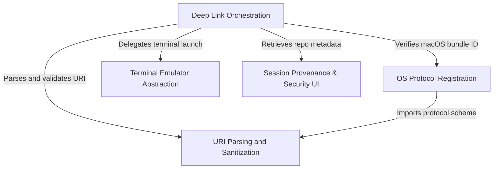

# Tutorial: deepLink

This project implements a secure **deep linking** system that allows external applications (like browsers) to launch a CLI tool via `claude-cli://` URLs. It orchestrates the entire flow by handling **OS-level protocol registration**, strictly **sanitizing** inputs to prevent command injection, and intelligently detecting the user's preferred **terminal emulator** to start an interactive session. It also includes **provenance checks** to warn users about the source and content of the triggered session.

## Chapters

1. [Deep Link Orchestration](01_deep_link_orchestration.md)
2. [OS Protocol Registration](02_os_protocol_registration.md)
3. [URI Parsing and Sanitization](03_uri_parsing_and_sanitization.md)
4. [Session Provenance & Security UI](04_session_provenance___security_ui.md)
5. [Terminal Emulator Abstraction](05_terminal_emulator_abstraction.md)

---

Generated by [Code IQ](https://github.com/adityasoni99/Code-IQ)