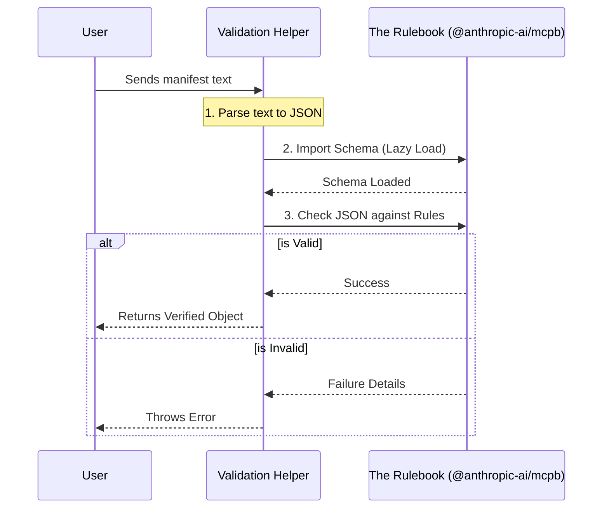

# Chapter 1: Manifest Validation & Parsing

Welcome to the world of **dxt**! Whether you are building extensions or just curious about how they work, everything starts with a single, crucial file: `manifest.json`.

## The "Border Control" of Extensions

Imagine you run a secure facility. Before you let anyone enter, they must show a passport. You check the passport to ensure:
1. It is a valid document (not just a napkin with scribbles).
2. It has a photo, a name, and an expiration date.
3. It hasn't been forged.

In the **dxt** project, every extension is a visitor. The `manifest.json` file is its **passport**.

**Manifest Validation & Parsing** is the border control agent. It rigorously checks this "passport" to ensure the extension is safe, correctly labeled, and follows the strict rules defined in the `@anthropic-ai/mcpb` schema. If the manifest is missing a version number or has an invalid name, the agent rejects it immediately.

### Key Use Case: Loading a New Extension

Let's say a user wants to install a "Weather Checker" extension. The system reads the extension's files. Before doing anything else, it takes the `manifest.json` text and asks: *"Is this valid?"*

If yes, we get a trusted object we can use in our code. If no, we stop immediately to prevent crashes later.

---

## How to Use It

This abstraction is handled primarily by the `parseAndValidateManifestFromText` function. It takes raw text (what you read from a file) and turns it into a useful code object.

### Example: Checking a Manifest

Let's look at how we process a simple JSON string.

**1. The Input**
Imagine we have read this text from a file:

```typescript
// This is raw text, perhaps read from a file on disk
const manifestText = `
{
  "name": "weather-checker",
  "version": "1.0.0",
  "author": { "name": "SuperCoder" }
}
`
```

**2. The Validation Call**
We pass this text to our validator.

```typescript
import { parseAndValidateManifestFromText } from './helpers'

// We wrap this in a try/catch block because validation might fail
try {
  const manifest = await parseAndValidateManifestFromText(manifestText)
  
  // If we reach here, the manifest is valid!
  console.log(`Loaded extension: ${manifest.name}`)
} catch (error) {
  console.error("Access Denied:", error.message)
}
```

**Output:**
```text
Loaded extension: weather-checker
```

If the JSON was missing the `name` field, the output would be an error explaining exactly what is missing.

---

## Under the Hood: How It Works

What actually happens inside `parseAndValidateManifestFromText`? It's a three-step process designed for safety and speed.

1.  **JSON Parsing:** It tries to turn the text string into a basic Javascript object. If the braces `{ }` are unbalanced, it fails here.
2.  **Lazy Loading the Rules:** It imports the "Rulebook" (Schema) only when needed.
3.  **Schema Check:** It compares the object against the strict `@anthropic-ai/mcpb` definitions.

### Sequence Diagram

Here is a visual flow of the data:



### Deep Dive: The Code Implementation

Let's break down the actual code in `helpers.ts` to see how it handles these steps.

#### 1. Turning Text into JSON
First, we ensure the input is actually JSON.

```typescript
export async function parseAndValidateManifestFromText(
  manifestText: string,
): Promise<McpbManifest> {
  let manifestJson: unknown

  try {
    // Attempt to parse the string into a raw object
    manifestJson = jsonParse(manifestText)
  } catch (error) {
    throw new Error(`Invalid JSON in manifest.json: ${errorMessage(error)}`)
  }

  // Pass the raw object to the main validator
  return validateManifest(manifestJson)
}
```
*Explanation:* If `jsonParse` fails (e.g., a missing comma), we throw a clear error saying "Invalid JSON".

#### 2. Lazy Loading the Schema
This is a cool performance trick! The validation library (Zod) is heavy. It creates about 24 internal closures and takes up ~700KB of memory.

If we just start the app without checking a manifest, we don't want to waste that memory.

```typescript
export async function validateManifest(
  manifestJson: unknown,
): Promise<McpbManifest> {
  // We only import the heavy library IF we are actually running this function
  const { McpbManifestSchema } = await import('@anthropic-ai/mcpb')
  
  // Now we check the data
  const parseResult = McpbManifestSchema.safeParse(manifestJson)
  
  // ... handling results continues below ...
```
*Explanation:* The `await import(...)` line ensures we keep the startup "lightweight." We only open the heavy rulebook when we have a passport to check. This concept relates to [Performance Optimization (Lazy Loading)](05_performance_optimization__lazy_loading_.md), though applied specifically to validation here.

#### 3. Handling Validation Errors
If the passport is fake (invalid data), we need to tell the user *why*.

```typescript
  if (!parseResult.success) {
    // Flatten the errors to make them easy to read
    const errors = parseResult.error.flatten()
    
    // Create a readable string of what went wrong
    const errorMessages = Object.entries(errors.fieldErrors)
      .map(([field, errs]) => `${field}: ${errs?.join(', ')}`)
      .join('; ')

    throw new Error(`Invalid manifest: ${errorMessages}`)
  }

  // Success! Return the clean data.
  return parseResult.data
}
```
*Explanation:* `safeParse` returns a success boolean. If it's false, we extract the specific field errors (like "Version is required") and throw a friendly error message.

---

## Conclusion

You have learned how `dxt` protects itself from bad configuration. By acting as a strict border control agent, the **Manifest Validation** system ensures that only valid, safe extensions enter the system. It uses **Lazy Loading** to keep the application fast and efficient.

Now that we have a valid manifest, we know the extension's **Name** and **Author**. But how do we turn that into a unique ID that the system can use to track it?

Find out in the next chapter: [Extension Identity Generation](02_extension_identity_generation.md).

---

Generated by [Code IQ](https://github.com/adityasoni99/Code-IQ)