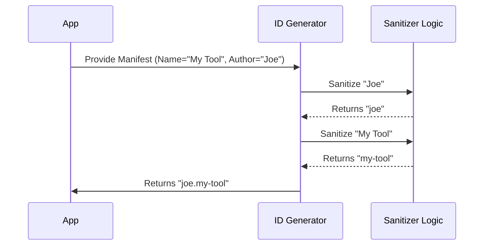

# Chapter 2: Extension Identity Generation

In the previous chapter, [Manifest Validation & Parsing](01_manifest_validation___parsing.md), we learned how to check the extension's "passport" (the `manifest.json`) to ensure it is valid and safe.

Now that we know the extension is valid, we face a new challenge: **Storage**. If two different authors both create an extension named "Weather", how do we tell them apart? How do we create a folder name that works on Windows, Mac, and Linux without crashing?

This chapter introduces **Extension Identity Generation**, the system used to create a unique, safe "ID Card" for every extension.

## The "Library Catalog" System

Imagine a library. If an author writes their name as "J.K. Rowling" on one book and "Rowling, Joanne" on another, the librarian might mistakenly put them on different shelves. To fix this, libraries use a standardized system (like a call number).

**dxt** does the exact same thing.

### The Problem: Messy Input
Extension authors are human. They might name their extension:
*   "My Super-Cool Tool!"
*   "   My   Tool   "
*   "Tool #1 (Best Version)"

If we tried to create a folder with those exact names, our operating system might reject the generic characters (like `!` or `#`), or spaces might cause bugs in scripts.

### The Solution: The Standard ID
We convert everything into a standardized format: **lowercase**, **hyphenated**, and **clean**. This is the **Extension ID**.

This ID is used everywhere:
1.  To name the folder on your hard drive.
2.  To reference the extension in the database.
3.  To ensure "Bob's Weather" doesn't overwrite "Alice's Weather".

---

## How to Use It

The magic happens in the function `generateExtensionId`. You provide the manifest (which we validated in Chapter 1), and it returns a clean ID string.

### Example: Generating an ID

Let's look at a simple example where we convert a messy name into a clean ID.

**1. The Input**
We have a manifest object (already validated).

```typescript
// A validated manifest object
const myManifest = {
  name: "Super  Cool_Extension!", // Note the spaces and symbols
  version: "1.0.0",
  author: { name: "  Code Wizard 99  " }
}
```

**2. The Generation Call**
We pass this object to our generator.

```typescript
import { generateExtensionId } from './helpers'

// Generate the ID
const id = generateExtensionId(myManifest)

console.log(`Extension ID: ${id}`)
```

**Output:**
```text
Extension ID: code-wizard-99.super-cool-extension
```

Notice what happened:
*   Uppercases became lowercase.
*   Spaces became hyphens (`-`).
*   Special characters (`!`) were removed.
*   The format is `author.extension-name`.

### Example: Adding a System Prefix

Sometimes, the system needs to categorize extensions (e.g., distinguishing between a downloaded extension and a local one). We can add a "prefix".

```typescript
// Generate an ID with a specific prefix
const localId = generateExtensionId(myManifest, 'local.dxt')

console.log(localId)
```

**Output:**
```text
local.dxt.code-wizard-99.super-cool-extension
```

---

## Under the Hood: How It Works

This process isn't random; it follows a strict recipe to ensure that if you run it 100 times, you get the exact same ID 100 times.

### Step-by-Step Flow

1.  **Extraction:** We pull the `author.name` and the extension `name` from the manifest.
2.  **Sanitization:** We run both names through a "cleaning machine" (Regex) to strip bad characters.
3.  **Assembly:** We join them with dots (`.`).

### Sequence Diagram



### Deep Dive: The Code Implementation

Let's look at `helpers.ts` to see exactly how the "cleaning machine" works. This is crucial because it ensures file system safety.

#### 1. The Sanitization Function
This small helper function is defined inside `generateExtensionId`. It chains several text replacements together.

```typescript
const sanitize = (str: string) =>
  str
    .toLowerCase()            // 1. Make everything lowercase
    .replace(/\s+/g, '-')     // 2. Turn spaces into hyphens
    .replace(/[^a-z0-9-_.]/g, '') // 3. Remove anything not a letter, number, or dash
    .replace(/-+/g, '-')      // 4. Merge multiple dashes (e.g., "a--b" -> "a-b")
    .replace(/^-+|-+$/g, '')  // 5. Trim dashes from start/end
```
*Explanation:*
*   Line 3 removes characters like `!`, `@`, `/`, or `\`. These characters are illegal in file names on many operating systems.
*   Line 4 ensures we don't end up with `my--tool` if the user typed two spaces.

#### 2. Constructing the Final ID
Once we have clean strings, we simply stick them together.

```typescript
export function generateExtensionId(
  manifest: McpbManifest,
  prefix?: 'local.unpacked' | 'local.dxt',
): string {
  // ... sanitize function is here ...

  // Clean the raw inputs
  const sanitizedAuthor = sanitize(manifest.author.name)
  const sanitizedName = sanitize(manifest.name)

  // Combine them: prefix (optional) + author + name
  return prefix
    ? `${prefix}.${sanitizedAuthor}.${sanitizedName}`
    : `${sanitizedAuthor}.${sanitizedName}`
}
```
*Explanation:* This logic guarantees that the ID is **unique to the author**. If "AuthorA" and "AuthorB" both make an extension called "Weather", the IDs will be `authora.weather` and `authorb.weather`. They will never conflict!

---

## Conclusion

You have learned how **Extension Identity Generation** takes messy, human-readable names and converts them into strict, machine-friendly IDs. This ensures that:
1.  We can create safe folders on disk.
2.  Every extension has a unique "call number."
3.  We avoid conflicts between different authors.

Now that we have a valid manifest and a safe ID (which tells us *where* to put the files), we are ready to actually unpack the extension's code.

In the next chapter, we will learn how to safely extract the files from the extension archive without accidentally overwriting critical system files.

Read on in [Secure Archive Extraction](03_secure_archive_extraction.md).

---

Generated by [Code IQ](https://github.com/adityasoni99/Code-IQ)