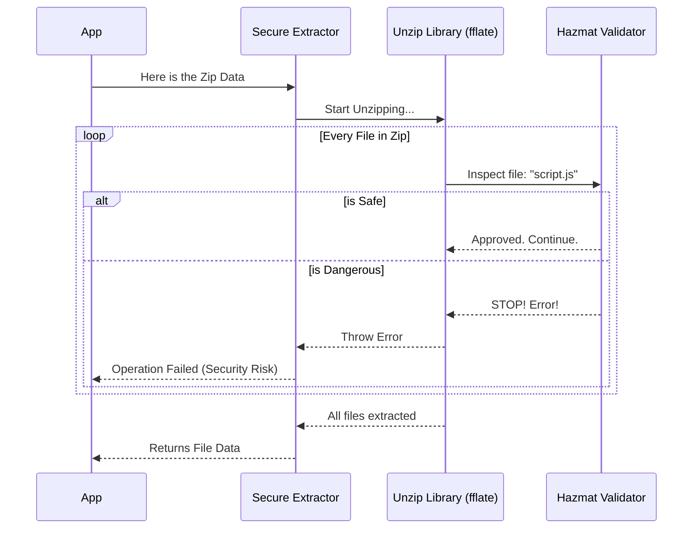

# Chapter 3: Secure Archive Extraction

In the previous chapter, [Extension Identity Generation](02_extension_identity_generation.md), we learned how to create a unique, standardized ID for an extension. This gave us a safe "name tag" and a location to put the files.

Now, we have to deal with the package itself. The extension comes as a **ZIP file**.

You might think unzipping a file is simple. But in the world of software, accepting a ZIP file from a stranger is like accepting a mystery package. It could be harmless, or it could contain a "Zip Bomb" meant to crash your server.

This chapter covers **Secure Archive Extraction**.

## The "Hazmat Team" for Files

Imagine you are running a secure mailroom. A package arrives. Do you just rip it open in the middle of the room? No.

You bring in the **Hazardous Materials (Hazmat) Team**. They inspect the package with special scanners before opening it.
1.  **Is it too heavy?** (File Size Limits)
2.  **Is it packed so tightly it will explode when opened?** (Zip Bombs)
3.  **Does it contain instructions to break into the manager's office?** (Path Traversal)

**Secure Archive Extraction** is that Hazmat team. It meticulously checks every single file inside the ZIP archive *before* and *during* the unpacking process.

### Central Use Case: Unpacking a User Upload

A user uploads `my-extension.zip`. We need to read the files inside so we can install them.

**The Goal:** Convert the raw ZIP data into safe, usable file contents in our computer's memory.
**The Risk:** If we just used a standard "unzip" tool, a malicious user could include a file named `../../password.txt`, which might overwrite your system's password file.

---

## How to Use It

We use the function `readAndUnzipFile`. This function handles reading the file from the disk, summoning the Hazmat team (validation), and returning the clean contents.

### Example: Unzipping a File

**1. The Input**
We have a file path pointing to a zip file on our disk.

```typescript
const zipFilePath = '/tmp/uploads/extension.zip'
```

**2. The Extraction Call**
We call the function. It is asynchronous because unzipping takes time.

```typescript
import { readAndUnzipFile } from './zip'

try {
  // This extracts the files into memory safely
  const files = await readAndUnzipFile(zipFilePath)
  
  // 'files' is an object where keys are paths and values are data
  console.log("Files found:", Object.keys(files))
} catch (error) {
  console.error("Security Alert:", error.message)
}
```

**Output:**
```text
Files found: [ 'manifest.json', 'dist/index.js', 'README.md' ]
```

If the zip file was malicious (e.g., a Zip Bomb), the code would jump to the `catch` block with a message like: *"Suspicious compression ratio detected... This may be a zip bomb."*

---

## Under the Hood: How It Works

This process relies on a library called `fflate`, which is a very fast unzipper. However, we wrap `fflate` in a layer of strict security logic.

### The Security Checklist

When `dxt` starts unzipping, it keeps a "Scorecard" (State Tracker). For every file it finds inside the zip, it updates the scorecard:

1.  **File Count:** Are there more than 100,000 files? -> **STOP.**
2.  **Path Safety:** Does the file name contain `..` (trying to go up a directory)? -> **STOP.**
3.  **Size Limit:** Is a single file larger than 512MB? -> **STOP.**
4.  **Compression Ratio:** Is a 1MB zip turning into 10GB of data? -> **STOP.**

### Sequence Diagram



---

## Deep Dive: The Code Implementation

Let's look at `zip.ts` to see how we implement these safety checks.

### 1. Lazy Loading for Performance
Just like in Chapter 1, we don't want to load the heavy zip library (`fflate`) unless we are actually unzipping something.

```typescript
export async function unzipFile(zipData: Buffer) {
  // Lazy Load: Only import 'fflate' when this function runs.
  // This saves memory (~196KB) at startup.
  const { unzipSync } = await import('fflate')
  
  // We prepare a state object to track file sizes and counts
  const state = {
    fileCount: 0,
    totalUncompressedSize: 0,
    compressedSize: zipData.length,
    errors: []
  }
  
  // ... extraction continues below ...
}
```
*Explanation:* We use `await import` to pull in the tool only when needed. This is a recurring theme in `dxt` to keep the application fast.

### 2. The Filter (The Hazmat Guard)
`fflate` allows us to provide a `filter` function. This function runs **before** a file is fully decompressed. This is where we plug in our `validateZipFile` logic.

```typescript
  const result = unzipSync(new Uint8Array(zipData), {
    // The filter runs for every file in the zip
    filter: file => {
      const validationResult = validateZipFile(file, state)
      
      if (!validationResult.isValid) {
        // If the file is dangerous, we crash the process intentionally
        throw new Error(validationResult.error!)
      }
      return true
    },
  })
```
*Explanation:* By throwing an error inside the filter, we abort the entire unzip process immediately. No dangerous files are ever written or fully processed.

### 3. Detecting Path Traversal
This is a critical security check. Hackers try to use file names like `../../etc/passwd` to overwrite system files.

```typescript
export function isPathSafe(filePath: string): boolean {
  // 1. Check for malicious patterns specifically
  if (containsPathTraversal(filePath)) {
    return false
  }

  // 2. Normalize the path (resolving dots)
  const normalized = normalize(filePath)

  // 3. Ensure it is not an absolute path (like /usr/bin/...)
  if (isAbsolute(normalized)) {
    return false
  }

  return true
}
```
*Explanation:* We ensure that every file inside the zip stays *inside* the destination folder. It is not allowed to escape.

### 4. Detecting Zip Bombs
A "Zip Bomb" is a small file that expands to be enormous (e.g., a file full of zeros). We detect this by comparing the compressed size to the uncompressed size.

```typescript
// Inside validateZipFile...

// Check compression ratio
const currentRatio = state.totalUncompressedSize / state.compressedSize

// If the data expands more than 50 times its size, it's suspicious
if (currentRatio > 50) {
  error = `Suspicious compression ratio: ${currentRatio}:1`
}
```
*Explanation:* If you have a 1MB zip file, it shouldn't turn into 100MB of data. If it does, `dxt` assumes it is an attack and stops.

---

## Conclusion

You have learned how `dxt` safely handles untrusted archives. By using a **Secure Archive Extraction** process, we treat every ZIP file as a potential threat until proven otherwise. We use **Lazy Loading** to keep things fast, and **Strict Validation** to prevent crashes and hacks.

However, there is one piece of information that ZIP files often lose during this process: **File Permissions**.

If your extension contains an executable script (like a shell script), standard unzipping might make it un-runnable. How do we ensure executable files stay executable?

Find out in the next chapter: [Zip Mode Restoration](04_zip_mode_restoration.md).

---

Generated by [Code IQ](https://github.com/adityasoni99/Code-IQ)