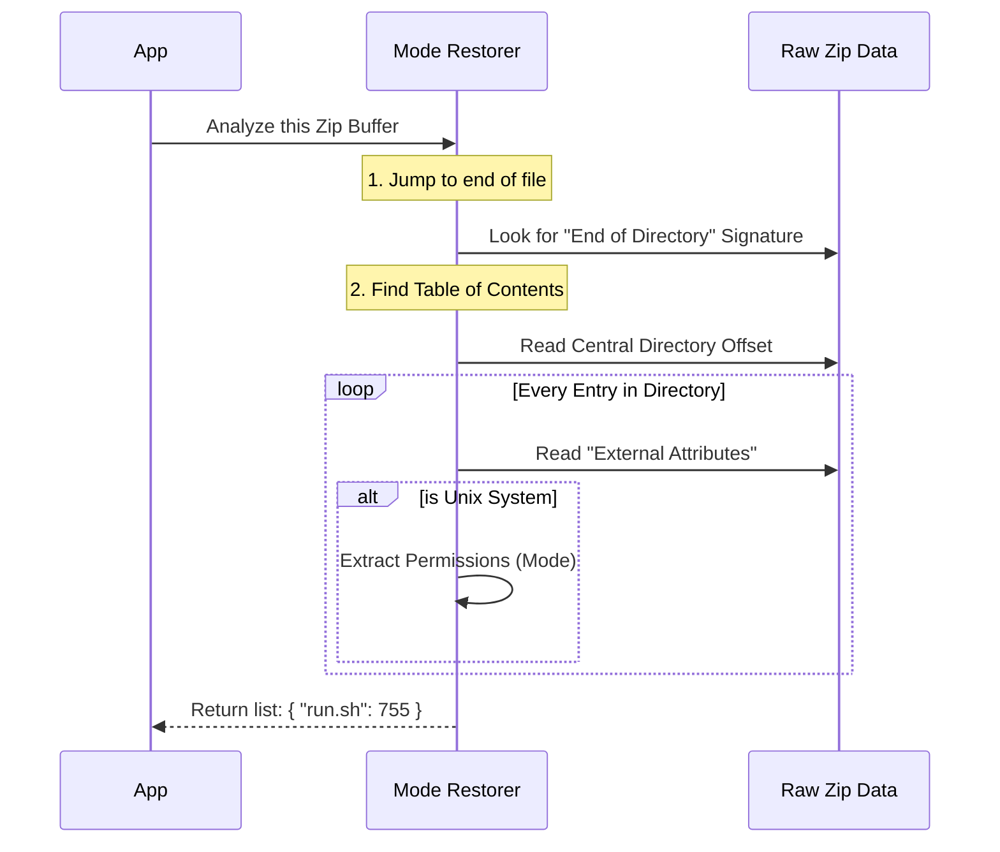

# Chapter 4: Zip Mode Restoration

In the previous chapter, [Secure Archive Extraction](03_secure_archive_extraction.md), we learned how to safely unpack a ZIP file, checking it for bombs and traps. We successfully got the files out of the box.

However, we have a new problem. When standard tools unzip files in JavaScript, they often act like a clumsy mover. They unpack your TV, but they lose the remote. They unpack your lamp, but forget the lightbulb.

In technical terms: **They extract the content, but lose the permissions.**

If your extension includes a script (like `run.sh`) that needs to be executable, standard extraction turns it into a plain text file. It won't run. This chapter introduces **Zip Mode Restoration**, a specialized utility that recovers these lost details.

## The "Art Restorer" of Files

Imagine you have an old painting. A casual observer just sees the image. But an **Art Restorer** looks deeper—ignoring the frame and examining the canvas itself to find hidden signatures or notes left by the original artist.

**Zip Mode Restoration** does exactly this.

Most unzip libraries (like the one we used in Chapter 3) only care about the *file data*. They ignore the "metadata" (permissions) to save memory. Our restoration tool ignores the data and looks exclusively at the raw binary headers—the "notes" left by the creator—to see if a file was meant to be an executable program.

### Central Use Case: The Un-runnable Script

You are building an extension that wraps a Python tool. You include a shell script:
`my-extension/start.sh`

1.  **The Creator:** Marks `start.sh` as executable (`chmod +x`) and zips it.
2.  **The Extractor:** Unzips it. The file content is there, but the "executable" flag is gone.
3.  **The Result:** The user tries to run it and gets: `Permission denied`.

**The Solution:** We run `parseZipModes`. It scans the ZIP file, realizes `start.sh` should be executable, and tells us so we can fix it.

---

## How to Use It

We use the function `parseZipModes`. It takes the raw binary data of the ZIP file and returns a simple list (object) of files that have special permissions.

### Example: Finding Executable Files

**1. The Input**
We have the raw bytes of a zip file loaded into memory.

```typescript
// Imagine this buffer contains a zip file with 'script.sh' inside
const zipBytes = await fs.readFile('extension.zip')
```

**2. The Restoration Call**
We ask the utility to find the permissions.

```typescript
import { parseZipModes } from './zip'

// Parse the binary headers
const modes = parseZipModes(zipBytes)

// Check the result
console.log(modes)
```

**Output:**
```text
{
  "script.sh": 33261,  // This number represents "755" (Executable)
  "bin/runner": 33261
}
```

Files that are just standard text files (like `README.md`) won't appear in this list. We only care about the special ones.

---

## Under the Hood: How It Works

To understand this, you need to know a secret about ZIP files: **They are written backwards.**

When a computer creates a ZIP, it writes the file data first. Then, at the very end of the file, it writes a "Central Directory"—a Table of Contents. This table contains the detailed metadata, including Unix permissions.

Standard extractors read the front (the data). **Zip Mode Restoration** jumps straight to the back (the Table of Contents).

1.  **Jump to End:** It looks at the end of the file for a specific "Magic Number" (signature).
2.  **Read the Map:** It finds the location of the Central Directory.
3.  **Decode Attributes:** It reads the `externalAttr` field for every file to see if the "Unix Executable" bit is set.

### Sequence Diagram



---

## Deep Dive: The Code Implementation

Let's look at `zip.ts`. This is low-level binary parsing, but we will break it down into simple steps.

### 1. Finding the "End of Central Directory" (EOCD)
The ZIP format ends with a specific signature: `0x06054b50`. We scan backwards from the end of the buffer to find it.

```typescript
export function parseZipModes(data: Uint8Array): Record<string, number> {
  const buf = Buffer.from(data.buffer) // Create a view of the data
  
  // Scan backwards from the end to find the signature
  // The EOCD is usually within the last few bytes
  let eocd = -1
  for (let i = buf.length - 22; i >= 0; i--) {
    if (buf.readUInt32LE(i) === 0x06054b50) {
      eocd = i
      break
    }
  }
  // ... continues below ...
}
```
*Explanation:* `readUInt32LE(i)` reads 4 bytes at position `i`. We are looking for the digital fingerprint that says "The Table of Contents ends here."

### 2. Locating the Central Directory
Once we find the End record, it tells us exactly where the Central Directory *starts*.

```typescript
  // Read the number of files (offset 10)
  const entryCount = buf.readUInt16LE(eocd + 10)
  
  // Read where the directory actually starts (offset 16)
  let off = buf.readUInt32LE(eocd + 16) 

  const modes: Record<string, number> = {}
```
*Explanation:* The ZIP format is a strict map. We know that exactly 16 bytes after the signature, there is a number telling us the "Start Offset."

### 3. Extracting the Permissions
Now we loop through the files in the directory. We look for the "External Attributes" field, which stores the Unix permissions.

```typescript
  for (let i = 0; i < entryCount; i++) {
    // Read the "Version Made By" field. 
    // If the high byte is '3', it was made on Unix.
    const versionMadeBy = buf.readUInt16LE(off + 4)
    const externalAttr = buf.readUInt32LE(off + 38)
    
    // Read the filename length so we can read the name next
    const nameLen = buf.readUInt16LE(off + 28)
```
*Explanation:* We are manually reading binary data. Offset `38` is where the permissions live. Offset `4` tells us if the ZIP was made on a Mac/Linux (Unix) or Windows machine.

### 4. The Bitwise Logic
Finally, we check if the file is from a Unix system and extract the mode.

```typescript
    // If it's Unix (3), the permissions are in the top 16 bits
    if (versionMadeBy >> 8 === 3) {
      // Shift bits to isolate the mode (e.g., 755)
      const mode = (externalAttr >>> 16) & 0xffff
      
      if (mode) {
         const name = buf.toString('utf8', off + 46, off + 46 + nameLen)
         modes[name] = mode
      }
    }
    // Update 'off' to jump to the next file entry...
  }
  return modes
```
*Explanation:* This is the core logic. `externalAttr >>> 16` takes the 32-bit attribute and slides it over, discarding the junk and keeping only the file permissions. We save this into our list.

---

## Conclusion

You have learned how **Zip Mode Restoration** acts as a digital archaeologist. While standard tools blindly dump files, this utility carefully parses the ancient binary structures of the ZIP format to recover critical information: **File Permissions**.

Thanks to this chapter, when you extract an extension, executable scripts stay executable.

We have now validated the manifest, generated an ID, safely extracted the files, and restored their permissions. The extension is ready!

But... what if the user never actually uses the extension? Did we waste time and memory loading all this code?

In the next chapter, we will learn how to make the system ultra-efficient by only doing work at the very last second.

Read on in [Performance Optimization (Lazy Loading)](05_performance_optimization__lazy_loading_.md).

---

Generated by [Code IQ](https://github.com/adityasoni99/Code-IQ)