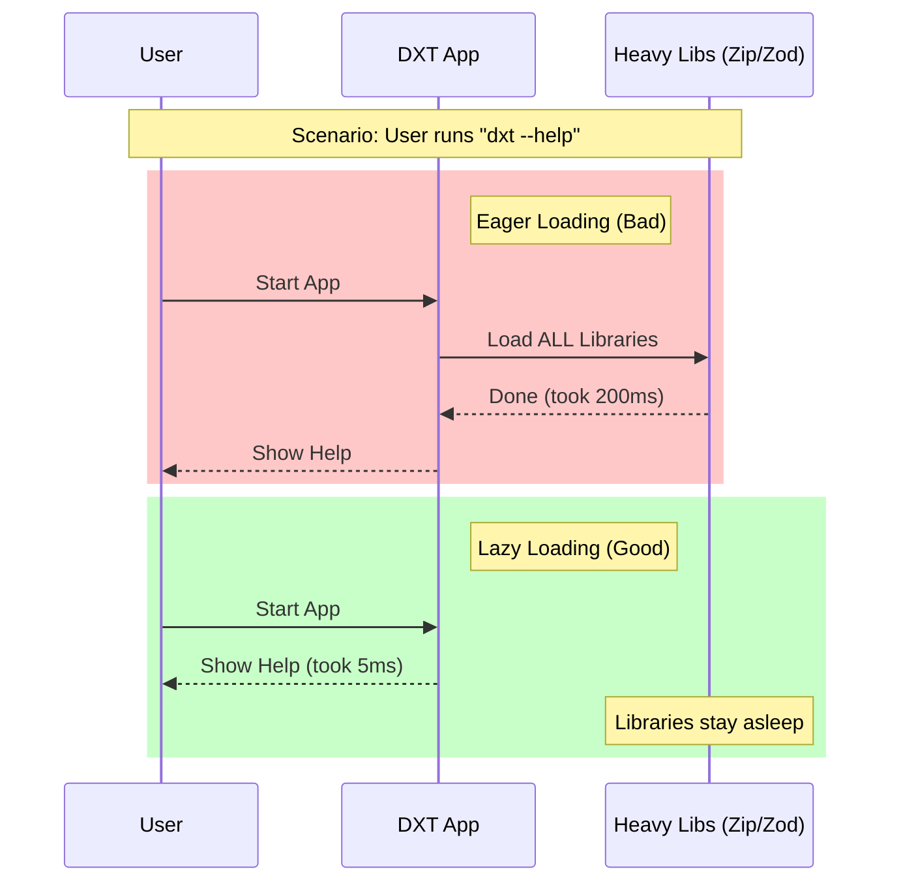

# Chapter 5: Performance Optimization (Lazy Loading)

In the previous chapter, [Zip Mode Restoration](04_zip_mode_restoration.md), we learned how to restore file permissions to ensure scripts remain executable. We now have a fully functional system that can validate, identify, extract, and restore extensions.

But there is one final question: **Is it fast?**

If a user simply wants to check the version of the tool (`dxt --version`), should they have to wait for the system to load the heavy ZIP extraction libraries? Absolutely not.

This chapter covers **Performance Optimization (Lazy Loading)**, the architectural pattern used in `dxt` to keep startup times instant and memory usage low.

## The "Just-In-Time" Factory

Imagine you run a manufacturing factory. You have a massive, heavy machine called "The Crusher" (used for compression) and a complex "Rulebook Library" (used for validation).

**The Old Way (Eager Loading):**
Every morning at 8:00 AM, you drag "The Crusher" onto the factory floor and stack all 5,000 pages of the Rulebook on your desk. You do this even if the only job for the day is to sweep the floor. This is slow, tiring, and takes up a lot of space.

**The New Way (Lazy Loading):**
You leave the heavy machine in the warehouse and the books on the shelf. You start work immediately.
*   If a sweeping job comes in, you sweep. (Fast!)
*   Only when a *crushing* job comes in do you go fetch "The Crusher."

In `dxt`, **Lazy Loading** means we do not import heavy code libraries until the exact line of code where they are needed.

### Central Use Case: The "Help" Command

A user types:
```bash
dxt --help
```

**Goal:** Show the help text immediately (within milliseconds).
**Problem:** The `zod` validation library takes up ~700KB of memory and creates complex internal objects. The `fflate` zip library creates large lookup tables (~200KB).
**Solution:** We structure our code so that `zod` and `fflate` are **not** loaded when running `--help`. They are only loaded when running `install`.

---

## Key Concept: Dynamic Imports

In standard JavaScript, we usually see imports at the top of the file. This is called a **Static Import**.

```typescript
// ❌ Static Import (The "Old Way")
// This runs immediately when the file loads, blocking execution.
import { heavyTool } from 'huge-library' 

export function doWork() {
  heavyTool.run()
}
```

To achieve Lazy Loading, we use **Dynamic Imports**. This moves the `import` statement *inside* the function.

```typescript
// ✅ Dynamic Import (The "Lazy Way")
export async function doWork() {
  // This only runs when doWork() is actually called.
  const { heavyTool } = await import('huge-library')
  
  heavyTool.run()
}
```

---

## How to Use It

In `dxt`, we use this pattern for every "heavy" dependency.

### Example: Validation Logic

In [Manifest Validation & Parsing](01_manifest_validation___parsing.md), we used a schema validator. Here is how we ensure it doesn't slow down the app startup.

**1. The Function Definition**
We mark the function as `async` because importing takes a micro-moment.

```typescript
export async function validateManifest(json: unknown) {
  // 1. The function starts running immediately.
  // 2. NOW we fetch the heavy library.
  const { McpbManifestSchema } = await import('@anthropic-ai/mcpb')

  // 3. Use the library
  return McpbManifestSchema.parse(json)
}
```

**2. The Execution**
*   **Scenario A:** User runs `dxt --version`. The `validateManifest` function is never called. The `@anthropic-ai/mcpb` library is **never loaded**. The app starts instantly.
*   **Scenario B:** User runs `dxt install`. The function is called. The library loads. The user waits 10ms extra, but only when necessary.

---

## Under the Hood: How It Works

JavaScript modules are like dominoes. Usually, if you touch the first one, they all fall (load). Dynamic imports put a "stopper" in the chain.

### Sequence Diagram: Eager vs. Lazy

Let's visualize the timeline of starting the application.



---

## Deep Dive: The Code Implementation

Let's look at the actual source code in `dxt` to see where we saved memory.

### 1. Optimizing Zip Extraction (`zip.ts`)

The `fflate` library is fast, but it initializes large arrays (Lookup Tables) to perform decompression. We avoid this cost at startup.

```typescript
// From zip.ts
export async function unzipFile(zipData: Buffer) {
  // Lazy Load: Only import 'fflate' when this function runs.
  // Savings: Avoids ~196KB of lookup tables at startup.
  const { unzipSync } = await import('fflate')
  
  // Now we use it
  const result = unzipSync(new Uint8Array(zipData), {
    // ... filtering logic ...
  })
  
  return result
}
```
*Explanation:* If we put `import { unzipSync } ...` at the top of `zip.ts`, simply *referencing* the `zip.ts` file (even for a different utility) would pay the memory cost. By moving it inside, the cost is isolated.

### 2. Optimizing Validation (`helpers.ts`)

The Zod library is even heavier. It creates complex closures (functions inside functions) that fill up the "Heap" (computer memory).

```typescript
// From helpers.ts
export async function validateManifest(
  manifestJson: unknown,
): Promise<McpbManifest> {
  // Savings: Keeps ~700KB of bound closures out of memory
  const { McpbManifestSchema } = await import('@anthropic-ai/mcpb')
  
  const parseResult = McpbManifestSchema.safeParse(manifestJson)

  // ... error handling ...
}
```
*Explanation:* ~700KB might sound small, but in a command-line tool, every kilobyte counts towards how "snappy" the tool feels.

### 3. Avoiding "Top-Level" Side Effects

A common mistake is doing work at the root level of a file.

**Don't do this:**
```typescript
// BAD: This runs as soon as the file is imported!
const heavyCalculator = new HeavyCalculator(); 

export function calculate() { ... }
```

**Do this:**
```typescript
// GOOD: No work is done until the function is called.
export async function calculate() {
  const { HeavyCalculator } = await import('./heavy')
  const calc = new HeavyCalculator()
  // ...
}
```

---

## Conclusion

Congratulations! You have completed the **dxt** tutorial series.

Throughout these five chapters, you have explored the lifecycle of a secure extension management system:

1.  **[Manifest Validation & Parsing](01_manifest_validation___parsing.md):** Ensuring the "passport" is valid.
2.  **[Extension Identity Generation](02_extension_identity_generation.md):** Creating a safe, unique ID.
3.  **[Secure Archive Extraction](03_secure_archive_extraction.md):** Unpacking files without security risks.
4.  **[Zip Mode Restoration](04_zip_mode_restoration.md):** recovering executable permissions.
5.  **Performance Optimization:** Using Lazy Loading to respect the user's time and memory.

By combining strict security (Validation, Sanitization) with smart engineering (Lazy Loading), `dxt` provides a tool that is not only safe but also incredibly fast.

You are now ready to explore the codebase with confidence! Happy coding!

---

Generated by [Code IQ](https://github.com/adityasoni99/Code-IQ)