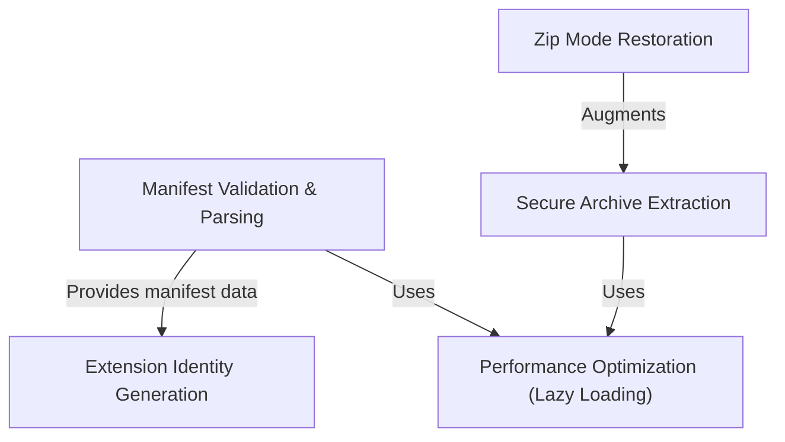

# Tutorial: dxt

The `dxt` project is a security-focused utility for managing extension packages. It performs **strict validation** of `manifest.json` files and handles **secure ZIP extraction** to prevent attacks like "zip bombs" and path traversal. Additionally, it includes specialized tools for **restoring Unix file permissions** and generating standardized extension IDs, all while using **lazy loading** to minimize memory usage and startup time.

## Chapters

1. [Manifest Validation & Parsing](01_manifest_validation___parsing.md)
2. [Extension Identity Generation](02_extension_identity_generation.md)
3. [Secure Archive Extraction](03_secure_archive_extraction.md)
4. [Zip Mode Restoration](04_zip_mode_restoration.md)
5. [Performance Optimization (Lazy Loading)](05_performance_optimization__lazy_loading_.md)

---

Generated by [Code IQ](https://github.com/adityasoni99/Code-IQ)