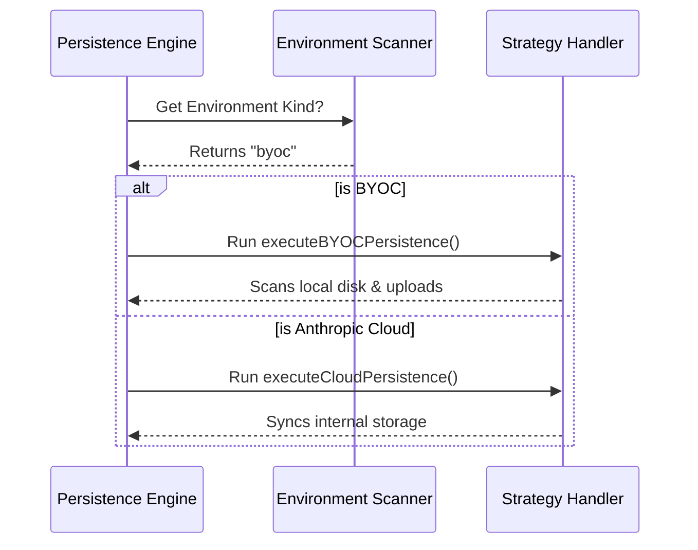

# Chapter 1: Environment Strategy

Welcome to the **File Persistence** project! In this tutorial series, we will explore how the system saves files generated during a Claude Code session.

We start with the most fundamental question the system asks itself: **"Where am I?"**

### The Concept: The Universal Adapter

Imagine you are traveling with your laptop. If you are at home, you plug it directly into the wall. If you are in a different country, you use a travel adapter. The goal is the same—power the laptop—but the method changes based on your location.

The **Environment Strategy** pattern works exactly like that.

**The Use Case:**
A user asks Claude to write a file named `hello_world.txt`.
- If the system is running on the user's own machine (Bring Your Own Cloud - **BYOC**), we need to scan the hard drive for that file and upload it.
- If the system is running inside the **Anthropic Cloud**, the file is already there, so we use a direct synchronization method.

This chapter explains how the code detects the environment and chooses the right strategy.

---

### Key Concept: The Environment Variable

The system relies on a specific flag to know where it is running. This flag is an environment variable called `CLAUDE_CODE_ENVIRONMENT_KIND`.

It can have two values:
1.  **`byoc`**: The system is running on your infrastructure.
2.  **`anthropic_cloud`**: The system is running in the managed cloud.

#### How to Detect the Environment

Let's look at how the code reads this information. This logic lives in `outputsScanner.ts`.

```typescript
// From outputsScanner.ts
export function getEnvironmentKind(): EnvironmentKind | null {
  // Read the variable from the system
  const kind = process.env.CLAUDE_CODE_ENVIRONMENT_KIND

  // Only accept known values
  if (kind === 'byoc' || kind === 'anthropic_cloud') {
    return kind
  }
  return null
}
```

**Explanation:**
The function checks `process.env`. If the variable is set to one of our allowed values, it returns it. If it's undefined or something strange, it returns `null` (which stops the process later).

---

### The Decision Logic

Once we know *where* we are, we have to decide *what* to do. This happens in the main orchestrator file, `filePersistence.ts`.

Think of this as a railway switch. The train comes in, we look at the destination (Environment Kind), and we switch the tracks accordingly.

#### Step-by-Step Flow

Before looking at the code, let's visualize the decision process.



#### The Implementation

Here is how the code implements that decision tree. We've simplified the code to focus purely on the strategy selection.

```typescript
// From filePersistence.ts (simplified)
export async function runFilePersistence(turnStartTime: TurnStartTime) {
  // 1. Ask the scanner where we are
  const environmentKind = getEnvironmentKind()

  // 2. If we are in BYOC mode, run the specific BYOC logic
  if (environmentKind === 'byoc') {
    return await executeBYOCPersistence(
      turnStartTime, 
      config, 
      outputsDir
    )
  } 
  
  // 3. Otherwise, run the Cloud logic
  else {
    return await executeCloudPersistence()
  }
}
```

**Explanation:**
1.  **Detection:** We call `getEnvironmentKind()`.
2.  **Branching:**
    *   If it is `byoc`, the system knows it must look for files physically created on the machine. This leads to **Delta Scanning** (which we will cover in [Delta Scanning](04_delta_scanning.md)).
    *   If it is `anthropic_cloud`, it runs a different function specialized for that environment (currently a placeholder for cloud syncing).

### Why This Matters

By isolating this logic at the very beginning, the rest of the application doesn't need to worry about where it is running.
- The **Scanner** (Chapter 4) only cares about finding files.
- The **Uploader** only cares about sending files.
- The **Environment Strategy** handles the "Where".

### Conclusion

You have learned how the system acts as a "Travel Adapter." It checks the `CLAUDE_CODE_ENVIRONMENT_KIND` variable to determine if it is in **BYOC** mode or **Anthropic Cloud** mode, and selects the appropriate path.

 However, just knowing the environment isn't enough. We also need to make sure we are allowed to save files for the current user session.

In the next chapter, we will learn how the system validates the session to prevent unauthorized access.

[Next Chapter: Session Gating](02_session_gating.md)

---

Generated by [Code IQ](https://github.com/adityasoni99/Code-IQ)