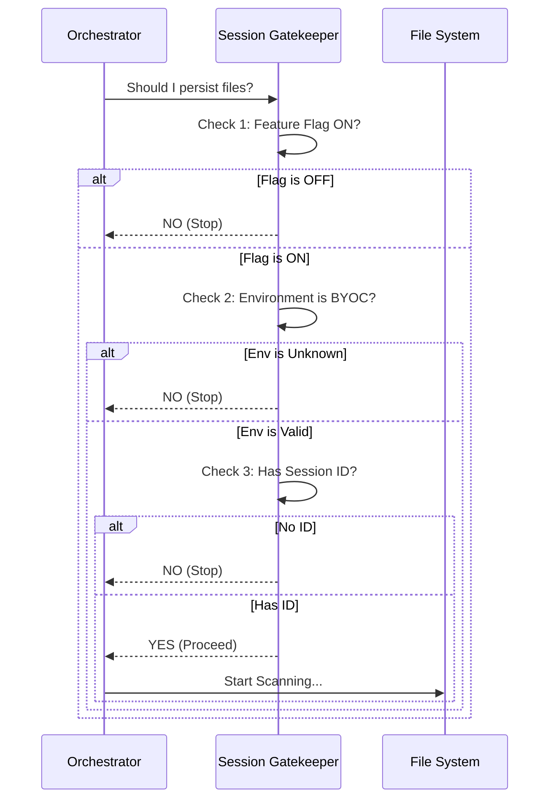

# Chapter 2: Session Gating

In the previous chapter, [Environment Strategy](01_environment_strategy.md), we learned how the system figures out "Where am I?" (BYOC or Cloud).

However, just knowing your location isn't enough. Imagine you are walking into a high-security office building. Just being in the lobby doesn't mean you are allowed to enter the server room. You need a badge.

This is where **Session Gating** comes in.

### The Problem: Accidental Uploads

We have a specific safety requirement: **Do not run file persistence for normal users.**

If you run Claude Code on your personal laptop to debug a script, you generally don't want your files being scanned and uploaded to a remote server automatically. We only want this to happen when Claude is running in a specific, authorized **Remote Session**.

### The Solution: The VIP Bouncer

The Session Gating logic acts like a bouncer at a club. It stands at the door and forbids entry unless you can show three specific forms of ID.

If any **one** of these is missing, the system says "No" and shuts down the persistence process immediately.

#### The Three IDs

1.  **The Feature Flag:** Is the "File Persistence" system turned on globally?
2.  **The Environment:** Are we in a `byoc` environment? (As learned in Chapter 1).
3.  **The Session Identity:** Do we have a valid `CLAUDE_CODE_REMOTE_SESSION_ID`?

---

### Step-by-Step Logic Flow

Before looking at the code, let's visualize how the bouncer makes the decision.



### The Implementation

This logic is found in `filePersistence.ts`. It acts as a guard at the very top of the main function. If these checks fail, the function returns `null` immediately.

#### Check 1: The Environment Check

First, we verify we are in the correct environment mode.

```typescript
// From filePersistence.ts
export async function runFilePersistence(...) {
  // 1. Ask: Where are we?
  const environmentKind = getEnvironmentKind()

  // If we aren't in BYOC mode, stop immediately.
  if (environmentKind !== 'byoc') {
    return null
  }
```

**Explanation:**
This relies on the logic we built in [Environment Strategy](01_environment_strategy.md). If the result isn't `'byoc'`, the bouncer closes the door.

#### Check 2: The Access Token

Next, we check if we have the keys to the API.

```typescript
  // 2. Ask: Do we have a key to talk to the server?
  const sessionAccessToken = getSessionIngressAuthToken()
  
  // If no token, we can't upload anyway, so stop.
  if (!sessionAccessToken) {
    return null
  }
```

**Explanation:**
The `sessionAccessToken` is like a wristband for the club. Without it, you can't buy drinks (upload files).

#### Check 3: The Session ID

Finally, the most critical check: The Remote Session ID. This ID only exists if the user is running a remote session (not a local CLI run).

```typescript
  // 3. Ask: What is the specific Session ID?
  const sessionId = process.env.CLAUDE_CODE_REMOTE_SESSION_ID
  
  // If this variable is empty, it's just a local user. Stop.
  if (!sessionId) {
    // Log an error because this is unexpected if enabled
    logError(new Error('...REMOTE_SESSION_ID is not set'))
    return null
  }
```

**Explanation:**
If `process.env.CLAUDE_CODE_REMOTE_SESSION_ID` is missing, the code assumes this is a standard user running locally. The system aborts to protect user privacy.

---

### The "Is Enabled" Helper

Ideally, you want to check if you are allowed in *before* you even drive to the club. The file includes a helper function `isFilePersistenceEnabled` that combines all these checks into a simple "Yes/No".

This is useful for other parts of the app that just need to know if the feature is active.

```typescript
// From filePersistence.ts
export function isFilePersistenceEnabled(): boolean {
  // Check the global switch first
  if (feature('FILE_PERSISTENCE')) {
    
    // Then check all 3 IDs at once
    return (
      getEnvironmentKind() === 'byoc' &&
      !!getSessionIngressAuthToken() &&
      !!process.env.CLAUDE_CODE_REMOTE_SESSION_ID
    )
  }
  return false
}
```

**Explanation:**
1.  `feature('FILE_PERSISTENCE')`: This is a global toggle.
2.  `!!`: This is a JavaScript trick to convert a value (like a string) into a boolean (`true` or `false`).
3.  If **all** conditions are true, the function returns `true`.

### Conclusion

You have learned how **Session Gating** protects the system. It ensures that file scanning and uploading only occur in authorized, remote contexts. It prevents the code from running on a standard user's local machine by checking for the Environment Kind, Access Token, and Session ID.

Now that the Bouncer has let us in, we need to coordinate the actual work. Who keeps track of time? Who handles the errors?

In the next chapter, we will look at the manager of this operation.

[Next Chapter: Persistence Orchestration](03_persistence_orchestration.md)

---

Generated by [Code IQ](https://github.com/adityasoni99/Code-IQ)