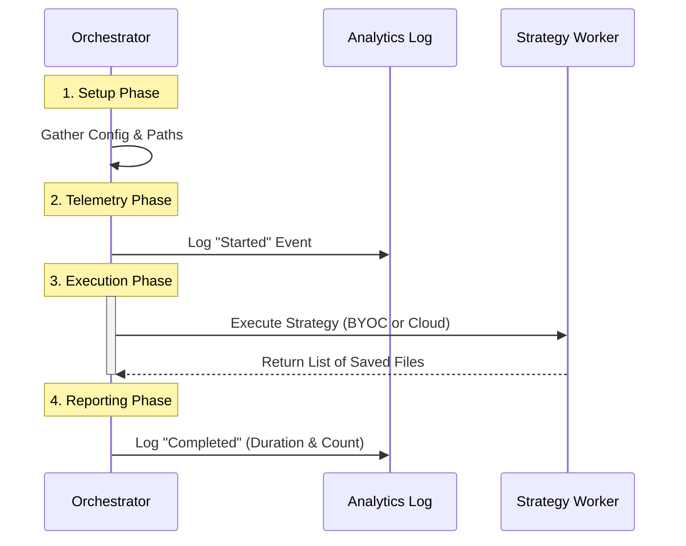

# Chapter 3: Persistence Orchestration

Welcome back! 

In the previous chapter, [Session Gating](02_session_gating.md), we acted as the "Bouncer." We checked IDs, verified tokens, and ensured that only authorized remote sessions could enter the file saving process.

Now that we are inside, who manages the actual work?

### The Concept: The Project Manager

Imagine a construction site. You have workers (functions) who know how to pour concrete or wire electricity. But without a **Project Manager**, the electrician might show up before the walls are built.

**Persistence Orchestration** is that Project Manager.

It doesn't personally scan the hard drive or upload the bytes. Instead, it coordinates the workflow:
1.  **Preparation:** Gathers the necessary tools (Configuration & Tokens).
2.  **Clock-in:** Notes the exact time the job started (Analytics).
3.  **Delegation:** Tells the specific strategy to do the work.
4.  **Reporting:** logs whether the job was a success or a failure.

### The Use Case

The user has just finished a "turn" (an interaction with Claude).
*   **Input:** The timestamp when the turn started.
*   **Goal:** coordinate the saving of files without crashing the application, and record how long it took.

---

### The Workflow Visualization

Before looking at the code, let's visualize the timeline managed by the Orchestrator.



---

### Step-by-Step Implementation

The orchestration logic lives in `runFilePersistence` inside `filePersistence.ts`. Let's break down the manager's checklist.

#### 1. The Setup (Gathering Tools)

First, the orchestrator needs to prepare the configuration object. It grabs the Session ID and the Access Token (which we validated in [Session Gating](02_session_gating.md)).

```typescript
// From filePersistence.ts
const config: FilesApiConfig = {
  oauthToken: sessionAccessToken, // The Key
  sessionId,                      // The Room Number
}

// Define where the files live
const outputsDir = join(getCwd(), sessionId, OUTPUTS_SUBDIR)
```

**Explanation:**
We package the token and session ID into a `config` object. We also calculate the exact folder path (`outputsDir`) where we expect to find the user's files.

#### 2. The "Clock In" (Analytics)

Before doing any heavy lifting, we log that we are starting. This is crucial for debugging. If we see a "Started" log but never a "Completed" log, we know the system crashed mid-process.

```typescript
// Start the stopwatch
const startTime = Date.now()

// Tell the analytics system we are beginning
logEvent('tengu_file_persistence_started', {
  mode: environmentKind, 
})
```

**Explanation:**
We record the current time in `startTime`. We also send an event to our analytics system saying "The file persistence process has begun in BYOC mode."

#### 3. The Execution (The Try/Catch Block)

This is the most critical part. The manager wraps the actual work in a `try/catch` block. This ensures that if the worker fails (e.g., the internet cuts out), the error is caught gracefully instead of crashing the entire Claude Code application.

```typescript
try {
  let result: FilesPersistedEventData
  
  // Decide which worker to call (based on Chapter 1)
  if (environmentKind === 'byoc') {
    result = await executeBYOCPersistence(turnStartTime, config, outputsDir)
  } else {
    result = await executeCloudPersistence()
  }

  // ... (Success handling goes here)
  return result

} catch (error) {
  // ... (Failure handling goes here)
}
```

**Explanation:**
*   **The Switch:** We check `environmentKind` (from [Environment Strategy](01_environment_strategy.md)) to decide which function to call.
*   **The Safety Net:** All this happens inside `try { ... }`. If anything inside explodes, the code jumps immediately to `catch (error)`.

#### 4. The Report (Success)

If the worker returns successfully, the manager looks at the clock again to see how long it took.

```typescript
  // Calculate how long the job took
  const durationMs = Date.now() - startTime

  logEvent('tengu_file_persistence_completed', {
    success_count: result.files.length,
    failure_count: result.failed.length,
    duration_ms: durationMs,
    mode: environmentKind,
  })
```

**Explanation:**
We subtract the start time from the current time to get `durationMs`. We then log a "Completed" event, including exactly how many files were saved.

#### 5. The Report (Failure)

If an error occurred, the `catch` block handles it. The manager logs the error but returns a safe "failed" result so the main program continues running.

```typescript
} catch (error) {
  // Log the error to the console
  logError(error)

  // Report the crash to analytics
  logEvent('tengu_file_persistence_completed', {
    success_count: 0,
    error: 'exception',
  })

  // Return a structured failure object
  return { files: [], failed: [{ filename: outputsDir, error: errorMessage(error) }] }
}
```

**Explanation:**
Even when things go wrong, we log a "Completed" event (with 0 successes) so our data remains consistent. We return a specific object describing the failure.

### Summary

You have learned how the **Persistence Orchestration** pattern works:
1.  It prepares the configuration.
2.  It monitors the process using **Analytics** (Start/End events).
3.  It wraps the execution in a safety net (`try/catch`).
4.  It delegates the specific work based on the environment.

The Orchestrator has now successfully delegated the work. In the code snippet above, we saw it call `executeBYOCPersistence`.

But what exactly happens inside that function? How does it know which files are new and which ones are old?

In the next chapter, we will dive into the worker's logic: **Delta Scanning**.

[Next Chapter: Delta Scanning](04_delta_scanning.md)

---

Generated by [Code IQ](https://github.com/adityasoni99/Code-IQ)