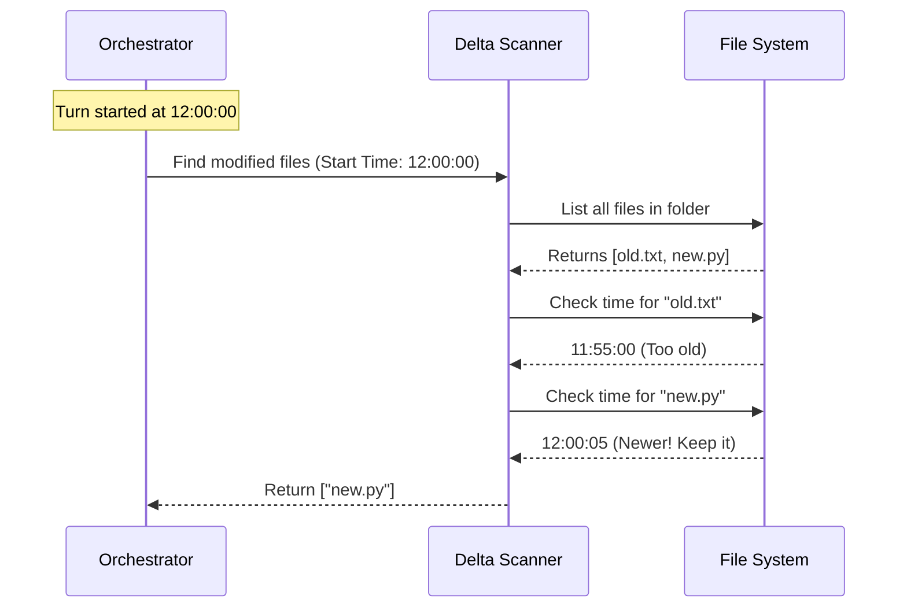

# Chapter 4: Delta Scanning

Welcome to the fourth chapter of our File Persistence tutorial!

In the previous chapter, [Persistence Orchestration](03_persistence_orchestration.md), we set up the "Project Manager" who oversees the entire saving process. Now, we dive into the specific task of the worker: **Finding the right files.**

### The Problem: Finding a Needle in a Haystack

Imagine you have a project folder with 1,000 files. You just asked Claude to create **one** new Python script.

When the session ends, we want to save that new script to the cloud. We have two options:
1.  **The Brute Force Way:** Upload all 1,001 files every single time. (Slow, expensive, wasteful).
2.  **The Smart Way:** Find only the file that changed in the last 5 minutes.

We choose the smart way. This process is called **Delta Scanning**.

---

### The Concept: The Security Camera

Think of this scanner like a motion-activated security camera.

*   **The "Turn":** This is the time window when Claude was working (from the moment you hit "Enter" until the response finished).
*   **The "Delta":** This is the difference—or change—that happened during that time.

The scanner looks at the file system and asks a simple question for every file:
> *"Were you touched since the camera turned on?"*

If the answer is **Yes**, we save it.
If the answer is **No**, we ignore it.

---

### How It Works: The `mtime` Comparison

Computers stamp every file with a "Modified Time" (called `mtime`).

To implement Delta Scanning, we need two pieces of data:
1.  **`turnStartTime`**: The exact millisecond the user started the interaction.
2.  **`file.mtimeMs`**: The exact millisecond the file was last changed.

**The Logic:**
```text
IF (File Modification Time >= Turn Start Time)
    -> SAVE FILE
ELSE
    -> IGNORE FILE
```

### The Workflow

Let's visualize the process inside the scanner code.



---

### The Implementation

This logic lives in `outputsScanner.ts`. The main function is called `findModifiedFiles`.

Let's break down the code into small, digestible steps.

#### Step 1: Reading the Directory

First, we need to get a list of *everything* in the folder. We use the `recursive: true` option so we can find files hiding inside sub-folders.

```typescript
// From outputsScanner.ts
export async function findModifiedFiles(turnStartTime, outputsDir) {
  // 1. Get all file entries recursively
  const entries = await fs.readdir(outputsDir, {
    withFileTypes: true,
    recursive: true, 
  })
```

**Explanation:**
`fs.readdir` acts like opening a file explorer window. It gives us a list of every item in the `outputsDir`.

#### Step 2: Filtering Candidates

Not everything in a folder is a regular file. Sometimes there are "Symbolic Links" (shortcuts to other places). For security reasons, we skip those immediately.

```typescript
  const filePaths: string[] = []

  for (const entry of entries) {
    // Skip shortcuts (symlinks) for safety
    if (entry.isSymbolicLink()) continue

    // If it's a real file, keep it for checking
    if (entry.isFile()) {
      filePaths.push(path.join(entry.parentPath, entry.name))
    }
  }
```

**Explanation:**
We loop through the list. If it's a standard file, we build its full path (e.g., `/home/user/project/script.py`) and add it to our "To Check" list.

#### Step 3: Checking the Time (The Core Logic)

Now comes the most important part. We check the `mtime` of each candidate.

*Note: In the actual code, we use `Promise.all` to check many files at once for speed, but the logic remains simple:*

```typescript
  // Check the stats (details) of the file
  const stat = await fs.lstat(filePath)

  // THE GOLDEN RULE:
  // Is the modification time >= the start time?
  if (stat.mtimeMs >= turnStartTime) {
    modifiedFiles.push(filePath)
  }
```

**Explanation:**
We look at `stat.mtimeMs`. If it is greater than (newer) or equal to our `turnStartTime`, it qualifies as a "Delta." It gets added to the final list.

#### Step 4: Handling Race Conditions

File systems change fast. A file might exist when we list the directory (Step 1) but be deleted by the time we check its stats (Step 3).

To prevent the system from crashing, we wrap the check in a `try/catch`.

```typescript
    try {
      const stat = await fs.lstat(filePath)
      // ... check time logic ...
    } catch {
      // If the file was deleted mid-scan, just ignore it.
      return null
    }
```

**Explanation:**
This makes the scanner robust. If a file disappears "ghost-style" in the middle of the operation, the scanner quietly moves on to the next one.

---

### Bringing It All Together

Back in `filePersistence.ts` (the Orchestrator from Chapter 3), we use this scanner like this:

```typescript
// From filePersistence.ts

// 1. Run the scanner
const modifiedFiles = await findModifiedFiles(turnStartTime, outputsDir)

// 2. If nothing changed, we can stop early!
if (modifiedFiles.length === 0) {
  logDebug('No modified files to persist')
  return
}
```

This efficiency is crucial. Most of the time, the user might just ask a question ("How does this code work?") without creating files. In those cases, `modifiedFiles` is empty, and the system does no work.

### Conclusion

You have learned how **Delta Scanning** acts as an intelligent filter.
1.  It lists all files recursively.
2.  It filters out unsafe items like symbolic links.
3.  It compares the file's `mtime` against the `turnStartTime`.
4.  It returns only the files that are new or modified.

However, just because a file is new doesn't mean it is safe to upload. What if the scanner found a file that is technically "new" but located in a forbidden system folder due to a relative path trick?

In the final chapter, we will learn how to clean and verify this list before the final upload.

[Next Chapter: Security Sanitization](05_security_sanitization.md)

---

Generated by [Code IQ](https://github.com/adityasoni99/Code-IQ)