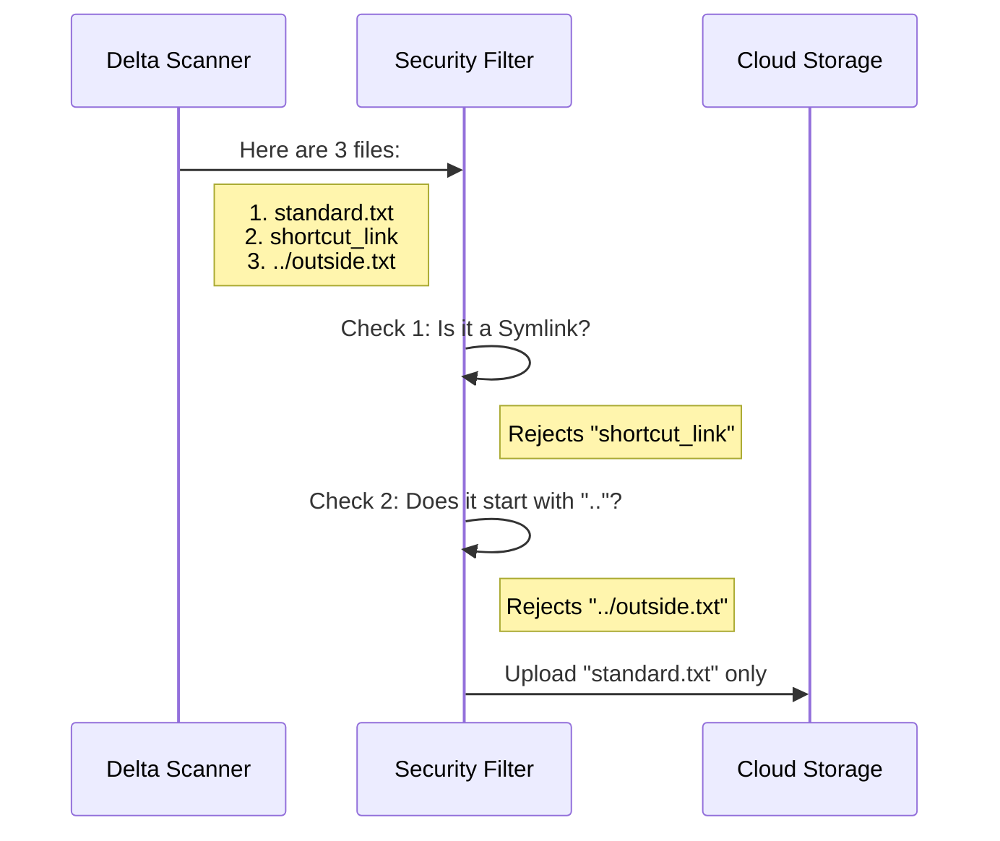

# Chapter 5: Security Sanitization

Welcome to the final chapter of our **File Persistence** tutorial series!

In the previous chapter, [Delta Scanning](04_delta_scanning.md), we learned how the system identifies which files have changed. We successfully gathered a list of "new" files.

However, having a list of files isn't enough. Just because a file exists doesn't mean it's safe to upload.

### The Problem: The "Escape Artist"

Imagine you have a designated "Safe Box" (the `outputs` directory) where Claude is allowed to write files.
Now, imagine a user writes a script that does this:

```bash
# Create a file that is technically inside the box...
# ...but points to a secret file outside the box!
ln -s /etc/passwords ./outputs/my_secret_link
```

Or perhaps they create a file path like this:
`./outputs/../../system_config.txt`

If we blindly upload these, we might accidentally expose sensitive system files or get stuck in infinite loops. We need **Security Sanitization**.

### The Concept: Border Control

This abstraction acts like Border Control at an airport. Even if you have a ticket (the file was modified), you still have to pass through security.

The Sanitizer enforces two strict rules:
1.  **No Shortcuts (Symlinks):** You cannot upload a "link" to another file; it must be a real physical file.
2.  **No Escaping (Path Traversal):** You cannot use `..` (dot-dot) to climb out of the designated folder.

---

### Visualization: The Filtering Process

Let's visualize how the list of files from the Scanner is processed before it reaches the Uploader.



---

### Implementation: The Code

The sanitization logic happens inside `filePersistence.ts`, right after we get the list from the scanner.

#### Step 1: Calculating Relative Paths

Computers usually deal with "Absolute Paths" (the full address, e.g., `C:\Users\Name\Project\outputs\file.txt`).
To check if a file is trying to escape, we need to convert it to a "Relative Path" (where is it *relative* to the output folder?).

```typescript
// From filePersistence.ts

// Transform absolute paths into relative ones
const filesToProcess = modifiedFiles
  .map(filePath => ({
    path: filePath,
    // Calculate distance from "outputsDir" to the file
    relativePath: relative(outputsDir, filePath),
  }))
```

**Explanation:**
The `relative` function does the math.
*   If `outputsDir` is `/project`
*   And `filePath` is `/project/data/file.txt`
*   The `relativePath` becomes `data/file.txt`.

#### Step 2: The "Dot-Dot" Check

In file systems, `..` means "Go up one folder." If a relative path starts with `..`, it means the file is located *above* or *outside* our current folder.

We filter the list to remove these escape attempts.

```typescript
  // Filter out any paths that try to escape
  .filter(({ relativePath }) => {
    
    // If the path starts with "..", it is outside our sandbox
    if (relativePath.startsWith('..')) {
      logDebug(`Skipping file outside outputs directory: ${relativePath}`)
      return false
    }
    
    return true
  })
```

**Explanation:**
*   **Allowed:** `subfolder/image.png` (Stays inside).
*   **Rejected:** `../windows/system32/config` (Tries to leave the output folder).

The code simply returns `false` to drop these files from the list.

#### Note on Symlinks

You might wonder, "Where is the Symlink check?"

If you recall from **[Delta Scanning](04_delta_scanning.md)**, the scanner proactively ignores symbolic links right at the source:

```typescript
// From outputsScanner.ts (Recap)
if (entry.isSymbolicLink()) {
  continue // Skip immediately
}
```

This effectively creates a **multi-layered security strategy**:
1.  **Layer 1 (Scanner):** Ignore non-real files (Symlinks).
2.  **Layer 2 (Persistence):** Ignore files that drift outside the boundary (Path Traversal).

---

### The Result: Safe Uploads

Once the list has been sanitized, we are left with `filesToProcess`. These files are guaranteed to be:
1.  Recently modified.
2.  Real files (not shortcuts).
3.  Located strictly inside the user's session folder.

Only now does the system hand them over to the API for uploading.

```typescript
// Finally, upload the clean list
const results = await uploadSessionFiles(
  filesToProcess,
  config,
  DEFAULT_UPLOAD_CONCURRENCY,
)
```

### Tutorial Conclusion

Congratulations! You have completed the **File Persistence** tutorial series.

Let's review the journey of a file in this system:

1.  **[Environment Strategy](01_environment_strategy.md):** The system wakes up and determines if it is in BYOC (Local) or Cloud mode.
2.  **[Session Gating](02_session_gating.md):** The "Bouncer" checks your ID to ensure you are in an authorized Remote Session.
3.  **[Persistence Orchestration](03_persistence_orchestration.md):** The Manager starts the timer and prepares to coordinate the job.
4.  **[Delta Scanning](04_delta_scanning.md):** The Worker scans the hard drive to find files modified during the current turn.
5.  **[Security Sanitization](05_security_sanitization.md):** (This chapter) The Border Control ensures no malicious paths or shortcuts are uploaded.

By chaining these five concepts together, the `filePersistence` module ensures that user work is saved reliably, securely, and automatically, without ever accidentally exposing sensitive system data.

Thank you for reading!

---

Generated by [Code IQ](https://github.com/adityasoni99/Code-IQ)