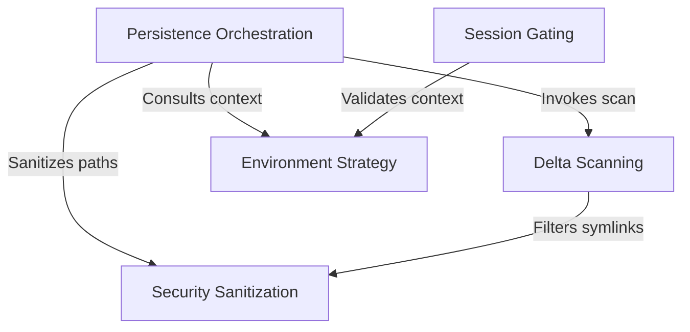

# Tutorial: filePersistence

This project acts as an intelligent **file preservation system** for remote coding sessions. It automatically detects, verifies, and saves any work produced during an interaction "turn" (like creating or editing code files). By using **Delta Scanning** to find only new changes and rigorous *Security Sanitization* to prevent unsafe access, it ensures that a user's outputs are safely backed up to the cloud without manual effort.

## Chapters

1. [Environment Strategy](01_environment_strategy.md)
2. [Session Gating](02_session_gating.md)
3. [Persistence Orchestration](03_persistence_orchestration.md)
4. [Delta Scanning](04_delta_scanning.md)
5. [Security Sanitization](05_security_sanitization.md)

---

Generated by [Code IQ](https://github.com/adityasoni99/Code-IQ)