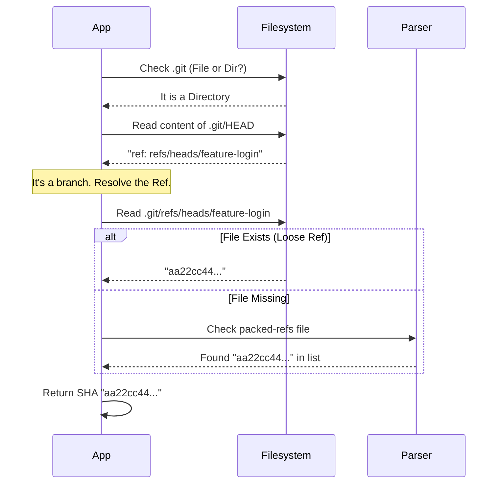

# Chapter 1: Filesystem-Based Git Internals

Welcome to the first chapter of our journey into the engine room of Git!

Most developers interact with Git using the command line: `git status`, `git branch`, or `git log`. This is like driving a car and relying on the dashboard lights. It works, but it hides the machinery.

In this chapter, we are going to be **mechanics**. We will open the hood and look directly at the engine components. Instead of asking the Git program to tell us the status (which involves starting a new process, which is slow), we will read the raw text files inside the `.git` folder directly.

**What you will learn:**
1. How to find the "real" `.git` directory (even in complex setups).
2. How to read the `HEAD` file to find your current branch.
3. How to follow "References" to find specific Commit SHAs.

---

## The Central Use Case: "Where am I?"

Imagine you are building a tool that needs to display the current branch and commit hash in a status bar. You want this to update instantly.

**The Slow Way:**
Run `git rev-parse HEAD` via a subprocess. This has "overhead"—it takes time to start the program.

**The Fast Way (Our Way):**
Read the file `.git/HEAD`. It’s just a text file!

Let's break down how to do this safely and correctly.

---

## Concept 1: Finding the `.git` Directory

Usually, `.git` is a folder in your project root. However, in advanced setups like **Worktrees** or **Submodules**, `.git` might actually be a *file* that points somewhere else.

We need a function `resolveGitDir` that handles both.

### The "Pointer" File
If `.git` is a file, it looks like this inside:
```text
gitdir: /path/to/actual/repo/.git/worktrees/my-feature
```

### The Implementation
Here is how we resolve the path. We check if `.git` is a folder or a file.

```typescript
// fs/promises imports assumed (stat, readFile)
import { join, resolve } from 'path'

export async function resolveGitDir(cwd: string): Promise<string | null> {
  const gitPath = join(cwd, '.git')
  
  try {
    const st = await stat(gitPath)
    if (st.isDirectory()) {
      return gitPath // It's a standard repo
    }
    // If it's a file, we need to read where it points
    return readGitPointerFile(gitPath) 
  } catch {
    return null // Not a git repo
  }
}
```

If it is a file, we parse that `gitdir:` line:

```typescript
async function readGitPointerFile(path: string): Promise<string> {
  // Read the file content, e.g., "gitdir: ../../.git/modules/my-sub"
  const content = (await readFile(path, 'utf-8')).trim()
  
  if (content.startsWith('gitdir:')) {
    // Extract the path after 'gitdir:'
    const rawPath = content.slice('gitdir:'.length).trim()
    // Resolve relative paths to absolute ones
    return resolve(path, '..', rawPath)
  }
  return path
}
```

---

## Concept 2: Reading `HEAD`

The `HEAD` file determines where you are currently working. It usually lives at `<gitDir>/HEAD`.

It contains one of two things:
1. **A Reference:** `ref: refs/heads/main` (You are on the `main` branch).
2. **A SHA:** `a1b2c3d...` (You are in "detached HEAD" state, pointing to a specific commit).

Here is how we parse it:

```typescript
export async function readGitHead(gitDir: string) {
  const content = (await readFile(join(gitDir, 'HEAD'), 'utf-8')).trim()

  if (content.startsWith('ref:')) {
    // We are on a branch! Extract the name.
    const ref = content.slice('ref:'.length).trim()
    const name = ref.replace('refs/heads/', '')
    return { type: 'branch', name }
  }

  // Otherwise, it's a raw SHA (Detached HEAD)
  return { type: 'detached', sha: content }
}
```

**Example Output:**
If you are on `main`, this returns `{ type: 'branch', name: 'main' }`.

---

## Concept 3: Resolving References (The Treasure Hunt)

If `HEAD` told us we are on `refs/heads/main`, we still don't know the Commit SHA (the ID of the code version). We have to follow the map.

Git stores these references in two places:
1. **Loose Refs:** Individual files. E.g., `.git/refs/heads/main` contains the SHA.
2. **Packed Refs:** A single file `.git/packed-refs` containing a list of many branches and tags (used for compression).

We must check the loose file first. If it's missing, we check the packed file.

### Checking Loose Refs
```typescript
async function resolveRef(gitDir: string, ref: string): Promise<string | null> {
  try {
    // Try to read .git/refs/heads/main directly
    const content = await readFile(join(gitDir, ref), 'utf-8')
    return content.trim() // Returns the SHA, e.g., "3b1a..."
  } catch {
    // File doesn't exist? Try packed-refs next.
    return readPackedRefs(gitDir, ref)
  }
}
```

### Checking Packed Refs
If the file didn't exist, we look in `packed-refs`. This file looks like a list:
```text
# pack-refs with: peeled fully-peeled sorted 
9f0c2a... refs/remotes/origin/main
e4d1b0... refs/tags/v1.0.0
```

```typescript
async function readPackedRefs(gitDir: string, ref: string) {
  try {
    const packed = await readFile(join(gitDir, 'packed-refs'), 'utf-8')
    
    // Find the line that contains our ref
    for (const line of packed.split('\n')) {
      // Split line into [SHA, RefName]
      const [sha, name] = line.split(' ') 
      if (name === ref) return sha
    }
  } catch { /* No packed-refs file */ }
  return null
}
```

---

## Internal Implementation Walkthrough

Let's visualize the entire flow when our application asks: **"What is the current Commit SHA?"**



### Safety and Security
You might notice the `isSafeRefName` function in the source code.
Since we are reading files based on strings found inside `.git`, a malicious actor could theoretically create a branch named `../../passwords.txt`.

We strictly validate that reference names only contain safe characters (alphanumeric, `/`, `-`, etc.) to prevent **Path Traversal** attacks.

```typescript
// Simplified safety check
export function isSafeRefName(name: string): boolean {
  if (name.includes('..')) return false // Prevent directory traversal
  // Only allow letters, numbers, slash, hyphen, underscore
  return /^[a-zA-Z0-9/._-]+$/.test(name)
}
```

---

## Conclusion

We have successfully bypassed the `git` command line! By reading the filesystem directly, we can determine the repository root, identify the current branch, and resolve the commit SHA.

This approach is:
1. **Faster:** No process spawning overhead.
2. **Synchronous-ready:** Can be checked instantly in tight loops.
3. **Robust:** Handles worktrees and packed references.

However, reading the state once is not enough. Development tools need to know *when* the state changes (like when a user switches branches).

In the next chapter, we will learn how to efficiently watch these files for changes.

[Next Chapter: Reactive Git State Watching](02_reactive_git_state_watching.md)

---

Generated by [Code IQ](https://github.com/adityasoni99/Code-IQ)