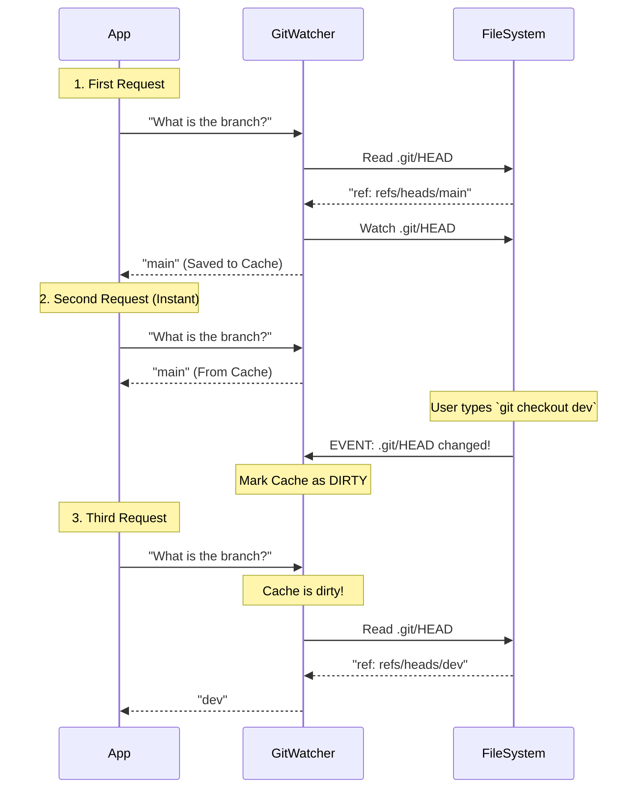

# Chapter 2: Reactive Git State Watching

In [Chapter 1: Filesystem-Based Git Internals](01_filesystem_based_git_internals.md), we learned how to be mechanics. We opened the hood of the `.git` folder and read the `HEAD` file to find our current branch.

However, there is a catch.

If you are building a tool (like a status bar in a code editor), you need to know the current branch **all the time**.

**The Naive Approach (Polling):**
You could write a loop that reads `.git/HEAD` every 100 milliseconds.
*   *Problem 1:* This wastes CPU and battery.
*   *Problem 2:* It keeps the disk busy unnecessarily.

**The Pro Approach (Reactive Watching):**
Instead of asking "Are we there yet?" constantly, we wait for the filesystem to tap us on the shoulder and say, "Hey, something changed."

This chapter introduces the **Git State Watcher**.

---

## The Central Use Case: The Lazy Baker

Imagine a bakery (your program) trying to display "Fresh Bread Available" (current Git status).

**Polling (Bad):**
The baker opens the oven door every 5 seconds to check if the bread is done. This lets heat escape and wastes time.

**Reactive Watching (Good):**
The baker sets a timer (a file watcher). They sit down and read a book (do other work). When the timer *dings* (event triggers), they get up and check the oven *once*.

We want our Git tool to be the Lazy Baker. It should only read the hard disk when `.git/HEAD` actually changes.

---

## Concept 1: The "Dirty" Cache

To implement this, we need a **Cache**. This is just a variable in memory that stores the last known result (e.g., `currentBranch = 'main'`).

We also need a flag called `dirty`.
*   **False:** The value in memory is fresh. Use it.
*   **True:** The file changed on the disk. The value in memory is stale. Read the disk again.

Here is the logic in its simplest form:

```typescript
// Simplified pseudo-code
class SmartCache {
  private value = null
  private dirty = true // Start dirty to force a first read

  async get() {
    // If clean, return memory (INSTANT)
    if (!this.dirty) return this.value

    // If dirty, do the hard work (SLOW)
    this.value = await readGitHead() 
    this.dirty = false
    return this.value
  }
}
```

If you call `get()` 1,000 times, it only reads the disk **once**.

---

## Concept 2: The Sensors (File Watchers)

How do we switch `dirty` back to `true`? We attach a sensor to the file. Node.js provides `fs.watchFile`.

When you run `git checkout develop`, Git modifies `.git/HEAD`. Our sensor detects this modification and invalidates our cache.

```typescript
import { watchFile } from 'fs'

// When the file changes, mark our data as old (dirty)
watchFile('.git/HEAD', () => {
  console.log('Sensor triggered! Invalidating cache.')
  cache.dirty = true
})
```

---

## Concept 3: Dependency Chains

It's not just about `HEAD`.

1.  **Switching Branches:** Modifies `.git/HEAD`.
2.  **Committing Code:** Modifies `.git/refs/heads/main` (the file containing the SHA for the `main` branch).

If we only watch `HEAD`, we will know when you switch branches, but we won't know if you make a new commit on the *current* branch.

Therefore, our watcher must be dynamic.
1.  Read `HEAD`.
2.  If `HEAD` points to `main`, **start watching** `.git/refs/heads/main`.
3.  If we switch to `dev`, **stop watching** `main` and **start watching** `.git/refs/heads/dev`.

---

## Internal Implementation Walkthrough

Let's visualize the lifecycle of a request to `getCachedBranch()`.



### The Code: The `GitFileWatcher`

Let's look at the actual implementation in `gitFilesystem.ts`. We use a class to manage the state.

#### 1. The Cache Entry
We don't just store the string; we store a small object tracking the state.

```typescript
type CacheEntry<T> = {
  value: T          // The data (e.g., "main")
  dirty: boolean    // Is it stale?
  compute: () => Promise<T> // Function to fetch fresh data
}
```

#### 2. The Smart Getter
This is the heart of the "Lazy Baker." It handles the logic of when to read and when to return cached data.

```typescript
// Inside GitFileWatcher class
async get<T>(key: string, compute: () => Promise<T>): Promise<T> {
  // 1. Check existing cache
  const existing = this.cache.get(key)
  
  // 2. If it exists and is clean, return it immediately
  if (existing && !existing.dirty) {
    return existing.value as T
  }

  // 3. Otherwise, compute fresh data
  const value = await compute()
  
  // 4. Save it and mark it clean
  this.cache.set(key, { value, dirty: false, compute })
  return value
}
```

#### 3. The Invalidator
When `fs.watchFile` tells us a file changed, we don't re-read it immediately. We just mark everything as "dirty." We wait for the App to ask for the data again.

```typescript
private invalidate(): void {
  // Mark all cached values as dirty
  for (const entry of this.cache.values()) {
    entry.dirty = true
  }
}
```

#### 4. Setting up the Watchers
We start watching files as soon as the system starts. Notice we also support `commonDir`—this handles advanced Git setups like Worktrees, but the logic remains the same: find the file, watch it.

```typescript
private async start(): Promise<void> {
  this.gitDir = await resolveGitDir() // From Chapter 1
  
  // Watch HEAD for branch switches
  this.watchPath(join(this.gitDir, 'HEAD'), () => {
    this.onHeadChanged() 
  })

  // Watch config for remote URL changes
  this.watchPath(join(this.gitDir, 'config'), () => {
    this.invalidate()
  })
}
```

> **Note on Safety:** Just like in Chapter 1, we validate all data read from these files to ensure no malicious code is injected via branch names.

---

## Conclusion

We have now evolved from a simple mechanic who looks at the engine once, to a sophisticated computer system that monitors the engine's sensors.

1.  **Efficiency:** We only read the disk when necessary.
2.  **Speed:** Most requests are served instantly from memory.
3.  **Reactivity:** The UI updates automatically when you use Git commands in the terminal.

But wait—knowing the branch name (`main`) is useless if that branch points to a Commit SHA that doesn't exist or is invalid. How do we ensure the references we find are real?

In the next chapter, we will look at how to resolve and validate these references deeper in the Git graph.

[Next Chapter: Reference Resolution & Validation](03_reference_resolution___validation.md)

---

Generated by [Code IQ](https://github.com/adityasoni99/Code-IQ)